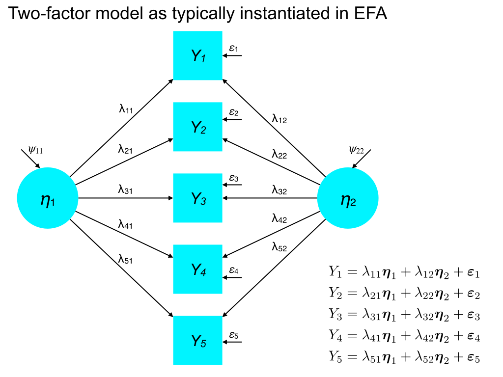
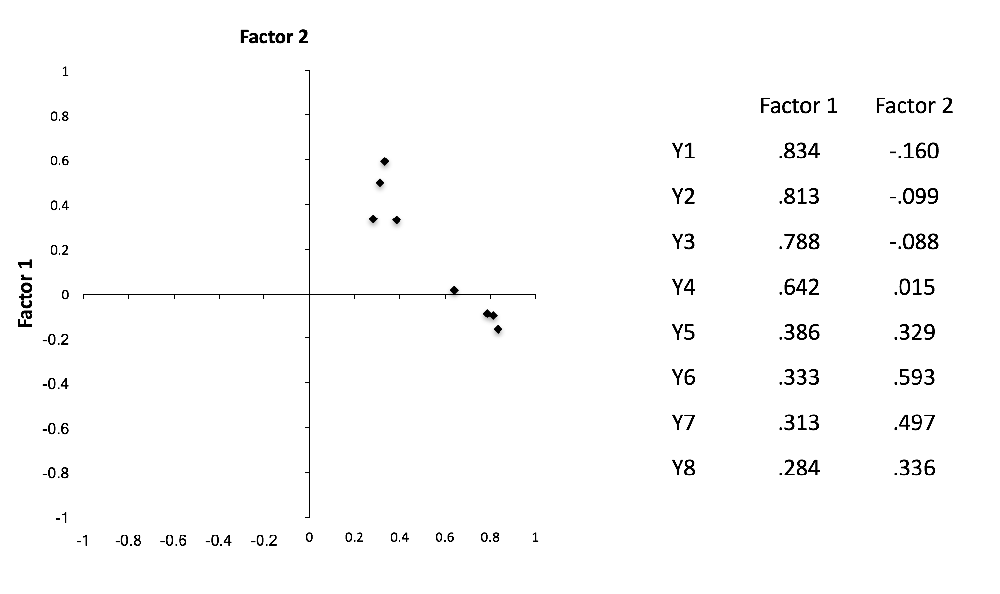
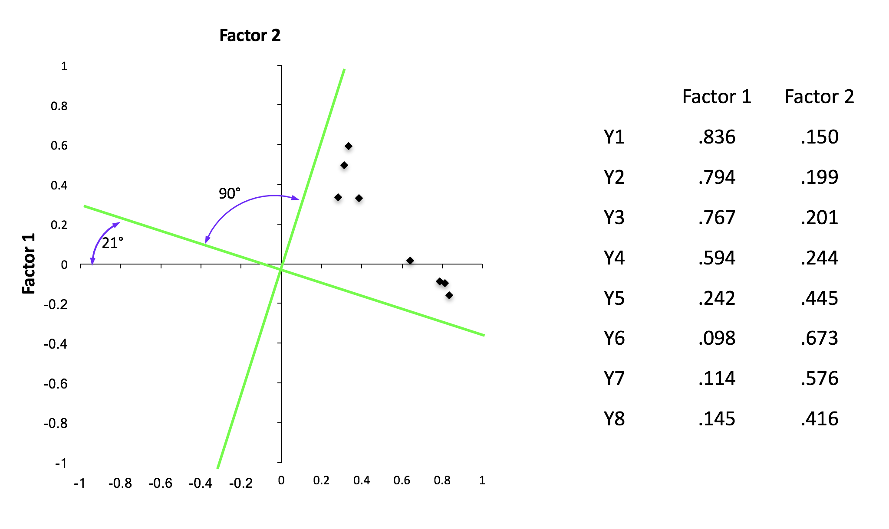
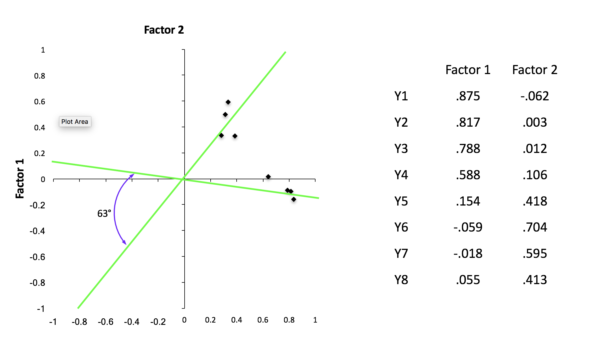

<style type="text/css">
body{ font-size: 20px; max-width: 1400px; margin: auto; padding: 1em; }
code.r{ font-size: 20px; }
p { padding-top: 10px; padding-bottom: 10px; }
pre { font-size: 18px; }
</style>


```{r setup, include=FALSE}
if (!require(pacman)) { install.packages("pacman"); library(pacman) }
p_load(knitr, MASS, tidyverse, viridis, lavaan, modelr, mlbench, lattice, lm.beta, semPlot, DiagrammeR, matrixcalc, psych)
knitr::opts_chunk$set(echo = TRUE) #print code by default
options(digits=3) 
```

# Overview

The common factor model represents the view that covariation among a set of observed variables reflects the influence of one or more common factors (i.e., shared latent causes), as well as unexplained variable-specific variance. In the common factor model, items are considered *indicators* of the latent variables that underlie their covariation (a form of a *reflective* latent variable model).

Thus, factor analysis partitions variation in the indicators into *common variance* and *unique variance*. Common variance reflects the shared influence of underlying factors on an indicator. Unique variances in factor models have the same interpretation as the familiar concept of a *disturbance* in SEM. That is, unique variance represents a) reliable variation in the item that reflects unknown latent causes, and b) random error due to unreliability or measurement error.

Each indicator has a *communality* (sometimes denoted $h^2$), which is the total variance in an indicator explained by latent factors. The remaining unexplained variation is called an indicator's *uniqueness* ($u^2$). Factor analyses are conventionally conducted on standardized data (*M* = 0, *SD* = 1), meaning that the communality and uniqueness should sum to 1.0 for each indicator (i.e., its total variance).

Altogether, if a factor model is a good representation of the data, then the correlation among items that load onto a factor should be largely attributable to the factor. More generally, a good factor model should have high communality estimates and low uniquenesses for all items. If the uniqueness of an indicator is high (e.g., 0.5), it indicates that variation in the indicator is not explained by the specified factor structure.

Returning to our discussions of latent variables, the common factor model assumes conditional independence among the indicators. That is, there should not be meaningful correlations among indicators after accounting for the factor structure. In SEM, we can relax this assumption in selected cases, but in exploratory factor analysis (EFA), it is built in.

#Formal specification of the common factor model

The common factor model builds on the mechanics of linear regression, where we view realizations of a dependent variable $Y$ as a linear combination of multiple predictors, $\textbf{X}$, plus unexplained variance, $\varepsilon$. Unlike regression, however, the common factor specifies that observed data reflect a linear combination of *latent* influences. If we consider a single item, $\textbf{y}_i$, the model specification is:

## Single item form

$$
\textbf{y}_i = \lambda_{i1} \boldsymbol{\eta}_1 + \lambda_{i2} \boldsymbol{\eta_2} + ... + \lambda_{im} \boldsymbol{\eta}_m + \boldsymbol{\varepsilon}_i
$$
where $\lambda_{im}$ reflects the strength of the association between factor $m$ and indicator $i$. For example, if we estimated 3 factors and had 8 indicators, the factor loadings would be:

$$
\underset{8 \times 3}{\boldsymbol{\Lambda}_y} = \begin{bmatrix}
   \lambda_{11} & \lambda_{12} & \lambda_{13} \\
   \lambda_{21} & \lambda_{22} & \lambda_{23} \\
   \lambda_{31} & \lambda_{32} & \lambda_{33} \\
   \lambda_{41} & \lambda_{42} & \lambda_{43} \\
   \lambda_{51} & \lambda_{52} & \lambda_{53} \\
   \lambda_{61} & \lambda_{62} & \lambda_{63} \\
   \lambda_{71} & \lambda_{72} & \lambda_{73} \\
   \lambda_{81} & \lambda_{82} & \lambda_{83} \\
 \end{bmatrix}
$$

Note that in the 'vanilla' common factor model of EFA, each item is a weighted combination of *all* factors, which is often an anti-parsimonious account. In multiple-factor models, scientists often seek to achieve *simple structure* in which each item has a dominant loading on only *one* factor.

In EFA, this is often accomplished by rotating the factor solution, a procedure that tries to simplify the pattern of factor loadings by geometrically rotating the orientation of the latent directions. In confirmatory factor analysis (CFA), we often specify a sparse $\boldsymbol{\Lambda}_y$ matrix in which many improbable factor loadings are fixed at zero. That is, we assert that an observed variable is only a function of a small number of factors (preferably one). This assertion is testable by fitting the hypothesized confirmatory factor model and examining global and local fit.

## Expansion of equations for each indicator

Here is the notation for a simple case in which there are 5 indicators and represented by two factors:

$$
\begin{align*}
\textbf{y}_1 &= \lambda_{11} \boldsymbol{\eta}_1 + \lambda_{12} \boldsymbol{\eta}_2 + \boldsymbol{\varepsilon}_1 \\
\textbf{y}_2 &= \lambda_{21} \boldsymbol{\eta}_1 + \lambda_{22} \boldsymbol{\eta}_2 + \boldsymbol{\varepsilon}_2 \\
\textbf{y}_3 &= \lambda_{31} \boldsymbol{\eta}_1 + \lambda_{32} \boldsymbol{\eta}_2 + \boldsymbol{\varepsilon}_3 \\
\textbf{y}_4 &= \lambda_{41} \boldsymbol{\eta}_1 + \lambda_{42} \boldsymbol{\eta}_2 + \boldsymbol{\varepsilon}_4 \\
\textbf{y}_5 &= \lambda_{51} \boldsymbol{\eta}_1 + \lambda_{52} \boldsymbol{\eta}_2 + \boldsymbol{\varepsilon}_5 \\
\end{align*}
$$

## Graphical depiction



##Matrix form

We can generalize the factor model to matrix form:

$$
\boldsymbol{y} = \boldsymbol{\Lambda}_y \boldsymbol{\eta} + \boldsymbol{\varepsilon}
$$

Nice and simple! :-)

# Assumptions of the common factor model

The common factor model has several key assumptions:

1.  Unique variances (disturbances) have a mean of zero: $E(\varepsilon_{i}) = 0$
2.  Latent factors have mean zero, $E(\eta_{i}) = 0$.
3.  Latent factors have a variance of one, $\textrm{var}(\eta_i) = 1$. (Standardized solution)
4.  Unique variances are uncorrelated with each other: $\textrm{cov}(\varepsilon_{i},\boldsymbol{\varepsilon}_{\backslash i}) = 0$. (Conditional independence)
5.  Latent factors are independent of each other: $\textrm{cov}(\eta_{i},\boldsymbol{\eta}_{\backslash i}) = 0$
6.  Latent factors are uncorrelated with unique variances: $\textrm{cov}(\boldsymbol{\varepsilon} ,\boldsymbol{\eta}) = 0$

These assumptions are necessary to obtain unique solutions to the model parameters (i.e., identification).

Together, assumptions 1 and 2 yield the appropriate expectation that the mean of the *i*th indicator is the zero when we solve the equation:

$$
y_i = \lambda_{i1} \eta_1 + \lambda_{i2} \eta_2 + ... + \lambda_{ij} \eta_j + \boldsymbol{\varepsilon}_i
$$
In this scenario, all terms become zero, yielding a zero estimate of the indicator $y_i$. If it had a non-zero mean, we would need to include mean structure in the model by adding intercepts to the equations (as in multiple regression):

$$
y_i = \tau_i + \lambda_{i1} \eta_1 + \lambda_{i2} \eta_2 + ... + \lambda_{ij} \eta_j + \boldsymbol{\varepsilon}_i
$$

# Partitioning variance in the common factor model

As we discussed last week, the variance explained in a given indicator *i* by a factor in the model (e.g., $\psi_1$), is given by squaring its (standardized) factor loading. This comes from the equivalency of factor loadings and correlations in the common factor model, assuming uncorrelated factors (otherwise it gets more complicated).

More generally, we can decompose the variance of any indicator in to the part explained by the factor model (i.e., its communality) and residual, unexplained variation (i.e., its uniqueness):

$$
\textrm{var}(y_i) = \lambda_{i1} \psi_{11} + e_i
$$

where $\psi_{11} = 1.0$ (i.e., the requirement that factor variances are unity). Consequently, if we want to estimate the proportion of variance explained in a variable $y_i$ by the *m*th factor, it is:

$$
h^2_i = r^2_i = \lambda_{im}^2
$$
And proportion of unexplained variance is:

$$
u^2_i = \varepsilon_i = 1 - \lambda_{im}^2
$$

## Communality

These equations only hold if item *i* loads only onto a single factor. In multiple-factor EFA, this is not the case. Thus, the total explained variance for item *i* is the sum of squared loadings for *all* factors multiplied by the corresponding factor scores:

$$
h^2_i = r^2_i = \sum_{j=1}^{m}\lambda_{ij}^2
$$

## Uniqueness

$$
u^2_i = \varepsilon_i = 1 - \sum_{j=1}^{m}\lambda_{ij}^2
$$
Again, the $\eta$ (factor scores) term drops out because it is 1.0 for all factors.

## Covariance

In the case of a single-factor model or a lambda matrix in which two indicators load *only* on one factor (e.g., a simple structure CFA model), their covariance can be obtained via:

$$
\textrm{cov}(y_1, y_2) = \sigma_{12} = \lambda_{11} \eta_{11} \lambda_{21}
$$

# A quick example of the common factor model in EFA

Consider a (simulated) dataset in which 300 students rated their affinity for different topics of study: biology, geology, chemistry, algebra, calculus, and statistics. Items were rated on a 1-5 scale from 'strongly dislike' to 'strongly like'. Dataset courtesy of John Quick: http://rtutorialseries.blogspot.com/2011/10/r-tutorial-series-exploratory-factor.html.

First, let's take a look at the descriptive statistics, including correlations among items:

```{r}
data <- read.csv("quick_efa_data.csv")
describe(data)
round(cor(data), 2)
```

At first glance, there appears to be some association among math-related topics and science-related topics.

We could fit a one-factor model to these data in which all six indicators are thought to reflect a common latent factor (e.g., affinity for school). Here, we estimate this factor using maximum likelihood:

```{r}
f1 <- fa(data, nfactors=1, fm="ml")
print(f1)
```

We see that much of the variation in `BIO`, `GEO`, and `CHEM` is explained by the latent factor. But only 3-7% of variation in `ALG`, `CALC`, and `STAT` is attributable to the factor -- that is, we have low communality estimates and high uniquenesses. This suggests a poor factor solution. Let's compare against a 2-factor solution:

```{r}
f2 <- fa(data, nfactors=2, fm="ml", rotate="oblimin")
print(f2)
```

Here, we see that a two-factor solution provides a reasonably parsimonious account of the data, with a factor representing 'science' (`BIO`, `GEO`, and `CHEM`) and a factor representing 'math' (`ALG`, `CALC`, and `STAT`). By default, psych applies an *oblimin* rotation to the factor loadings to improve their interpretability -- especially to shift the solution toward simple structure. This is an oblique transformation; in this case, the factors correlate at $r = .21$. Note that the two-factor solution explains 66% of the total variation in the data, with each the 'science' factor accounting for slightly more variance that than 'math.'

We could also attempt a 3-factor solution:

```{r}
f3 <- fa(data, nfactors=3, fm="ml")
print(f3)
```

Note that the third factor appears to capture `CALC` specifically and that the correlation between the 2nd and 3rd factors is $r = 0.8$. Thus, this model does not appear to be interpretable or parsimonious. It also explains little more variation than the 2-factor model (66% versus 72%).

##Looking under the hood of the FA model

The object returned by the `fa` function from `psych` gives us a lot of information that we can use to diagnose and interpret the factor model. Much of this is printed in the summary, but we may wish to work with these statistics further. First, let's examine the estimated communalities:

```{r}
f2$communalities #note that these will diverge from the sum of squared loadings if we use 'minrank' factor analysis.
```

And uniquenesses:

```{r}
f2$uniquenesses
```

The factor loadings. Note that by default, `fa` applies the 'oblimin' rotation, which allows the factors to correlate in its attempt to achieve simple structure. Therefore, the loadings no longer represent the correlations between items and factors. Instead, they are standardized partial regression coefficients (i.e., the unique effects of a factor on a variable).

```{r}
f2$loadings
```

Note that loadings below 0.1 are suppressed by default. You can change this using `print(f2$loadings, cut=0.3)` to suppress anything below 0.3, for example.

If an oblique rotation is performed, the `Phi` matrix contains the correlations among factors:

```{r}
f2$Phi
```

When an oblique rotation is applied, we may nevertheless be interested in assessing the correlation then the correlation between indicators and factors is not equal to the summed squared factor loadings because the *factors* correlate. One must take this into account to understand the relationship between indicators and factors. We can obtain the correlation between a factor and an indicator by multiplying the factor *loadings* $\boldsymbol{\Lambda}_y$ by the factor correlation matrix $\boldsymbol{\Psi}$. This is called the factor *structure*  matrix and is stored in the `$Str` element of an `fa` object:

```{r}
f2$Str
```

Notice the modest level of correlation between `CALC`, `ALG`, and `STAT` with the 'science' factor (similar cross-associations for 'math' factor).

We can examine the eigenvalues of the raw correlation matrix:

```{r}
f2$e.values
```

Note, however, that factor analysis is computed on the *reduced* correlation matrix $\boldsymbol{R}_r$, which places the communalities along the diagonal. Unlike PCA, where the model attempts to explain total variance in each indicator, factor analysis tries to explain only variation that is shared among variables due to common factors. In this way, non-shared variance (i.e., uniquenesses) is discarded from the analysis. This is exemplified by the use of a raw correlation matrix in PCA (1.0 on the diagonal) versus reduced correlation matrix in EFA. As a refresher, here's the raw correlation matrix:

```{r}
round(cor(data), 3)
```

And the reduced correlation matrix based on the 2-factor solution above:

```{r}
cmat <- cor(data)
diag(cmat) <- f2$communalities
print(cmat)
```

As a result, we can also consider the eigenvalues of the *reduced* correlation matrix:

```{r}
f2$values
```

*NB*. As pointed out by Preacher, Kaiser's rule (eigenvalues > 1.0) for deciding on the number of factors is based on the eigenvalues from the *original* (unreduced) correlation matrix. Kaiser's rule is discussed below.

We can examine the divergence between the raw correlation matrix and the model-implied correlation matrix using the `residuals` function. Note that the uniquenesses ($u^2$) are along the diagonal.

```{r}
residuals(f2)
```

##Plotting factor solutions to aid interpretation

We can plot the factor loadings to get a sense of how items relate to factors.

```{r}
plot(f2)
```

Note that more extreme points along each factor axis are a *good* thing because they reflect a stronger association between the indicator and the factor. Thus, we are not looking for dispersion along the axes per se, but evidence of separability 

For reference, things get a bit more complex as we plot 3+ factors, but we can still get some mileage from this:
```{r}
plot(f3)
```

Another popular visualization tool for factor analysis is the *biplot*, which plots the *factor scores* as points and the factor loadings as directional *vectors*. As the name suggests, biplots visualize two factors at a time, but can be tiled to look at all pairwise combinations. Ideally, we would like to see vectors for indicators of one factor that are at 90 degrees to indicators of the other factor. This is evidence of the speparability of the indicators (a part of simple structure). The dispersion of factor scores provides information about how correlated the factors are. For example, if the scatterplot reveals an ellipse whose major axis has a positive slope, this is evidence of correlation between factors.

```{r}
biplot(f2)
```

```{r}
biplot(f3)
```

#Goal of EFA

(from Brown) The goal of EFA is to evaluate the dimensionality of a set of indicators in order to identify the smallest number of latent factors that explain the pattern of correlations. EFA tries to identify a *simple* model, which means a) minimizing the number of factors (parsimony), and b) minimizing non-zero factor loadings (simple structure, often achieved through rotation).

EFA is a data-driven *exploratory* technique with little intervention from the scientist in the estimation of the model. The primary decisions are how many factors to extract and how/whether to rotate the factors for interpretability.

Of course, once one has a set of outputs from EFAs with different dimensionality (number of factors) and rotations, there is considerable involvement of the scientist in interpreting the models. But when we think of EFA as a *measurement model*, it is important to remember that no restriction are placed *a priori* on the number of factors to extract or the pattern of relationships between observed and latent variables. As mentioned above, all indicators load onto all factors, even if trivially.

##Estimation methods in EFA

Because this is primarily an SEM class, we won't spend much time on this but there are two particularly popular methods for estimating: maximum likelihood and principal axis factoring.

Maximum likelihood follows the same approach as in typical SEM, trying to reproduce the observed covariance matrix $\textbf{S}_{XX}$ on the basis of the model-implied covariance: $\hat{\boldsymbol{\Sigma}}$. This is achieved by choosing parameter values (e.g., factor loadings) that maximize the sample likelihood function. One advantage of ML for EFA is that the fit (log-likelihood) is on the same basis (i.e., sample likelihood) as other latent variable models (esp. CFA) of the same data (also fit using ML). Furthermore, fit statistics from SEM (e.g., model $\chi^2$) can be computed to understand and diagnose misfit. ML assumes that the indicators are distributed as multivariate normal, just like typical SEM. ML is also limited in the number of factors it can extract (see free parameters below) relative to other methods.

Principal axis factoring (PAF) does not assume that the data follow a particular distribution and is less prone to invalid solutions than ML. There is also a much higher limit on the number of factors that can be extracted compared to ML: $p - 1$ where $p$ is the number of indicators. PAF is based on iteratively solving for the eigenvalues and eigenvectors underlying the *reduced* correlation matrix by updating the factor loadings. That is, we try to maximize the *communality* estimates of the data by updating the factor loadings until no further increase in communalities can be achieved. In this way, we begin with an estimate of communality (usually the squared multiple correlation among items) and try to increase it according to the factor model. Unlike ML, PAF does not provide estimates of parameter uncertainty (e.g., SEs of factor loadings)

#Selecting an appropriate number of factors in EFA

Interpretation is king: factors should make sense from a conceptual perspective. Moreover, if only two or three items load onto a factor, you may have a) overfactored, or b) the items are not a coherent part of the larger test.


## Kaiser's rule: eigenvalues > 1.0

The Kaiser-Guttman rule for factor extraction is that all factors should have eigenvalues greater than 1.0. This rule of thumb reflects the intuition that a factor (latent direction through the shared correlational structure)
should account for the variance of at least *one* indicator. Recall that because EFA is run on a correlation matrix, the variances of indicators are all 1.0, and thus the eigenvalues sum to the number of indicators.

Although Kaiser's rule is nice because of its simplicity, it should not be used in isolation because of the risk of being too dogmatic. For example, if the eigenvalues are $\boldsymbol{\lambda} = [10, 5, 4, 1.01, 1.01, 0.99, ... \lambda_p ]$, the fourth, fifth, and sixth factors all explain similar variance, but the sixth would be excluded. Likewise, these later factor explain much less variance than the first three, suggesting they may be relatively trivial. Finally, we would need to examine the factor loading matrix to determine the interpretability of the factors, which is a key aspect of factor models.

## Scree test

Cattell's scree test plots the eigenvalues (from largest to smallest) in order to identify an 'elbow' in the function (i.e., a change in slope) that may suggest a natural cut point in selecting the number of factors. Scree is defined as 'a mass of small loose stones that form or cover a slope on a mountain' (Google). Here's a plot of the eigenvalues mentioned above, taken from a correlation matrix with 25 indicators (and thus 25 eigenvalues). I have plotted only the first 10 for clarity.

```{r}
df <- data.frame(ev=c(10, 5, 4, 1.01, 1.01, 0.99, .12, .1, .08, .06), factor_number=factor(1:10))
ggplot(df, aes(x=factor_number, y=ev, group=1)) + geom_point() + geom_line() + theme_bw(base_size=15) +
  xlab("Factor number") + ylab("Eigenvalue")
```

As this example, illustrates, identifying the elbow in the scree plot is often an interpretative exercise. Here, there is clearly a strong change in slope between 3 and 4 factors, suggesting that we may with to stop at 3 factors. However, there is a less pronounced slope change between 2 and 3 factors, so a scree test might lead us to consider 2- *or* 3-factor solutions. Like most factor extraction rubrics, one must examine the factor loadings to decide which solution aligns with theory and is most interpretable.

##Parallel analysis

Parallel analysis compares the magnitude of eigenvalues generated from random data against the eigenvalues from the sample correlation matrix. The idea is that meaningful directions in one's data should have eigenvalues larger than would be expected by change. Notably, eigenvalues depend on the number of variables, $p$, and the number of observations, $n$. Thus, in parallel analysis, one usually simulates data from 100+ random datasets of the same $p$ and $n$ as the observed data. The eigenvalues of the 'parallel' data are then averaged and plotted against the observed eigvalues.

Consider the nine-variable Thurstone dataset:

```{r}
describe(Thurstone)
print(Thurstone)
```

The eigenvalues of the corresponding correlation matrix are:

```{r}
round(eigen(Thurstone)$values, 3)
```

Note that there is some debate about whether the scree test (and thus, parallel analysis) should be conducted on the eigenvalues from the raw correlation matrix or on the correlation matrix that reflects only *shared* variance among the items based on the squared multiple correlation (SMC), or *communality.* The correlation matrix of just the shared variance among indicators is sometimes called the *reduced* correlation matrix.

If we want to examine the eigenvalues of the reduced correlation matrix, we typically substitute the SMC onto the diagonal of the correlation matrix. Thus, instead of each element being 1.0, it is the proportion of variance shared by that item with all other items. We can obtain the SMCs using the `smc` function in `psych`.

```{r}
smc(Thurstone)
```
We could then obtain the reduced correlation matrix as:

```{r}
Thurstone_reduced <- Thurstone
diag(Thurstone_reduced) <- smc(Thurstone)
print(Thurstone_reduced)
```

Here, I generate 100 normally distributed random datasets of $p = 9$ and $n = 213$.
```{r}
ff <- fa.parallel(Thurstone, n.iter=100, n.obs=213, fa="fa", plot = TRUE, SMC=TRUE)
print(ff$fa.values)
```

Thus, parallel analysis suggests that 3 factors may best account for these data. Note that if raw data are provided to `fa.parallel`, parallel datasets are obtained using resampling (row shuffling) and multivariate normal simulation. These may give slightly different results, and are stored in `$fa.sim` and `$fa.simr`.

# Rotation in EFA

As mentioned above, even though EFA identifies latent directions in the data, there is no guarantee that these directions are inherently interpretable. Thus, we may wish to rotate the axes of the factor

Note that rotation does not change the fit or the amount of variance explained.

Rather, it redistributes the variace across factors to aid in interpretation. This may change the eigenvalues of each factor, but not their sum (i.e., same total variance explained). Rotations should usually be applied after one selects an appropriate number of factors.

There are two types of rotations: orthogonal and oblique. Orthogonal rotations such as 'varimax' try to rotate the factors to obtain simple structure while keeping the directions at 90 degrees to each other (uncorrelated). This has the advantage of keeping the standardized factor loadings in correlational units. Oblique rotations allow for the factors to correlate, but are still motivated to achieve simple structure of the loading matrix. In general, assuming that factors are uncorrelated is probably a bad, or at least questionable, idea (cf. Preacher & MacCallum, 2003).

## Unrotated solution (from Brown CFA book)



## Orthogonal rotation




## Oblique rotation




#EFA versus CFA

EFA is data-driven, no specification from scientist, no constraints on factor loadings.

#PCA versus EFA

PCA tries to find composites of observed variables that explain the total variation in each item.

EFA provides a structural model of *shared* variation based on an assumption that common latent factors underlie the data.

PCA is best for creating composites of variables without necessarily assuming interpretability of latent cause (more like formative measurement), whereas EFA is better for identifying potentially interpretable factors (more like reflective measurement).

# Free parameters in EFA

The number of free parameters estimated in an EFA model is:

$k = p \cdot m + m(m+1)/2 + p - m^2$

where $p$ is the number of indicators, $m$ is the number of factors, and $k$ is the number of free parameters.

## Factor loadings

In EFA, the $\boldsymbol{\Lambda}_y$ matrix is $p \times m$ in dimension (i.e., indicators x factors). Moreover, unlike CFA, where some elements of the factor matrix can be fixed at zero (a priori specification), in EFA, all elements are free parameters:

$$
\underset{p \times m}{\boldsymbol{\Lambda}_y} = \begin{bmatrix}
   \lambda_{11} & \lambda_{12} & \dots & \lambda_{1m} \\
   \lambda_{21} & \lambda_{22} & \dots & \lambda_{2m} \\
   \vdots & \vdots & \ddots & \vdots \\
   \lambda_{p1} & \lambda_{p2} & \dots & \lambda_{pm}
 \end{bmatrix}
$$

##Factor variances and covariances

$\boldsymbol{\Psi}$ is a square matrix representing variances and covariances among factors. Thus, like the typical covariance matrix, the number of free parameters in $\boldsymbol{\Psi}$ is $m(m+1)/2$.

## Residual variances

Each indicator also has a free parameter in the diagonal of the $\boldsymbol{\Theta}_\varepsilon$ matrix that quantifies its residual variance:

$$
\underset{p \times p}{\boldsymbol{\Theta}_\varepsilon} = \begin{bmatrix}
   \varepsilon_{11} & 0 & \dots & 0 \\
   0 & \varepsilon_{22} & \dots & 0 \\
   \vdots & \vdots & \ddots & \vdots \\
   0 & 0 & \dots & \varepsilon_{pp}
 \end{bmatrix}
$$


Under the assumption of conditional independence in the factor model, the residual correlations indicators are assumed to be zero. In SEM, we can free off-diagonal elements of this matrix, but this is not a typical part of EFA.

##Identification constraints

Why is $- m^2$ the last term in the number of parameters to be estimated? In essence, to identify a factor model and obtain an interpretable estimates, there must be some constraint on the solution. In standard EFA, variances are fixed to 1, so we save *m* parameters. We also fix factor covariances to zero: $m(m-1)/2$. Other restrictions include fixing the loading of an anchor item onto each factor and fixing anchor loadings to 0 on other factors. There are actually many ways to impose these identifications constraints, as we'll get to in SEM proper.

# Confirmatory factor analysis (CFA)

The common factor model underlies both exploratory and confirmatory factor analyses. The crucial difference in CFA, however, is that the investigator must specify the expected relationships between indicators and factors. Thus, one must have an explicit account of what factors underlie each item. This account then informs how the $\boldsymbol{\Lambda}_y$ matrix is defined. For example, if we havee 6 indicators that we believe load onto two factors (first three, second three):

$$
\underset{6 \times 2}{\boldsymbol{\Lambda}_y} = \begin{bmatrix}
   \lambda_{11} & 0 \\
   \lambda_{21} & 0 \\
   \lambda_{31} & 0 \\
   0 & \lambda_{42} \\
   0 & \lambda_{52} \\
   0 & \lambda_{62} \\
 \end{bmatrix}
$$

Here, instead of estimating 12 parameters as in EFA, we estimate only 6 and enforce simple structure. Whether this provides a good account of the data is a matter of model fit.

Also, recall the bifactor model in which some items may have both general and specific causes:


In addition to requiring that the scientist specify the measurement model, CFA also allows for certain assumptions of EFA to be relaxed. For example, in the six indicator model above, we could relax the assumption of conditional independence by freeing the residual association of two indicators, $Y_1$ and $Y_2$:

$$
\underset{6 \times 6}{\boldsymbol{\Theta}_\varepsilon} = \begin{bmatrix}
   \varepsilon_{1} & \varepsilon_{7} & 0 & 0 & 0 & 0 \\
   \varepsilon_{7} & \varepsilon_{2} & 0 & 0 & 0 & 0  \\
   0 & 0 & \varepsilon_{3} & 0 & 0 & 0 \\
   0 & 0 & 0 & \varepsilon_{4} & 0 & 0 \\
   0 & 0 & 0 & 0 & \varepsilon_{5} & 0 \\
   0 & 0 & 0 & 0 & 0 & \varepsilon_{6}
 \end{bmatrix}
$$

## CFA lavaan demo

We start with lavaan's default, which is to fix the first factor loading of each factor to 1.0 and estimate the variance of the factor.

Note that passing `standardized=TRUE` to `summary` prints out the standardized parameter estimates alongside the regular set. Note that `Std.lv` refers to a model in which the variances of the factors are fixed at 1.0, but the indicators themselves are not standardized. The `Std.all` column indicates that both latent variables and indicators have been standardized (mean = 0, SD = 1), which is closest to the conventional EFA model. That is, in the case of uncorrelated factors, loadings represent the correlation between an indicator and its factor.

##Model with orthogonal (uncorrelated) factors

We force the factors to be orthogonal in the first model by specifying `math ~~ 0*sci`.

```{r}
msyn <- '
math =~ 1*CALC + ALG + STAT #putting the 1* here for clarity, but it is the lavaan default
sci =~ 1*BIO + GEO + CHEM
math ~~ 0*sci #force orthogonal (uncorrelated) factors
math ~~ math #explicitly indicate that lavaan should estimate a free parameters for factor variances
sci ~~ sci
'

mcfa <- cfa(msyn, data)
summary(mcfa, standardized=TRUE)

```

##Model with correlated factors

How does model fit change if we allow the factors to correlate? This is accomplished by estimating a free parameter, and we can compare to the orthogonal version using a likelihood ratio test (LRT; which tests difference in model fit).

```{r}
msyn_corr <- '
math =~ 1*CALC + ALG + STAT #putting the 1* here for clarity, but it is the lavaan default
sci =~ 1*BIO + GEO + CHEM
math ~~ sci #estimate correlation between factors
math ~~ math #explicitly indicate that lavaan should estimate a free parameters for factor variances
sci ~~ sci
'

mcfa_corr <- cfa(msyn_corr, data)
summary(mcfa_corr, standardized=TRUE)

#likelihood ratio test
anova(mcfa, mcfa_corr)

```

The LRT (and AIC difference) provides strong evidence that the factors are meaningfully correlated. Forcing them to be orthogonal significantly worsens fit.