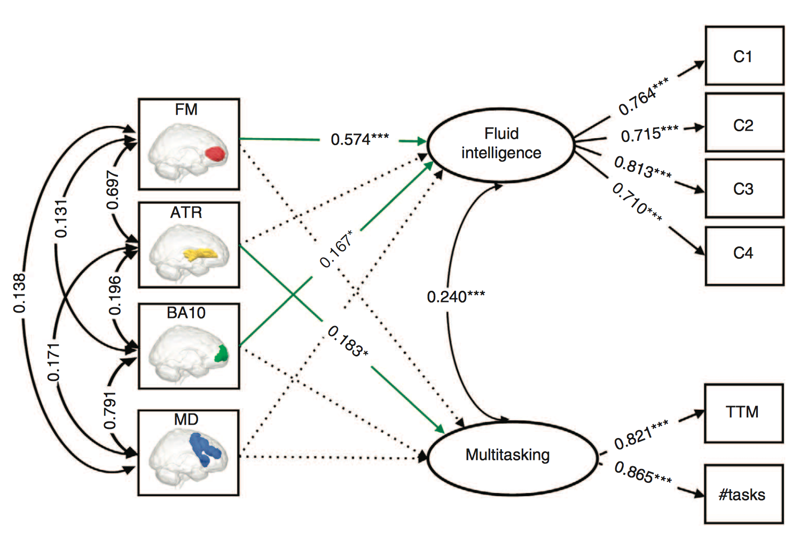
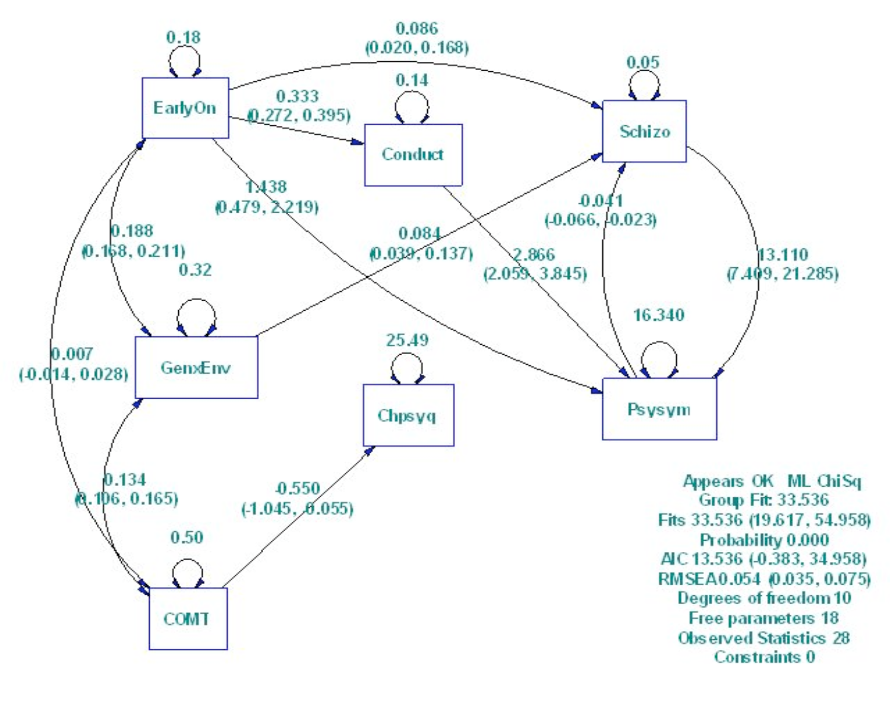

<style type="text/css">
body{ font-size: 24px; max-width: 1400px; margin: auto; padding: 1em; }
code.r{ font-size: 20px; }
</style>


```{r setup, include=FALSE}
if (!require(pacman)) { install.packages("pacman"); library(pacman) }
p_load(knitr, MASS, tidyverse, viridis, lavaan, modelr, mlbench, lattice, lm.beta, semPlot, DiagrammeR, matrixcalc, ggplot2,corrplot)
knitr::opts_chunk$set(echo = TRUE) #print code by default
options(digits=3) 


```


```{r, include=FALSE}
theme_set(theme_bw(base_size = 18))

plot_matrix <- function(matrix_toplot){
corrplot(matrix_toplot, is.corr = FALSE,
               type = 'lower',
               order = "original",
               tl.col='black', tl.cex=.75)
}
```

# Brief intro to SEM

Structural equation modeling (SEM) can be a very useful tool in determining relationships between variables. Often SEM is used in a "confirmatory" manner, when determining whether a certain model is valid (i.e., comparing the goodness-of-fit of nested models). We can even extend SEM to study interactions across groups. SEM is sometimes referred to as **causal modeling**, **path analysis (with latent variables)**, or **covariances structure analysis**. It subsumes a bunch of other techniques, like multiple regression, confirmatory factor analysis, ANOVA, etc. 

You supply the **observed relationship between variables** (i.e., the covariance or correlation matrix), the **# of observations**, and a **formal model specificiation**, and SEM basically **estimates parameters** that will give you the "best" reproduction of the **covariance matrix**. The better your model fit, the better your reproduction of the covariance matrix (hence, lower chi-squared = better model)!

## Mediation
For more information on how to conduct classic mediation with lavaan, check out the tutorial [here](http://lavaan.ugent.be/tutorial/mediation.html).

## Latent variables
Often we are interested in investigating **latent, abstract variables** (like "intelligence") by obtaining multiple observable measures (e.g., high school GPA, SAT and ACT scores). Using SEM we can easily include latent variables!

## Sample size
[Source](http://faculty.chass.ncsu.edu/garson/PA765/structur.htm)

SEM necessitates large sample sizes! In the literature, **sample sizes commonly run 200 - 400 for models with 10 - 15 indicators**. One survey of 72 SEM studies found the median sample size was 198. A sample of 150 is considered too small unless the covariance coefficients are relatively large. With over ten variables, sample size under 200 generally means parameter estimates are unstable and significance tests lack power.

One rule of thumb found in the literature is that **sample size should be at least 50 more than 8 times the number of variables in the model**. Mitchell (1993) advances the rule of thumb that there be 10 to 20 times as many cases as variables. Another rule of thumb, based on Stevens (1996), is to **have at least 15 cases per measured variable or indicator**. The researcher should go beyond these minimum sample size recommendations particularly when data are non-normal (skewed, kurtotic) or incomplete. Note also that to compute the asymptotic covariance matrix, one needs $\frac{k(k+1)}{2}$ observations, where $k$ is the number of variables.

## Lavaan in action
Kievit, R. A., Davis, S. W., Mitchell, D. J., Taylor, J. R., Duncan, J., Henson, R. N., & Cam-CAN Research team. (2014). Distinct aspects of frontal lobe structure mediate age-related differences in fluid intelligence and multitasking. *Nature communications, 5*.



"Following best practice in SEM, we first report our measurement model on the full sample of N=567 (for further details on the sample and model fitting, see Methods). For this model, **we hypothesize that two latent variables** (fluid intelligence and multitasking; tasks shown in Fig. 1, see Methods for more detail) capture the **covariance between the six behavioural variables** described in the Methods section, freely estimating every factor loading. This model fits the data well, $\chi^2$ = 15.40, degrees of freedom (df) = 8, P = 0.052, root mean square error of approximation (RMSEA) = 0.04 (0.00-0.070), comparative fit index (CFI) = 0.993, standardized root mean square residual (SRMR)=0.023, Satorra-Bentler scaling factor=1.009. As the **two latent factors are positively correlated** (standardized estimate = 0.325, Z = 6.17, P<0.001), **we can ask whether a more parsimonious model** with only a single cognitive factor (for example, 'executive function') shows better fit. Such a model would be compatible with a unitary perspective on the age-related decline of higher cognitive function. **However, this one-factor model fits very poorly**: $\chi^2$ =334.149, df=9, P<0.00001, RMSEA=0.252 (0.231-0.275), CFI = 0.685, SRMR = 0.121, Satorra-Bentler scaling factor = 1.109, **significantly worse than the two-factor model** ($\chi^2$ = 46.224, dfdiff = 1, P<0.00001)."

"For this reason, partial least squares is often considered a pragmatic alternative to the more principled, theory-driven SEM approach, which is why we here prefer the latter **to test our *a priori* conceptualization**"

"SEM were fit using the package Lavaan in R, plots were generated using ggplot2 (ref. 69). We used the following guidelines for judging good fit: RMSEA<0.05 (acceptable: 0.05-0.08), CFI>0.97 (acceptable: 0.95-0.97) and SRMR<0.05 (acceptable: 0.05-0.10) and report the Satorra-Bentler scaling factor for each fitted model. All models were fit using Maximum Likelihood Estimation using robust s.e., and report overall model fit using the Satorra-Bentler scaled test statistic"


# Lavaan steps & syntax

## Brief dataset description
Here we have data on environmental, behavioral, genetic, and control variables. The main environmental risk was **adolescent-onset use of cannabis** (`earlyon` = 1/0, i.e., yes/no). The variable, `schizo` (= 1/0), indexes whether or not a person is diagnosed with **schizophreniform disorder** at age 26, and `psysym` is a self-report of the **severity of psychotic symptoms** at that age. The specific gene used to define the genotypes was the **COMT gene**, which has two alleles, namely, valine (V) and methionine (M), that affect the level of dopamine activity. We can treat "genotype" as a quantitative variable (`COMT`) with values 0 (for MM individuals), 1 (for VM) and 2 (for VV). Many control variables were measured, such as, `chpsycq` a quantitative measure of the **severity of childhood psychotic symptoms**.

## Define your data!
Lavaan can take a **correlation** or **covariance matrix** (or even a dataframe) as input. Here, we have a covariance matrix. Remember to look at your data!

```{r fig.width=4, fig.height=4}
d = read.table("http://www.stanford.edu/class/psych253/data/comt-covar7.txt", sep = "\t")

d

lower = '
.183
.007 .500
.009 .001 .035
.556 .207 .018 13.025
.061 .010 -.007 .466 .164
.030 -.275 .096 .899 .216 25.646
.188 .134 .015 .695 .060 -.163 .321'

labels1 = c("EarlyOn", "COMT", "Schizo", "Psysym", "Conduct", "Chpsyq", "GenxEnv")
comt7.cov = getCov(lower, names = labels1); comt7.cov

plot_matrix(comt7.cov) 
```
<p>This plot shows the relative weight of the variance/covariance terms in our matrix.  Clearly, the variance of `chpsyq` is the largest in our matrix, which is consistent with the numbers above.

## Plan the model
Before running SEM, it's helpful to plan out your hypothesized "model" of how the variables are related. For instance, run `lm()` or `glm()` models to get a sense for relationships! Better yet, have a priori hypotheses before collecting data (based off of the literature, etc.), and you can generate your model before you even have data!

It's often helpful to sketch out your model beforehand, so grab a piece of paper (or find a whiteboard) for the homework, and use that to draw out your models! Remember that **circles** are used to describe **latent variables**, and **squares** for **observed variables**. Some predictor variables can be **exogenous**, meaning they are of "external origin" and their causes are not included in the model (i.e., no arrows are pointing towards it). The remaining variables are **endogenous** (e.g., a DV), meaning that they are the effects of other variables; in SEM, endogenous variables *can also predict other variables*!

Here we have a model that we want to recreate:


<p>

Notice in this path diagram, unlike the one shown above, there are no latent variables (i.e., no measurement model).  In this case we are only modeling the structural model (i.e., path analysis).  This is review from Week 3.

## Define the model

As a note, remember that the numbers of parameters you can estimate depends on the number of unique cells in your variance/covariance matrix.  That is, the number of diagonal terms plus the number of terms in *one* of the off-diagonal triangles (lower or upper, but not both).  This equates to: $k(k+1)/2$ where k is the number of manifest variables in your data. In the case of these data, $\# = 7(7+1)/2 = 28$ parameters that can be estimated.  

Similar to `lm()` and `lmer()`, etc., the model format has the DV on the left side of the operator, and the IV on the right side. In terms of the structural diagram, you could think of the arrow going from right to left. When the operator is a `~` this is regression, such that the DV(s) are "predicted by" the IV(s). When the operator is `=~` we are defining a latent variable, reading it like L is "measured by" IVs. Variances/covariances are specified with a `~~` (e.g., DV is "correlated with" DV), and intercepts are simple regression formulas with `1` as the predictor. We include all these formulas inside **single quotes**.

- **Regressions**
    - Y is predicted by X1 and X2: `Y ~ X1 + X2`
    - Y1 is predicted by X1, and Y2 is predicted by X1: `Y1 + Y2 ~ X1`

- **Latent Variables**
    - Latent variable L is measured by variables U and V: `L =~ U + V`

- **Variances & covariances**
    - The variance of X: `X ~~ X`
    - The covariance of X and Y1: `X ~~ Y1`
    - The covariance of X and Y2 is fixed at 0: `X ~~ 0*Y2`
    
- **Intercepts**
    - The intercept of X: `X ~ 1`

For some practice generating the structural plot and equations, go [here](http://www.stanford.edu/class/psych253/section/section_8/example_lavaan.html)!

```{r}
comt7.model1 = '
  Schizo ~ EarlyOn + GenxEnv + Psysym
  Psysym ~ EarlyOn + Conduct + Schizo
	Conduct ~ EarlyOn
	Chpsyq ~ COMT
'
```

In this model, we want to specify the following:

1. Schizo is predicted by: EarlyOn, GenxEnv, Psysym
1. Psysym is predicted by: EarlyOn, Conduct, Schizo
1. Conduct is predicted by: EarlyOn
1. Chpsyp is predicted by: COMT

Note that this model doesn't include any definitions of latent variables, or explicit variances/covariances. However, the variances can still be estimated, and the covariances between exogenous variables can still be estimated, as we'll see in a second!

## Fit the model

Once we have the model specified, the covariance matrix all set, and we know the number of observations (n=803 in this case), we can actually fit the model!

Note that as long as we have `fixed.x = F`, the model will estimate the variance, and covariance of your IVs as free parameters automatically. These parameters must be explicitly removed if you don't want them.  If our IVs were latent variables we could remove this argument as the variances and covariances among these variables would be automatically estimated.

```{r}
comt7.fit1 = sem(comt7.model1, fixed.x = F, 
                 sample.cov = comt7.cov, 
                 sample.nobs = 803) 

#if we were working with raw data, instead of a covariance matrix:
# comt7.fit1 = sem(comt7.model1, fixed.x = F, 
#                  data=data) 

```


## Analyze/visualize the model fit
```{r}
summary(comt7.fit1)

# Just the parameter estimates
parameterEstimates(comt7.fit1)

# Plot!
semPaths(comt7.fit1, what='std', 
         node.label.cex=5,
         edge.label.cex=1.25, curvePivot = TRUE, 
         fade=FALSE)
```

Looking at the model output, we can see that this model is not doing very well, since the estimated covariance matrix is significantly different from the actual covariance matrix, $\chi^2$(10) = 33.578, p < 0.001.

We can see, however, that we're also doing a pretty good job predicting things. As predicted from our original causal diagram, adolescent-onset use of cannabis (`EarlyOn`) significantly predicts whether or not a person is diagnozed w/schizophreniform disorder at age 26 (`Schizo`), z=2.3, p < 0.05. Schizo is also significantly predicted by GenxEnv and Psysym ($p$s < 0.05). So that's good! However, interpreting parameters in the context of a poorly fitting model is unadvisable.  So let's take a better look at where we're failing...


## Assess where you're messing up!

One way to do this is to plot the strength of the residuals.  Larger values (circles) suggest greater misfit (error) of our model . 
```{r}
plot_matrix(residuals(comt7.fit1)$cov)
residuals(comt7.fit1)
```

We might want to add in some relationship between Psysym and Chpsyq, or between Schizo and Chpsyq, or between Conduct and Chpsyq.

We can also evaluate misfit empirically by looking at modification indices, which tell us the amount of improvement in our model we would have if we were to estimate a given parameter. 

```{r}
mi = modificationIndices(comt7.fit1)
head(mi[order(-mi$mi), ], 10)  #shows the unestimated parameters with the ten highest modification indices
```

Here the "mi" column shows the decrease in the model chi-square that would occur if a given parameter was added. 

## Update the model
Let's add in Chpsyq predicting Schizo, and a covariance between Conduct and Chpsyq.
```{r}
comt7.model2 = '
  Schizo ~ EarlyOn + GenxEnv + Psysym + Chpsyq
  Psysym ~ EarlyOn + Conduct + Schizo
  Conduct ~ EarlyOn
  Chpsyq ~ COMT
  Conduct ~~ Chpsyq
'

comt7.fit2 = sem(comt7.model2, sample.cov = comt7.cov, sample.nobs = 803)
summary(comt7.fit2)
```

## Check if you improved
```{r}
anova(comt7.fit2, comt7.fit1)
```
This new model is doing significantly better than our first model! We have a lower AIC value, and our chi-squared is significantly lower! That means we're doing a better job reproducing the covariance matrix!  We also have a non-significant model chi-square now, suggesting this model fits the data well.  We can stop attempting to improve the model here.  

# Including latent variables (the measurement model) 

Holzinger and Swineford (1939) administered a battery of achievement tests to a sample of 145 grade-school-aged children in a Chicago school.  Nine of these tests include the following:

    1) Visual perception
    2) Shape identification
    3) Cube sorting
    4) Paragraph completion
    5) Sentence completion
    6) Words in a minute
    7) Addition
    8) Dot counting 
    9) Capitalization recognition
    
We might hypothesize that some number of latent achievement factors underlie these 9 indicators.  Based on theory, we believe that a capacity for Visual Information Processing (VIS), Processing Speed (SPEED), and Verbal Capacity (VERB) are each important achievement markers that we are interested in among young students.  We hypothesize that the first 3 tests measure VIS, the second 3 VERB, and the last 3 SPEED.  Let's confirm this assumption by examining the correlation matrix among our nine variables to see if these indicators seem to hang together as we hypothesized.   

## Reading in the correlation matrix:

```{r}

cor2B <-'1.0
        .318 1.0
        .436 .419 1.0
        .335 .234 .323 1.0
        .304 .157 .283 .722 1.0
        .326 .195 .350 .714 .685 1.0
        .116 .057 .056 .203 .246 .170 1.0
        .314 .145 .229 .095 .181 .113 .585 1.0
        .489 .239 .361 .309 .345 .280 .408 .512 1.0'  
cor2B <- getCov(cor2B, names=c("vis", "cub", "shape", "para","sent", "word", "add", "count", "cap")) #create cor matrix object
cor2B #print cor matrix
plot_matrix(cor2B) #visualize the cor matrix

```

## Measurement component

It appears that so far our assumptions about the latent structure of these data are relatively accurate.  However, we will want to formally test our hypotheses using factor analysis.  This will be an important first step before we examine any causal paths among our constructs.

Let's run a CFA of our data, testing this 3-factor structure.  

```{r}

ach.model1<-'

#measurement model
VIS=~vis+cub+shape
VERB=~para+sent+word
SPEED=~add+count+cap
'

ach.cfa1<-sem(ach.model1,sample.cov=cor2B,sample.nobs=145,std.lv=T) #std.lv=T fixes factor var to 1 (UVI)

summary(ach.cfa1)
semPaths(ach.cfa1)

```

(For pedagogical purposes, let's compare this model with a model using ULI, instead of UVI:)

```{r}

ach.model1b<-'

#measurement model
VIS=~vis+cub+shape
VERB=~para+sent+word
SPEED=~add+count+cap
'

ach.cfa1b<-sem(ach.model1b,sample.cov=cor2B,sample.nobs=145,std.lv=F) #std.lv=F requires that the first indicator of each factor is fixed to 1 (UVI)

summary(ach.cfa1b)
```
(We see that the model has identical fit.)


It appears that our model does not adequately capture our data.  However, examining the standardized loadings of our indicators suggest that each is doing a pretty good job of reflecting the underlying achievement constructs:

```{r}
inspect(ach.cfa1,"std")
```

Perhaps we have incorrectly assumed *simple structure* (i.e., no "complex indicators" which  load on more than one factor).  We can examine the modification indices of our model to see if we should free up any cross-loadings in this case.  

```{r}
mi = modificationIndices(ach.cfa1)
head(mi[order(-mi$mi), ], 10)
```
The first two suggested parameters appear relatively similar in terms of improving model fit. `add ~~ count` would estimate correlated errors between the addition and dot counting indicators.  `VIS =~ cap` would allow the capitalization recognition indicator to load not only on Processing Speed but also on Visual Information Processing.  Given the content of this test and our understanding of these constructs based on theory, we elect to free the second of these two parameters in a subsequent model.  This will eliminate the *simple structure* of our model.  (Note, if we were to have freed the correlation between errors of `add` and `count`, we would have eliminated the *local independence* assumption.  This will produce off-diagonal elements in the theta-epsilon matrix, making this no longer simply a diagonal matrix.)  

```{r}

ach.model2<-'

#measurement model
VIS=~vis+cub+shape+cap  #adding cap to load on VIS as a complex indicator
VERB=~para+sent+word
SPEED=~add+count+cap
'

ach.cfa2<-sem(ach.model2,sample.cov=cor2B,sample.nobs=145,std.lv=T) #std.lv=T fixes factor var to 1 (UVI)

summary(ach.cfa2)
semPaths(ach.cfa2)

```
<p>
Aha!  Our model now provides good fit to the data. Notice also that this model is identified as it satisfies Rule 9.3 for identification of models with complex indicators.  

## Adding in the structural component

Now, suppose that we also assume that these three underlying constructs (VIS, VERB, and SPEED) are related *causally* to each other.  Currently we have only estimated nondirectional covariances among the three constructs (done by default in the `sem()` function).  Rather, we might hypothesize that visual processing and processing speed *contribute* to verbal capacity.  Thus, we would also like to include directed structural paths among our constructs in our model.  In order to both estimate latent constructs and examine relations between them, we will need a full SEM analysis.   


```{r}

ach.model3<-'

#measurement model
VIS=~vis+cub+shape+cap
VERB=~para+sent+word
SPEED=~add+count+cap

#structural model
VERB~SPEED+VIS
'

ach.cfa3<-sem(ach.model3,sample.cov=cor2B,sample.nobs=145,std.lv=T)

summary(ach.cfa3)
semPaths(ach.cfa3)
```
<p>
Notice that our model has identical fit to the previous model.  Why is this?  Our model output suggests that the covariance between our endogenous variables SPEED and VIS has been estimated, despite us not including this explicitly in the model.  This is a result of the `sem()` function attempting to include all relevant covariances among latent factors in our model.  However, the consequence of this is that we (as before) have a "just identified" structural component to our model. We would prefer an overidentified structural component, as this would provide more parsimony.  Let's try forcing lavaan to remove the covariance between SPEED and VIS.  (However, we may be concerned about doing so, given that this parameter is highly significant in our output.)


```{r}

ach.model4<-'

#measurement model
VIS=~vis+cub+shape+cap
VERB=~para+sent+word
SPEED=~add+count+cap

#structural model
VERB~SPEED+VIS

#removing the covariance between SPEED and VIS
VIS~~0*SPEED
'

ach.cfa4<-sem(ach.model4,sample.cov=cor2B,sample.nobs=145,std.lv=T)

summary(ach.cfa4)
semPaths(ach.cfa4)
```

Unfortunately, this has caused a significant reduction in our model fit, which we can confirm statistically with an anova test:

```{r}
anova(ach.cfa3,ach.cfa4)
```

In sum, this, in combination with the nonsignificant estimate of VERB regressed onto SPEED, suggests that our initial hypothesis is not supported by the data.  Perhaps we can examine an alternative model that may better represent our data.  We notice that in the output the VERB~VIS and VIS~~SPEED parameters are both significant.  It is possible that visual acuity is a necessary foundational capacity contributing to both processing speed and linguistic functioning.  This makes sense, given the need to visually encode information prior to higher-order executive functions that utilize visual input.  Let's test a model in which VIS is a cause of both SPEED and VERB.  However, to avoid a just-identified model, we also require the covariance between SPEED and VERB (after being regressed on VIS) to be zero.

```{r}

ach.model5<-'

#measurement model
VIS=~vis+cub+shape+cap
VERB=~para+sent+word
SPEED=~add+count+cap

#structural model
VERB+SPEED~VIS

#removing the covariance between VERB and SPEED
VERB~~0*SPEED
'

ach.cfa5<-sem(ach.model5,sample.cov=cor2B,sample.nobs=145,std.lv=T)

summary(ach.cfa5)
semPaths(ach.cfa5)
```

This model provides good fit to the data, suggesting the potential general causal influence of visual processing on both processing speed and verbal capacity.

## Wrench in the works

It is worth noting (and complicates matters considerably) that based on the results of Model 3, we might also have hypothesized that processing speed contributes to visual information processing, which in turn contributes to verbal capacity (SPEED&rarr;VIS&rarr;VERB).  If we were to test this model, we would discover *identical* model fit.  This result points out the important caveat to SEM that there will always be at least one other testable model that provides statistically identical fit to a model of interest.  In this case, both a combination of theory and the real-life properties of the data (e.g., longitudinal data) are necessary in order to determine which model may be most appropriate.  However, you should always remember that another equally tenable process may be producing the data you have collected.      

```{r, include=FALSE}

ach.model5b<-'

#measurement model
VIS=~vis+cub+shape+cap
VERB=~para+sent+word
SPEED=~add+count+cap

#structural model
VIS~SPEED
VERB~VIS

#note: sem() will *not* attempt to covary an endogenous with an exogenous variable
'

ach.cfa5b<-sem(ach.model5b,sample.cov=cor2B,sample.nobs=145,std.lv=T)

summary(ach.cfa5b)
semPaths(ach.cfa5b)
```


# A more complicated example
Here, Sadler & Woody (2003) test an interpersonal theory of dyadic interaction: Person M's 'behavior' when interacting with person F (i.e., M's situational behavior) is influenced by (i) M's long-term tendency to elicit the behavior (i.e., M's behavioral trait), and (ii) F's situational behavior. The same is assumed true for F. 

The four variables, trait and behavior for each of M and F, are represented as **latent variables** that can be measured in multiple ways. "Reciprocal influence" is conceptualized as M's situational behavior influencing F's situational behavior, and vice versa. In this study, M and F were strangers, so M's trait (which is unknown to F) couldn't affect F's situational behavior. However, if M and F were friends, such links would be expected to be significant and should be included in the model. Trait is measured by self-report and a friend's report; and situational behavior is rated by self, partner and an observer. Rater biases are introduced through the use of covariance arrows.

## Variable coding:
1. Female or male (M/F)
2. Situational or trait (S/T)
3. Observer, partner, friend, or self rating (O/I/F/S)
4. Rating (R)

## Load in data

```{r}
low.dom = '
1
.415 1
.460 .351 1
-.321 -.374 -.310 1
-.239 -.221 -.133 .626 1
-.185 -.164 -.272 .533 .345 1
.349 .307 .496 -.180 -.081 -.067 1
.308 .302 .562 -.222 -.156 -.118 .573 1
.038 -.115 -.048 .296 .167 .320 .008 -.036 1
-.072 -.160 -.124 .317 .167 .248 -.152 -.175 .414 1 
'
labels1 = c("FSOR", "FSIR", "FSSR", "MSOR", "MSIR", "MSSR", "FTFR", "FTSR", "MTSR", "MTFR")
dom.cov = getCov(low.dom, names = labels1)
plot_matrix(dom.cov)
```

Notice that since these covariance units are *standardized* (i.e., correlation matrix), they are all similar to each other (between -1 and 1) and therefore we see a *lot* more circles on the grid than in our first dataset, which was unstandardized and had a much wider range. 

## Unconstrained paths

Here, we have latent variables that are measured by observed variables. Specifically, female trait dominance (FTD) is measured by friends and self trait ratings (FTSR and FTFT). Similarly, female situational dominance (FSD) is measured by self, informant (partner), and observers' ratings. The same is true for males. Thus, we'll have to define these latent variables in the model, and then see how these latent variables are predicted by other latent variables!

We want to estimate the paths A and B (the effect of the individuals' traits on their situational behavior) and C and D (the effects of individuals' situational behavior on each other). Let's first allow these paths to be unconstrained (i.e., we can get a different estimate for each path).

```{r}
dyad.model1 = '
  # Latent variable definitions for trait, FTD & MTD, and situation, FSD & MSD	
	FTD =~ FTSR + FTFR
	MTD =~ MTSR + MTFR
	FSD =~ FSSR + FSIR + FSOR
	MSD =~ MSSR + MSIR + MSOR
	
	# regressions
	FSD ~ FTD + MSD
	MSD ~ MTD + FSD
	 
	# variances and covariances
	# Residual correls among M ratings, MTSR, MSSR, FSIR as we assume that ratings will be similar within men
	MTSR ~~ FSIR
  MSSR ~~ FSIR
	MSSR ~~ MTSR
	
	# Residual correls among F ratings, FTSR, FSSR, MSIR as we assume that ratings will be similar within women
	FTSR ~~ MSIR
  FSSR ~~ MSIR
	FSSR ~~ FTSR
	
	# Residual correls among Observer situational ratings, MSOR, FSOR	
	MSOR ~~ FSOR	
'
```

```{r}
dyad.fit1 = sem(dyad.model1, fixed.x = F, sample.cov = dom.cov, sample.nobs = 112)
summary(dyad.fit1) #good p value
semPaths(dyad.fit1, what='std', 
         node.label.cex=5,
         edge.label.cex=1.25, curvePivot = TRUE, 
         fade=FALSE)
```

This model is ok, but let's see if we can get a simpler model that works! Let's try taking out most of the covariance terms.  Notice that rather than building *up* to a more complicated better model as in the previous example, we are trimming *down* to a more parsimonious better model.


```{r}
dyad.model2 = '
  # Latent variable definitions for trait, FTD & MTD, and situation, FSD & MSD	
	FTD =~ FTSR + FTFR
	MTD =~ MTSR + MTFR
	FSD =~ FSSR + FSIR + FSOR
	MSD =~ MSSR + MSIR + MSOR
	
	# regressions
	FSD ~ FTD + MSD
	MSD ~ MTD + FSD
	 
	# Residual correls among M ratings, MTSR, MSSR
	MSSR ~~ MTSR
	
	# Residual correls among F ratings, FTSR, FSSR
	FSSR ~~ FTSR
'
dyad.fit2 = sem(dyad.model2, fixed.x = F, sample.cov = dom.cov, sample.nobs = 112) 
summary(dyad.fit2) # Wow, even better !

semPaths(dyad.fit2, what='std', 
         node.label.cex=5,
         edge.label.cex=1.25, curvePivot = TRUE, 
         fade=FALSE)

anova(dyad.fit1,dyad.fit2)
```

This simpler model is definitely the better one! We have more dfs (fewer parameters estimated), a lower AIC, and then $\chi^2$ isn't significantly worse!

## Constrained paths
Let's see if the effects of one's partner's situational dominance on one's own situational dominance doesn't differ depending on which partner you are.  We want to constrain the paths in which M's situational dominance (MSD) predicts F's situational domainance (FSD) and vice versa to be equal.  We have 1 less parameter to estimate if we constrain them to be the same, so it would be more parsimonious if we can have a constrained model!  Notice that the estimates of these parameters in the previous models we have run are nearly identical, given us confidence that this approach may be well-founded.

Using the `*` operator below "names" the regression coefficient. This is useful mainly because if we give two coefficients the same name, the function automatically constrains them to be the same.  

```{r}
dyad.model3 = '
  # Latent variable definitions for trait, FTD & MTD, and situation, FSD & MSD	
	FTD =~ FTSR + FTFR
	MTD =~ MTSR + MTFR
	FSD =~ FSSR + FSIR + FSOR
	MSD =~ MSSR + MSIR + MSOR
	
	# regressions
	FSD ~ FTD + a*MSD  #constraining paths to be equal
	MSD ~ MTD + a*FSD  #constraining paths to be equal
	 
	# Residual correls among M ratings, MTSR, MSSR
	MSSR ~~ MTSR
	
	# Residual correls among F ratings, FTSR, FSSR
	FSSR ~~ FTSR
'

dyad.fit3 = sem(dyad.model3, fixed.x = T, sample.cov = dom.cov, sample.nobs = 112) 
summary(dyad.fit3)

anova(dyad.fit1,dyad.fit2,dyad.fit3) 

```

It appears that constraining these parameters to be equal improved our model fit.  So they probably aren't actually different.

## Wrapping up

```{r}

semPaths(dyad.fit3, what='std', 
         node.label.cex=5,
         edge.label.cex=1.25, curvePivot = TRUE, 
         fade=FALSE)
```
<p>
In the end, then, we see that trait dominance predicts situational dominance for both men and women, although this relationship appears stronger in women than men.  

We also see that there is no significant association between men and women's *trait* dominance, but there is a small-to-moderate significant negative relationship between men and women's *situational* dominance, suggesting that when one partner is more dominant, the other acts less so (consistent with interpersonal theory of complementarity).

Our model trimming approach suggests that men and women report on each others' level of situational dominance in *different* (uncorrelated) ways, suggesting that informant reports and self-reports of the same person's behavior may be unrelated in this context.

Finally, we have relaxed the local independence assumption in terms of self-reported trait and situational assessments of dominance, suggesting that beyond the effect of the latent dominance constructs themselves, these variables are related purely based on shared variance due to the self-report assessment method.  
