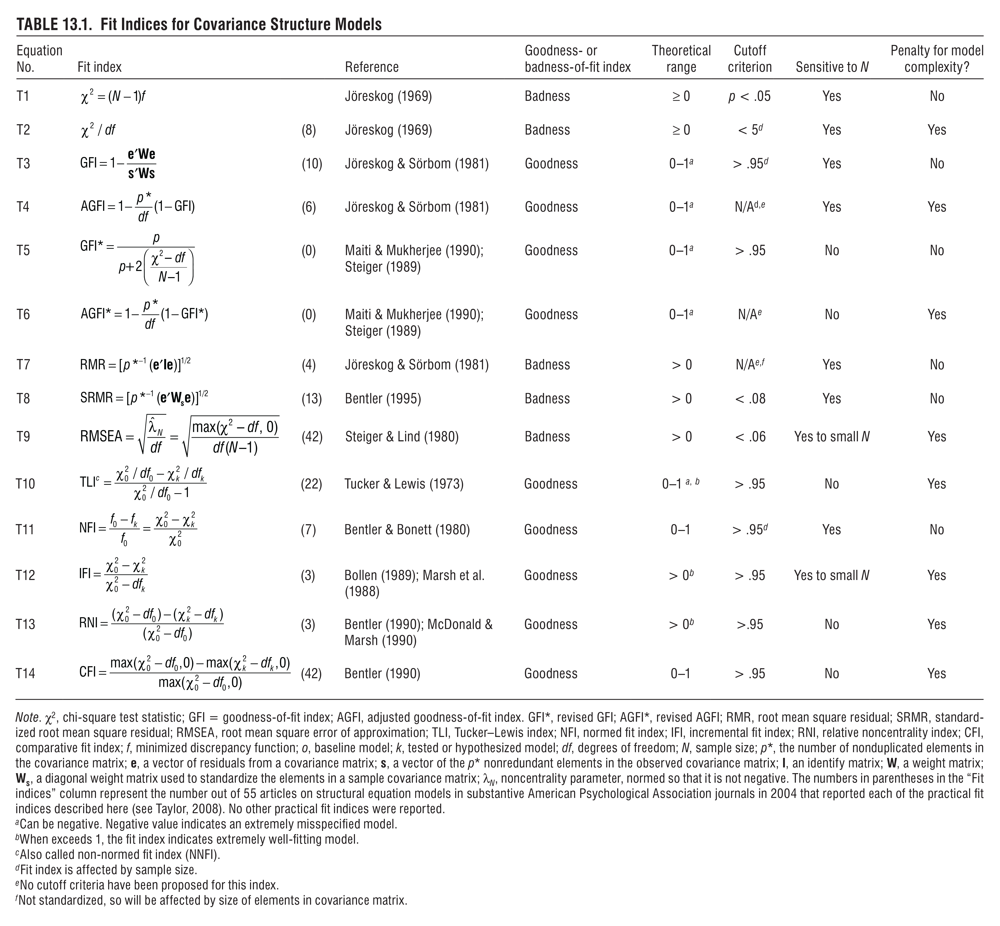

<style type="text/css">
body{ font-size: 20px; max-width: 1600px; margin: auto; padding: 1em; }
code.r{ font-size: 20px; }
p { padding-top: 10px; padding-bottom: 10px; }
pre { font-size: 16px; }
</style>


```{r setup, include=FALSE}
if (!require(pacman)) { install.packages("pacman"); library(pacman) }
p_load(knitr, MASS, tidyverse, viridis, lavaan, modelr, mlbench, lattice, lm.beta, semPlot, DiagrammeR, matrixcalc, psych)
knitr::opts_chunk$set(echo = TRUE) #print code by default
options(digits=3)
set.seed(15092) #to make simulated data the same across computers

#small function to plot all SEM diagrams using
semPaths_default <- function(lavObject, sizeMan=11, ...) {
  require(semPlot)
  semPaths(lavObject, nCharNodes = 0, sizeMan=sizeMan, sizeMan2=4, sizeLat = 13, sizeLat2=7, ...)
}

```

# Global fit

Measures of global fit in SEM provide information about how well the model fits the data. Importantly, these statistics attempt to quantify the overall recovery of the observed data without typically considering specific components of fit or misfit in each element of the mean and covariance structure.

Global fit statistics can be divided into *absolute* and *comparative* fit indices. Absolute indices are often a function of the test statistic $T$, which quantifies global fit to the population covariance structure (see model chi-square goodness of fit below). Absolute fit indices can also be a function of the model residuals.

Comparative fit indices compare a candidate model (specified by you) against a *baseline* model, which is a minimal model containing only *variances* for observed endogenous variables, but not covariances among them. Thus, the baseline model represents the view that there are no meaningful relationships among variables. Comparative fit indices describe how much better your model fits the data compared to this *independence* representation.

Global fit statistics can also be divided into tests of *goodness* versus *badness* of model fit, so it's important to remember what are acceptable ranges for each.

## Matrix expression of CFA
$$
\boldsymbol{\Sigma} = \boldsymbol{\Lambda}_y \boldsymbol{\Psi} \boldsymbol{\Lambda}_y' + \boldsymbol{\Theta}_\varepsilon
$$

Reminders about SEM parameterization:

1.  The number of observed variables (sometimes called 'observations') is $k$.
2.  The sample covariance matrix, estimated in a sample of $N$ individuals, is $\boldsymbol{S_{XX}}$.
3.  The population covariance matrix (unknown) is denoted $\boldsymbol{\Sigma}$.
4.  The model-implied covariance matrix, given $q$ free (estimated) parameters, is $\hat{\boldsymbol{\Sigma}}({\boldsymbol{\theta}})$.
5.  The number of unique elements in a covariance matrix is: $p = k (k+1) / 2$.
6.  SEM tries to minimize the discrepancy between $\boldsymbol{S_{XX}}$ and $\hat{\boldsymbol{\Sigma}}({\boldsymbol{\theta}})$ according to an objective (fit) function: $F = (\textbf{s} - \hat{\boldsymbol{\sigma}}(\theta))' \boldsymbol{W}^{-1} (\textbf{s} - \hat{\boldsymbol{\sigma}}(\theta))$.
7.  In standard ML estimation, the objective function is: $\hat{F} = \textrm{log} | \hat{\boldsymbol{\Sigma}}({\boldsymbol{\theta}}) | + \textrm{tr} | \boldsymbol{S_{XX}} \hat{\boldsymbol{\Sigma}}({\boldsymbol{\theta}})^{-1} | - \textrm{log} | \boldsymbol{S_{XX}} | - k$.

## Model chi-square goodness of fit

The model $\chi^2$ test is the most common global fit index in SEM and is a component of several other fit indices. It is a test of the null hypothesis that the model-implied covariance matrix $\hat{\boldsymbol{\Sigma}}({\boldsymbol{\theta}})$ equals the population covariance $\boldsymbol{\Sigma}$. Therefore, we would prefer *not* to reject the null hypothesis since doing so would be indicative of misfit.

In standard ML, model $\chi^2$ is computed as the product of the minimum value of $\hat{F}$ estimated in the optimization algorithm (often expectation-maximization [EM]). 
That is, the minimum value, denoted $f$, represents the fit of the model to the data given a vector of parameters with the greatest *sample likelihood*. The model $\chi^2$ is then computed:

$$
T = (N-1) f
$$
which is (asymptotically) distributed as $\chi^2$ with $df = p - q$. Thus, we can test the null hypothesis of perfect model fit in the population given value $T$ and $df$. People often test this hypothesis at $\alpha = .05$, but as we will discuss below, the $\chi^2$ test can be 'significant' in cases where there is only trivial misfit, especially in large samples.

### Assumptions of chi-square test

1.  Observed variables are distributed as multivariate normal.
2.  $N$ is sufficiently large (approx. 150+ observations).
3.  None of the tested parameters is at a boundary or invalid (e.g., variance of zero).

### Relationship to likelihood ratio test (LRT)

The model $\chi^2$ is a specific case of a likelihood ratio test (LRT) in which two models are compared according to differences in their log likelihoods (LL) and degrees of freedom. In the case of the model $\chi^2$ test, we are comparing the fit of our proposed SEM against the perfect fit of a *saturated* model, which estimates all variances and covariances individually (i.e., using $p$ parameters).

More generally, LRTs can be used to test fit differences in *nested models*, where model A is considered nested in model B if the free parameters of A are a subset of the parameters in B. In this situation, the difference in model fit can be computed as the *difference* in model $\chi^2$ values, which is also distributed according to a $\chi^2$ distribution. The degrees of freedom for a nested LRT is the difference in the individual degrees of freedom for each model:

$$
\begin{align*}
\Delta \chi^2 &= \chi^2_\textrm{Fewer} - \chi^2_\textrm{More} \\
\Delta df &= df_\textrm{Fewer} - df_\textrm{More}
\end{align*}
$$
where $Fewer$ refers to the model with fewer parameters that is nested in the $More$ model. 

### Comparing candidate models against a saturated model

Let's walk through an example. Say that we are interested in how well fear of global warming (FoGWar) and concern for animal welfare (CoAWe) predict donations to charities involved in environmental protection. We measure FoGWar and CoAWe using two self-report scales with four items each. We measure donations in terms of total dollars to five large charities most involved in environmental protection (i.e., observed variable). We predict that latent standing (factor scores) on both FoGWar and CoAWe will be associated with greater donations.

#### Simulate data along these lines

```{r}
demo.model <- '

l_FoGWar =~ .8*FoGWar1 + .8*FoGWar2 + .8*FoGWar3 + .8*FoGWar4  #definition of factor FoGWar with loadings on 4 items
l_CoAWe =~ .8*CoAWe5 + .8*CoAWe6 + .8*CoAWe7 + .8*CoAWe8  #definition of factor CoAWe with loadings on 4 items

l_FoGWar =~ .2*CoAWe5 #small cross-loading

donations ~ 0.3*l_FoGWar + 0.3*l_CoAWe

l_FoGWar ~~ 0.4*l_CoAWe

#equal (unit) residual variance
FoGWar1 ~~ 1*FoGWar1
FoGWar2 ~~ 1*FoGWar2
FoGWar3 ~~ 1*FoGWar3
FoGWar4 ~~ 1*FoGWar4
CoAWe5 ~~ 1*CoAWe5
CoAWe6 ~~ 1*CoAWe6
CoAWe7 ~~ 1*CoAWe7
CoAWe8 ~~ 1*CoAWe8
'

# generate data; note, standardized lv is default
simData <- lavaan::simulateData(demo.model, sample.nobs=500)

round(cor(simData), 2)
```

#### Fit a saturated model

```{r}
#pairwise combinations of observed variables
pairwise <- combn(x = names(simData), m = 2)
msat.syntax <- paste(apply(pairwise, 2, function(pair) { paste(pair, collapse="~~")}), collapse="\n")

msat <- sem(msat.syntax, simData)

```

First, let's check the parameterization of the saturated model. Is it identified? How many degrees of freedom?

```{r}
inspect(msat)
```

Next, let's examine fit and parameter values:

```{r}
summary(msat, fit.measures=TRUE, standardized=TRUE)
semPaths_default(msat, layout="circle")
```

Note that the $LL$ for our model (notated `H0`) is identical to the saturated model implicitly fit by `lavaan` (notated `H1`). This is because we explicitly fit a saturated model, though any *just identified* model would have equivalent fit. So, yes, the saturated model is just identified ($df = 0$), and it has 45 free parameters.

#### Fit the *true* SEM model that we used to generate the data

Note that in real life, we never know the 'true' model. To make this example more like real data, I've simulated the data with a small cross loading of `CoAWe5` (the first item on the concern for animal welfare scale) onto the fear of global warming factor. Here, we include this in the SEM to verify that we have a good fit to the data when we use a good  model (the groundtruth in this case).

```{r, fig.width=12, fig.height=6}
msem.syntax <- '
l_FoGWar =~ FoGWar1 + FoGWar2 + FoGWar3 + FoGWar4  #definition of factor FoGWar with loadings on 4 items
l_CoAWe =~ CoAWe5 + CoAWe6 + CoAWe7 + CoAWe8  #definition of factor CoAWe with loadings on 4 items

l_FoGWar =~ CoAWe5 #allow small cross-loading

donations ~ l_FoGWar + l_CoAWe #predict criterion based on SEM

l_FoGWar ~~ l_CoAWe
'

msem <- sem(msem.syntax, simData)
semPaths_default(msem)
```

What about identification and parameterization?

How many free parameters do we have?

```{r}
inspect(msem)
```

```{r}
summary(msem, fit.measures=TRUE, standardized=TRUE)
```

We see strong evidence of global fit: we do not reject the model $\chi^2$, CFI is > .95, RMSEA is < .06 (and its confidence interval does not include .06), and SRMR is < .08. Thus, at a global level, this model characterizes the data well.

#### Compare the saturated model with the candidate model

Let's compare the saturated model against the specified two-factor SEM. Technically, all SEM models are nested in the saturated model.

```{r}
anova(msat, msem)
```

Notice how the LRT exactly equals the model chi-square test of the two-factor SEM specified above. This is because the model chi-square test is a nested model comparison against the saturated model. An important point is that our candidate model has 24 fewer parameters than the saturated model but does *not* fit significantly worse. That's evidence of a good fit:parsimony tradeoff.

#### Compare a slightly simpler nested model

What about a nested model in which we remove one of the measurement parameters? In particular, the cross-loading is an interpretive nuisance (not simple structure). Let's remove the cross-loading. We are fixing this path to be exactly zero, which means that we are estimating one less parameter, but the rest of the model structure is the same. Thus, the simpler (reduced) model is *nested* in the more complex model.

```{r}
mnested.syntax <- '
l_FoGWar =~ FoGWar1 + FoGWar2 + FoGWar3 + FoGWar4  #definition of factor FoGWar with loadings on 4 items
l_CoAWe =~ CoAWe5 + CoAWe6 + CoAWe7 + CoAWe8  #definition of factor CoAWe with loadings on 4 items

donations ~ l_FoGWar + l_CoAWe #predict criterion based on SEM

l_FoGWar ~~ l_CoAWe
'

mnested <- sem(mnested.syntax, simData)
summary(mnested, fit.measures=TRUE, standardized=TRUE)
```

Note that the model chi-square is still non-significant, suggesting good fit relative to the population covariance matrix. But is the fit worse than the model that includes the cross-loading?

```{r}
anova(msem, mnested)
```

No, we do not see a significant degradation in fit by excluding the cross-loading parameter, suggesting we should retain the model with simple structure. That is, the LRT $p$ value of .15 suggests that the model with a freed cross-loading parameter is not *significantly* better than the model that the model with simple structure.

### Challenges of using the model chi-square test

Although the model $\chi^2$ is a common and useful test of global fit, it is not without flaws. Foremost among these is that the power to detect trivial misfit increases toward 1.0 as the sample size $N$ increases. That is, in large samples, we will reject the null hypothesis of good fit even if the model is excellent. This problem applies to comparison among nested SEMs using the LRT (difference in $\chi^2$) approach, too.

A related problem is that overemphasis on model $\chi^2$ may lead some researchers to prefer small samples in which the null hypothesis (of good fit) is not rejected. However, in small samples, parameters will be poorly estimated, and it is the parameters, not fit tests, that are usually of substantive interest. Thus, there is a risk of encouraging bad scientific practices (collecting small samples to avoid rejection the model $\chi^2$ test).

A second problem is that the model statistic $T$ does not follow a $\chi^2$ distribution if the data are not multivariate normal or when $N$ is small (see assumptions above). There have been additional developments in the SEM literature for estimators that are robust to non-normality, especially the Satorra-Bentler correction to the $\chi^2$

A third problem is that in small samples, even when other assumptions are met, the model $\chi^2$ test can reject the null hypothesis even when the model fits well... so yeah, you can't win (reject with small or large $N$)! On top of that, in small samples, the test can fail to detect serious misfit.

## tl;dr summary of global fit statistics

Altogether, many of the other fit indices that have been developed for SEM try to overcome dependence on $N$. Here's the tl;dr synopsis from the West et al. chapter.



The minimal set suggested by Kline (and I agree) is:

1.  Model $\chi^2$ along with its $df$ and $p$.
2.  standardized root mean residual (SRMR): .08 or less.
3.  root mean squared error of approximation (RMSEA), along with 90% CI: .06 or less
4.  comparative fit index (CFI): .95 or greater.

## $\chi^2/df$ ratio

The ratio of misfit, quantified by $\chi^2$, to the model degrees of freedom, $df$, is an absolute fit index. The intuition is that for every free parameter *removed* from the model, the $\chi^2$ should increase by about 1.0. That is, the expected value of $\chi^2$ for a correct model is $df$. Thus, in larger, more complex models, this ratio may be more indicative of fit than the $\chi^2$. The $\chi^2$, which is proportionate to the sample likelihood, is sensitive the case where there are many trivial deviations between the sample covariance matrix and the model-implied covariance matrix. Like $R^2$ in regression, penalties for these deviations can never be negative, so the model $\chi^2$ can become quite large in models with many free parameters.

The $\chi^2/df$ ratio is intended to help correct for such problems. Rules of thumb for this ratio in well-fitting models are 5, 4, or sometimes even 2. As the ratio approaches zero, we believe the model is a poor description of the data. Importantly, $\chi^2/df$ is a *badness of fit* index such that we become concerned at lower values, but there is no upper bound that is ideal. Also, because of the sample size dependence of $\chi^2$, the $\chi^2/df$ ratio is also dependent on $N$, leading it to be more of an ad hoc heuristic than a go-to fit index.

## GFI and AGFI

The Goodness-of-Fit Index (GFI) and Adjusted Goodness-of-Fit Index (AGFI) provide an absolute metric for how well the model describes the data. The GFI is conceptually related to the proportion of variance explained by the model, as in regression. Thus, it ranges between 0 (bad) and 1 (perfect).

The AGFI extends this metric by adjusting for the $df$ of the model, downweighting *goodness* in proportion to the number of free parameters. This is analogous to adjusted $R^2$ in regression, where a model with many predictors is penalized in its overall explanatory power because of the positive variance explained by each.

Although these are reasonable metrics, they are not often used in practice.

## RMR and SRMR

The root mean residual (RMR) and standardized root mean residual (SRMR) provide an estimate of the average misfit for each estimated versus observed variance/covariance parameter. That is, the RMR quantifies the square root of the average of the squared residuals comparing the model-implied covariance matrix and observed covariance matrix:

$$\sqrt{\sum_p (\hat{\boldsymbol{\Sigma}}({\boldsymbol{\theta}})_p - \boldsymbol{S}_p)^2 } $$

where $p$ is my sloppy notation for the *p*th unique element of the covariance matrix. Note that this gives an intuitive estimate of the level of average misfit in the model-implied covariance matrix in the units of the original data. The RMR is most interpretable when all variables are on a similar scale. RMR is a badness of fit index in that large values are indicative of misfit.

One virtue of RMR is that it is not sensitive to variables with small unique (residual) variances. The weighting procedure of many other fit measures (e.g., CFI or GFI) can misstate the badness of fit in this case.

The SRMR solves the problem of scaling the metric of RMR. Because RMR is in the original units, it is not comparable across studies and is hard to interpret when the variances of variables are disparate. The SRMR standardizes the average residuals in terms of the magnitude of elements in $\boldsymbol{S_{XX}}$. Thus, it ranges between 0 and 1, where 1 represents residuals that are as large, on average, as a given element of the sample covariance matrix.

The rule of thumb for SRMR is < .08.

## RMSEA

The root mean squared error of approximation (RMSEA) is a badness of fit index that quantifies level of approximate fit (as opposed to perfect fit in model $\chi^2$). The RMSEA seeks to examine whether a model exceeds a reasonable level of *close* fit to the data, which would indicate misfit. It is based on the fact that the null hypothesis test (model $T$) follows a $\chi^2$ distribution, whereas evidence for the alternative follows a non-central $\chi^2$ distribution, whose non-centrality is governed by a parameter $\lambda$.

Conceptually, RMSEA penalizes more complex models by dividing the non-centrality term by the degrees of freedom. This is a form of a parsimony-adjusted index such that simpler models are preferred. Furthermore, RMSEA is in the same units as SRMR, namely the size of the average element in $\boldsymbol{S_{XX}}$. Thus, it ranges from 0-1. Values above .10 indicate serious misfit. Values below .06 are considered good.

Many people encourage the best practice of reporting a 90% CI on RMSEA to see how close the model is to the boundary of misfit. Some programs also report a test on the null hypothesis that RMSEA is less than or equal to .05. One hopes not to reject this hypothesis since low RMSEA is a good thing.

*Mechanics of RMSEA*

Close fit is defined as:

$$
\hat{\Delta}_M = \textrm{max}(0, \chi^2_M - df_M)
$$

When the $\chi^2_M$ is less than $df_M$, then this metric is zero, indicating no departure from close fit. The term $\hat{\Delta}_M$ is the noncentrality parameter in a $\chi^2$ distribution that examines how well the model fits the population covariance matrix. When $\hat{\Delta}_M = 0$, this reduces to a standard $\chi^2$ testing close fit. But in general, the model will not perfectly fit the population, and its deviation according to RMSEA is:

$$
\hat{\varepsilon} = \sqrt{\frac{\hat{\Delta_m}}{df_M (N-1) }}
$$
Thus, the intuition is that the deviation becomes smaller when a) $df_M$ is larger (i.e., more parsimonious model) and b) the sample size increases. In larger samples, the correction for $df_M$ will be much smaller than the correction for $N$, indicating a weaker penalty for complex models in large samples

## TLI/NNFI

The Tucker-Lewis index (TLI), which is also called the non-normed fit index (NNFI), ranges between 0 and 1, with larger values indicating better relative fit. The typical rule of thumb is to judge a model as *good* if TLI > .95. It is related to the $\chi^2/df$ ratio described above, but instead of relying on rules of thumb, it compares the ratio of your model relative to a 'true model' (where the expected $\chi^2/df_M$ ratio of such a model is 1) and the baseline (independence) model.

That is, the TLI represents the *distance* (in terms of fit) between your model and the *independence* model as a proportion of the distance between the *independence* model and the *saturated* model. Because the independence model is lousy by definition and the saturated model is perfect (fit-wise) by definition, the distance between these models (e.g., in terms of an LRT) represents a benchmark for how good (or bad) fit can be. Hence, if we can achieve 90 or 95% of this distance using a candidate model, but with many fewer parameters, we would believe our model fits well.

More formally, the TLI is defined as:

$$
TLI = 1 - \frac{(\chi^2_k - df_k) / (\chi^2_0 - df_0)}{df_k/df_0}
$$
where $k$ is the candidate model and $0$ is the independence model. Note that the TLI can technically go below 0 or above 1, which is confusing and unlikely, but nevertheless, know that this metrics is not formally bounded. If you see a value below 0, your model fits *very* badly (worse than independence), or paradoxically, the independence model fits well. If the value is above 1, your model fits *very* well, or the independence model is especially bad.

## NFI

The normed fit index (NFI) is related to TLI in that it quantifies the distance between a candidate model and the baseline. It does not use the $\chi^2/df$ ratios, but instead is based on the log-likelihood of the models or model $\chi^2$. Similar to TLI, it represents the improvement in fit of a candidate model against the baseline (independence) as a proportion of the baseline fit.

NFI ranges between 0 and 1, and values > .95 are considered 'good.'

$$
\textrm{NFI} = \frac{\chi^2_0 - \chi^2_k}{\chi^2_0}
$$

Note that NFI does not penalize for complexity, which may encourage a researcher to overfit the data. Likewise, it is affected by sample size, with small $N$ underestimating NFI.

In an attempt to handle this underestimation problem, Bollen introduced the incremental fit index (IFI), but this metric introduced several new problems and is not recommended.

## CFI

The comparative fit index (CFI) is goodness of fit index that ranges between 0 and 1, with values above .95 indicating 'good' fit. It is conceptually related to the TLI in that it expresses the fit of a candidate model against an independence model. It is related to RMSEA in that both rely on the idea that the evidence for a candidate model follows a noncentral $\chi^2$ distribution. More specifically, CFI considers how much the noncentrality parameter is reduced as one moves from a baseline model to a candidate model (in terms of fit).

The CFI is quantified in terms of the relative difference between fit (model $\chi^2$) and degrees of freedom for both candidate and baseline models:

$$
\textrm{CFI} = \frac{\textrm{max}(\chi^2_0 - df_0, 0) - \textrm{max}(\chi^2_k - df_k, 0)}{\textrm{max}(\chi^2_0 - df_0, 0)}
$$
By taking the max of each operand, CFI is formally bounded between 0 and 1. Importantly, CFI is not affected by $N$ and has performed well in simulation studies relative to similar indices such as TLI. Finally, note that there is a very similar measure called relative noncentrality index (RNI) that differs from CFI primarily in that it can go above 1.0 in the same way as TLI.

## Challenges of practical fit indices

Many, if not most, of the practical indices described above cannot be interpreted blindly according to the rules of thumb above. Indeed, these rules of thumb were primarily developed for models containing only *covariance* structure, but not *means*. We'll get to mean structure later in the class, but suffice it to say that most fit indices struggle to balance misfit in the mean structure and covariance structure. Is a model that fits one well, but not the other, considered 'good?' For example, SRMR typically ignores mean structure altogether (since it is based on comparisons of covariance elements), so a model with poor representation of means could have a low SRMR.

There is also a challenge of specifying an appropriate baseline model in more complex SEMs, especially ones that include mean structure. Likewise, some models do not have a proper saturated model, such as models with specific patterns of missing data. The short version is to interpret global fit indices with caution and always to examine the fit of each part of the model (residuals are useful).

One may be tempted to modify a model according to modification indices in order to improve global fit, but atheoretically (fit) motivated modifications are unlikely to replicate in an independent sample. As West notes, model modification can often shift the epistemological perspective from confirmatory (a priori model) to (partially) exploratory. Exercise caution!

# Local fit

This brings us to the topic of 'local fit', by which I mean how well each part of the model captures the data. For example, in a two-factor model, does each factor fit the data well in isolation? Things typically only get worse when we consider a model built from poorly fitting elements. That is, global fit statistics can be a) *sensitive* to misfit in a single bad component amidst many good components, b) *insensitive* to a bad component when many are good, and/or c) *sensitive* to mild misfit in many reasonable components when these are considered together.

Tomarken and Waller (2003, *J Abnormal Psych*) argue for the importance of testing meaningful *partitions* of the model in order to verify good fit in each. Most commonly, one can separately test the measurement and structural models. But in larger models (esp. multi-factor or hierarchical factor), testing individual components of measurement is often important. Likewise, testing a sub-part of the SEM (e.g., both measurement and structural components for self-report data, but not the informant data) is useful.

They note the following problems with models that appear to fit well according to global statistics:

1.  There are many equivalent models that fit equally well
2.  There may be several alternative models that could fit better
3.  Important variables may be omitted (that would affect fit)
4.  Fit of lower-order components may be poor
5.  An ill-fitting partition (component) may be masked within a well-fitting overall model
6.  Global stats may be insensitive to particular kinds of misspecification (esp. in mean structure models)
7.  One may make post hoc modifications to the model that reduce the validity and reproducibility of the results.

Tomarken and Waller also offer the following advice for avoiding overreliance on global fit statistics:

1.  Acknowledge plausible equivalent models and design studies to rule out these alternatives
2.  Compare the fit of a candidate model against nonequivalent alternatives (e.g., one-factor versus three-factor)
3.  Acknowledge potentially important variables that were omitted from the model or not measured. How might these alter the conclusions?
4.  Report and evaluate lower-order model components
5.  Test components of the model to verify fit in each (this can proceed hierarchically)
6.  Design studies with sensitivity to detect non-trivial misspecifications and include measures to flag trivial misspecifications (I think this is quite hard in practice)
7.  Clearly distinguish between a priori models and post hoc modifications, or models generated from a search process.

## Testing fit of components

Let's return to the example above about fear of global warming (FoGWar) and concern for animal welfare (CoAWe). How might we test local fit? First, let me mess up the model a bit to make it complex so we can encounter fit challenges. :-)

In addition, let's make the structural model a bit more complex by testing the hypothesis that the effects of FoGWar and CoAWe on worldwide governmental spending on the environment (observed, in USD) are mediated by charitable donations. That is, we believe the environmental NGOs (charities) influence governments through lobbying and the development of legislation. Thus, if these NGOs have a larger budget, they can effect greater change in governmental spending.


```{r}
demo.model <- '

l_FoGWar =~ .8*FoGWar1 + .8*FoGWar2 + .8*FoGWar3 + .6*FoGWar4  #definition of factor FoGWar with loadings on 4 items
l_CoAWe =~ .6*CoAWe5 + .8*CoAWe6 + .8*CoAWe7 + .8*CoAWe8  #definition of factor CoAWe with loadings on 4 items

l_FoGWar =~ .6*CoAWe5 #cross-loading
l_CoAWe =~ .6*FoGWar4 #cross-loading

donations ~ 0.3*l_FoGWar + 0.3*l_CoAWe
gspending ~ 0.5*donations + 0.3*l_FoGWar + 0.3*l_CoAWe

l_FoGWar ~~ 0.4*l_CoAWe

#equal (unit) residual variance
FoGWar1 ~~ 1*FoGWar1
FoGWar2 ~~ 1*FoGWar2
FoGWar3 ~~ 1*FoGWar3
FoGWar4 ~~ 1*FoGWar4
CoAWe5 ~~ 1*CoAWe5
CoAWe6 ~~ 1*CoAWe6
CoAWe7 ~~ 1*CoAWe7
CoAWe8 ~~ 1*CoAWe8

'

# generate data; note, standardized lv is default
simData <- lavaan::simulateData(demo.model, sample.nobs=500)

round(cor(simData), 2)
```

Let's test the same model as above, but in the new dataset, and with the addition of `gspending`. We will start with the model having simple structure (no cross-loadings for FoGWar or CoAWe).

```{r, fig.width=12, fig.height=6}
msem.syntax <- '
l_FoGWar =~ FoGWar1 + FoGWar2 + FoGWar3 + FoGWar4  #definition of factor FoGWar with loadings on 4 items
l_CoAWe =~ CoAWe5 + CoAWe6 + CoAWe7 + CoAWe8  #definition of factor CoAWe with loadings on 4 items

donations ~ l_FoGWar + l_CoAWe #predict criterion based on SEM
gspending ~ donations

l_FoGWar ~~ l_CoAWe
'

msem <- sem(msem.syntax, simData)
semPaths_default(msem)
inspect(msem)
```

Any comments or concerns so far? We see that the latent factors for fear of global warming and concern for animal welfare predict individual donations, which in turn predict governmental spending. This fit with our hypotheses.

```{r}
summary(msem, fit.measures=TRUE, standardized=TRUE)
```

In terms of global fit, we see that only SRMR (barely) suggests good fit. RMSEA is in the *meh* range (~ .08), but not terrible (> .10). CFI is not acceptable at .91. Even if these statistics were acceptable, it is usually worthwhile to examine the fit of individual components, such as the measurement model or specific factors.

## Test FoGWar alone

What could be wrong? Let's examine the FoGWar factor in isolation.

```{r, fig.width=10, fig.height=4}
m1.syntax <- '
l_FoGWar =~ FoGWar1 + FoGWar2 + FoGWar3 + FoGWar4  #definition of factor FoGWar with loadings on 4 items
'

m1 <- sem(m1.syntax, simData)
inspect(m1)
semPaths_default(m1)
summary(m1, fit.measures=TRUE, standardized=TRUE)
```

No evidence of misfit. All looks good.

## Test CoAWe alone

```{r, fig.width=10, fig.height=4}
m2.syntax <- '
l_CoAWe =~ CoAWe5 + CoAWe6 + CoAWe7 + CoAWe8  #definition of factor CoAWe with loadings on 4 items
'

m2 <- sem(m2.syntax, simData)
inspect(m2)
semPaths_default(m2)
summary(m2, fit.measures=TRUE, standardized=TRUE)
```

Everything is excellent here. No cause for alarm.

## Measurement model altogether

Let's see if part of the misfit reflects the difficulty of modeling FoGWar and CoAWe together. Note that the fits of each factor alone don't consider the possibility that there is important variation among indicators *across* factors, such as cross-loading or important residual covariance terms. By zooming in on a single factor, we can't know anything about covariances across factors, either at the indicator level (residual covariance) or factor level (factor correlation).

```{r, fig.width=12, fig.height=6}
m3.syntax <- '
l_FoGWar =~ FoGWar1 + FoGWar2 + FoGWar3 + FoGWar4  #definition of factor FoGWar with loadings on 4 items
l_CoAWe =~ CoAWe5 + CoAWe6 + CoAWe7 + CoAWe8  #definition of factor CoAWe with loadings on 4 items
l_FoGWar ~~ l_CoAWe
'

m3 <- sem(m3.syntax, simData)
inspect(m3)
semPaths_default(m3)
summary(m3, fit.measures=TRUE, standardized=TRUE)
```

Yep, something is not quite right in the measurement model. Note the CFI is slightly below .95 and RMSEA is greater than .06. The model $\chi^2$ is also quite high relative to the $df$.

Let's examine the modification indices. Here, I will only consider $\chi^2$ improvements of > 2 points, and I arrange the MIs in descending order (print first 8 only):

```{r}
modificationindices(m3) %>% filter(mi > 2) %>% arrange(desc(mi)) %>% head(n=8)
```
The cross-loading of CoAWe5 onto l_FoGWar is clearly the most troubling problem in our model. If we include this cross-loading, the model $\chi^2$ would improve by 27.59 points. We could also consider residual correlations among some of the FoGWar and CoAWe items if these were substantively motivated (e.g., specific similarities in content or wording). Whether we should dump CoAWe5 altogether (bad item) or allow it to cross-load is a substantive consideration that would depend on the goal of the analysis. Dropping the item would not cause problems with identification and would ease interpretability by maintaining simple structure. Here are the fits for the alternatives.

### Drop CoAWe5

```{r, fig.width=11, fig.height=5}
m4.syntax <- '
l_FoGWar =~ FoGWar1 + FoGWar2 + FoGWar3 + FoGWar4  #definition of factor FoGWar with loadings on 4 items
l_CoAWe =~ CoAWe6 + CoAWe7 + CoAWe8  #definition of factor CoAWe with loadings on 3 items
l_FoGWar ~~ l_CoAWe
'

m4 <- sem(m4.syntax, simData)
inspect(m4)
semPaths_default(m4)
summary(m4, fit.measures=TRUE, standardized=TRUE)
```
We now see reasonable, though not perfect, fit on all practical measures. Thus, it appears that dropping this item largely resolves woes in the measurement model component.

### Allow CoAWe5 cross-loading

```{r, fig.width=11, fig.height=5}
m5.syntax <- '
l_FoGWar =~ FoGWar1 + FoGWar2 + FoGWar3 + FoGWar4  #definition of factor FoGWar with loadings on 4 items
l_CoAWe =~ CoAWe5 + CoAWe6 + CoAWe7 + CoAWe8  #definition of factor CoAWe with loadings on 3 items
l_FoGWar =~ CoAWe5 #allow cross-loading
l_FoGWar ~~ l_CoAWe
'

m5 <- sem(m5.syntax, simData)
inspect(m5)
semPaths_default(m5)
summary(m5, fit.measures=TRUE, standardized=TRUE)
```

Allowing for this cross-loading also solves the fit problems with our measurement model. What to do?

For now, let's enforce simple structure and drop CoAWe5 from further consideration.

## Testing the structural model

Perhaps we also have problems in the structural model relating FoGWar and CoAWe to governmental spending and charitable donations. The informal way to handle this might be to retain factor scores from a well-fitting measurement model and conduct a simple path analysis to identify misfit. This somewhat flawed approach is still conceptually revealing since it reminds us that we are trying to assess *structural* relationships among variables, both latent and observed.

### Using factor scores directly

Let's extract the factor scores from the measurement model in which we dropped CoAWe5 (the problematic item).

```{r, fig.width=11, fig.height=6}
m6.syntax <- '
l_FoGWar =~ FoGWar1 + FoGWar2 + FoGWar3 + FoGWar4  #definition of factor FoGWar with loadings on 4 items
l_CoAWe =~ CoAWe6 + CoAWe7 + CoAWe8  #definition of factor CoAWe with loadings on 3 items
l_FoGWar ~~ l_CoAWe
'

m6 <- sem(m6.syntax, simData)
#summary(m6, fit.measures=TRUE)

fscores <- lavPredict(m6)
simData_augment <- bind_cols(simData, data.frame(fscores))

mstruct.syntax <- '
donations ~ l_FoGWar + l_CoAWe #predict criterion based on saved factors scores
gspending ~ donations #donations to NGOs predict governmental spending
'

mstruct <- sem(mstruct.syntax, simData_augment)
semPaths_default(mstruct)
summary(mstruct, fit.measures=TRUE, standardized=TRUE)
```

We see from this analysis that the structural model (using saved factor scores) fits quite badly. These global fit statistics would never be considered acceptable and suggest that we cannot trust the structural parameter estimates. This is problematic since our hypotheses focused primarily on how fear of global warming and concern for animal welfare predict individual charitable contributions, which in turn influences governmental spending. We only have 2 $df$ to play with, so what can we do?!

```{r}
modificationIndices(mstruct)
```

Watch out for those first two... That would yield a non-recursive model (bidirectional relationships between `donations` and `gspending`), which is rarely a good approach in SEM. But we do see a couple of more plausible candidates. As our path diagram reveals, we have assumed that the effects of FoGWar and CoAWe on governmental spending are entirely mediated by donations to charitable organizations. What if there are other reasons for the charity-government spending association? There could be unmeasured mediators, but our model enforces zero residual covariance of `l_FoGWar` and `l_CoAWe` with `gspending` after accounting for effects on charitable donations (`donations`).

Let's consider the possibility that there is *partial*, but not *full*, mediation. To keep the structural model in overidentified territory, we can free just the largest MI and examine global fit.

```{r, fig.width=11, fig.height=6}
mstruct2.syntax <- '
donations ~ l_FoGWar + l_CoAWe #predict criterion based on saved factors scores
gspending ~ donations #donations to NGOs predict governmental spending
gspending ~ l_CoAWe #allow direct effect of CoAWe on governmental spending
'

mstruct2 <- sem(mstruct2.syntax, simData_augment)
semPaths_default(mstruct2)
summary(mstruct2, fit.measures=TRUE, standardized=TRUE)
```

We have moved in the right direction, with acceptable values of SRMR and CFI, but not TLI or RMSEA. Let's examine the just-identified model in which both mediators have a direct effect:

```{r}
mstruct3.syntax <- '
donations ~ l_FoGWar + l_CoAWe #predict criterion based on saved factors scores
gspending ~ donations #donations to NGOs predict governmental spending
gspending ~ l_FoGWar + l_CoAWe #allow direct effects of both FoGWar and CoAWe on governmental spending
'

mstruct3 <- sem(mstruct3.syntax, simData_augment)
semPaths_default(mstruct3)
summary(mstruct3, fit.measures=TRUE, standardized=TRUE)
```

By definition, we have achieved perfect fit, but notice that both FoGWar and CoAWe have strong relationships with governmental spending after accounting for charitable donations. We should not ignore these findings if we want the overall SEM to fit well and to trust the mediated effects of interest. Thus, we should strongly consider the saturated structural model.

### Formal testing of the structural model within the full SEM

As I mentioned above, extracting the factors scores is intuitive, and in some ways sensible, but it does not follow the SEM principle of trying to estimate all important effects, both measurement and structural, in a single model. In particular, we lose any information about covariances among the indicators of CoAWe and FoGWar with the outcomes of charitable donations and governemental spending. If there are strong residual associations after accounting for the factor model, we would entirely miss these by extracting fator scores.

Thus, to formally test the local fit of our candidate structural model (full mediation), we can leave the measurement model alone (drop CoAWe5, as above), but test an alternative in which we *saturate* the structural model only. That is, we can consider how well a model fits when `l_FoGWar`, `l_CoAWe`, `donations`, and `gspending` are allowed to correlate freely with each other.

This leads to a tricky situation, however, because in SEM (at least conventional LISREL all-y notation), there is no matrix that represents the correlations among observed and latent variables. Rather, $\boldsymbol{\Theta}_\varepsilon$ contains the (residual) covariance structure for the observed variables and $\boldsymbol{\Psi}$ contains the covariance structure of the latent variables.

When we regress observed variables (e.g., `gspending`) on latent variables (e.g., `l_FoGWar`) above, `lavaan` converts `gspending` into a single-indicator latent variable without our awareness. This allows the residual variance of `gspending` to be incorporated into $\boldsymbol{\Psi}$ while the regression coefficient is in $\boldsymbol{B}$. Here, we need to create the single-indicator latent variable ourselves. This is done by defining a latent variable with a fixed 1.0 loading onto the observed variable. Note that this does not increase our number of free parameters because the loading is fixed. It is more of a trick to get the matrix math to work properly.

```{r, fig.width=12, fig.height=6}
mstruct_saturated.syntax <- '
l_FoGWar =~ FoGWar1 + FoGWar2 + FoGWar3 + FoGWar4  #definition of factor FoGWar with loadings on 4 items
l_CoAWe =~ CoAWe6 + CoAWe7 + CoAWe8  #definition of factor CoAWe with loadings on 3 items
l_gspending =~ 1*gspending #could omit 1* since that is the default; left here for clarity
l_donations =~ 1*donations

#saturate structural model with undirected relationships
#4 choose 2 = 6 parameters
l_donations ~~ l_FoGWar
l_donations ~~ l_CoAWe
l_donations ~~ l_gspending
l_gspending ~~ l_FoGWar
l_gspending ~~ l_CoAWe
l_FoGWar ~~ l_CoAWe
'

mstruct_saturated <- sem(mstruct_saturated.syntax, simData)
semPaths_default(mstruct_saturated, sizeMan=10)
inspect(mstruct_saturated)
```

Notice how the `$psi` matrix is constructed.

What about fit?

```{r}
summary(mstruct_saturated, fit.measures=TRUE, standardized=TRUE)
```

It's not perfect, but looks pretty good -- all practical fit indices are in acceptable ranges. Thus, in the full SEM, saturating the structural model and fixing up the measurement model yields an acceptable solution.

The crucial test is how this model fits with our a priori hypothesis of mediation. We can use an LRT to test this because the restricted model is nested within the saturated (structural) model. To get the LRT right (i.e., exactly comparable models), we should use the single-indicator approach to the original model explicitly, rather than allowing lavaan to change the parameters behind the scene.

```{r}
msem.syntax <- '
l_FoGWar =~ FoGWar1 + FoGWar2 + FoGWar3 + FoGWar4  #definition of factor FoGWar with loadings on 4 items
l_CoAWe =~ CoAWe6 + CoAWe7 + CoAWe8  #definition of factor CoAWe with loadings on 4 items
l_gspending =~ 1*gspending #could omit 1* since that is the default; left here for clarity
l_donations =~ 1*donations

l_donations ~ l_FoGWar + l_CoAWe #predict criterion based on SEM
l_gspending ~ l_donations #donations predict governmental spending

l_FoGWar ~~ l_CoAWe #correlated factors
'

msem <- sem(msem.syntax, simData)
semPaths_default(msem)
inspect(msem)

anova(mstruct_saturated, msem)
```

We see that the LRT is highly significant and the AIC and BIC for the saturated model is much better than the restricted mediation model. Thus, the hypothesis that charitable donations fully mediates the relationship of FoGWar and CoAWe with governmental spending is not supported.

What about the alternative that the mediation can be partial, and that FoGWar and CoAWe also have direct effects?

```{r}
msem_partial.syntax <- '
l_FoGWar =~ FoGWar1 + FoGWar2 + FoGWar3 + FoGWar4  #definition of factor FoGWar with loadings on 4 items
l_CoAWe =~ CoAWe6 + CoAWe7 + CoAWe8  #definition of factor CoAWe with loadings on 4 items
l_gspending =~ 1*gspending #could omit 1* since that is the default; left here for clarity
l_donations =~ 1*donations

l_donations ~ l_FoGWar + l_CoAWe #predict criterion based on SEM
l_gspending ~ l_donations + l_FoGWar + l_CoAWe #all three predict spending

l_FoGWar ~~ l_CoAWe #correlated factors
'

msem_partial <- sem(msem_partial.syntax, simData)
semPaths_default(msem_partial)
inspect(msem_partial)

summary(msem_partial, fit.measures=TRUE, standardized=TRUE)
```

Hmm, looks pretty gosh-darned similar to the model with a saturated structural component.

```{r}
anova(msem_partial, mstruct_saturated)
```

Ignore the p-value for a second and just notice the identical `df` and `AIC`. Likewise, here are the log-likelihood estimates for each:

```{r}
cat("Partial mediation model:\n")
logLik(msem_partial)

cat("\nSaturated structural model:\n")
logLik(mstruct_saturated)
```

These are *equivalent* models, a topic we will spend more time on next week. For now, know that replacing a covariance term with a regression term yields *identical* fit. And recall that covariance is undirected. Thus, in our candidate model that allows for partial mediation, we believe that the effects are directed, but because there are strong associations among all 4 variables (FoGWar, CoAWe, gspending, and donations), we cannot *constrain* the model to be more specific. Therefore, there is no statistical evidence for our view of partial mediation relative to a model in which all structural relationships are undirected.

## Enough of fit statistics already, how do I know where my model fails?

As noted above, modification indices provide direct feedback about potential omitted effects in the model. That is, they help to identify relationships (measurement or structural) that, if included, would improve model fit (in $\chi^2$ terms). 

However, examination of residuals and standardized residuals can provide additional, complementary, guidance about sources of misfit in the model. Recall that the goal of SEM is to provide a good representation of the covariance matrix with the fewest parameters possible. Thus, residuals are conceptualized in terms of observed vs. predicted values for specific covariance terms, as in RMR and SRMR.

### Raw Residuals

We can obtain raw residuals using the `resid()` function. In our earlier SEM with a saturated structural model and no CoAWe5, we would get:

```{r}
resid(mstruct_saturated)
```

Note that we get a vector of means (all zero), even though we didn't fit mean structure. The values of each of these reflect the difference between the model-implied covariance matrix, $\hat{\boldsymbol{\Sigma}}({\boldsymbol{\theta}})$, and the sample covariance matrix, $\boldsymbol{S_{XX}}$.

The model-implied covariance is given by `fitted()`:

```{r}
fitted(mstruct_saturated)
```

And the sample covariance is given by `cov()`:

```{r}
cov(dplyr::select(simData, -CoAWe5))
```

### Standardized residuals

The raw residuals are always worth examination, but sometimes if variables vary in scale, or the variances are far from 1, the covariances are hard to interpret. How much is too much in the residuals?

This is where *standardized* residuals play a useful role in diagnosing misfit. Standardization is performed by dividing the raw residuals the square root of the difference between the model-implied and observed statistics. Long story short, they are in *z*-score terms, but if you see `NA` values, you can safely ignore them. We simply modify our `resid()` call slightly to obtain these:

```{r}
resid(mstruct_saturated, type="standardized")
```

Large positive values (e.g., > 2) indicate that the model is underestimating the covariance term, whereas large negative values (e.g., < -2) indicate overestimation. This follows from regression, where residuals are $Y - \hat{Y}$. Thus, standardized residuals given us direct information about which covariance terms are most misestimated.

When examining standardized residuals, remember that, as in null hypothesis significance testing, there is a chance of a false positive. That is, if you have 20 standardized residuals, you expect at least one of them to be 'significant' ($|z| > 1.96$) by chance even if the model is correct.

### Residuals in correlation units

We can also simply convert raw residuals into correlational units (standardize variances to 1) if that is more intuitive. These units can give us an sense of misfit on a common scale, where we might consider values $|r| > .10$ as troubling a priori (just a rule of thumb). 

```{r}
resid(mstruct_saturated, type="cor")
```


Finally, examination of residuals can help to guide your search through the modification indices to see which may be both justifiable and most related to covariance misestimation that is central to your substantive question.

For more details on residuals, see: https://www.statmodel.com/download/StandardizedResiduals.pdf. 