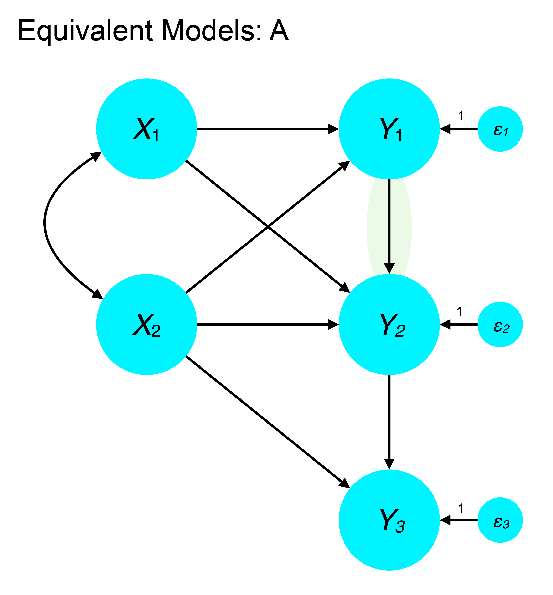
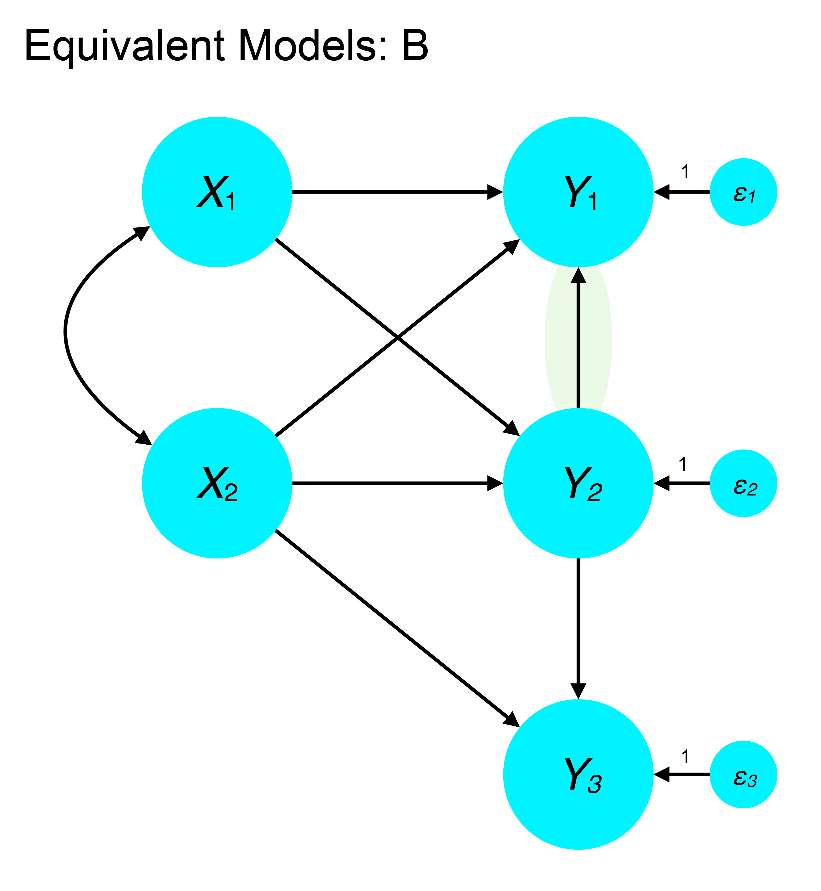
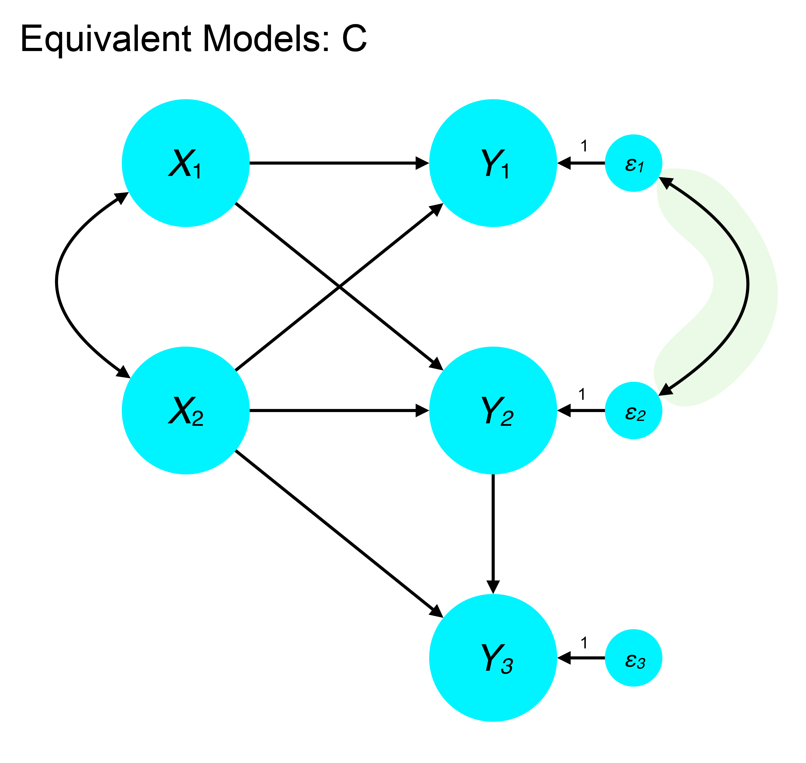
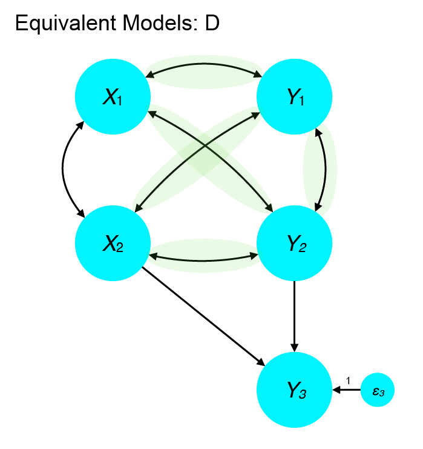
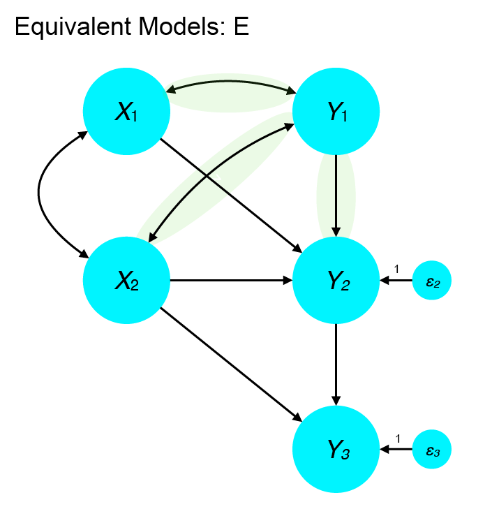
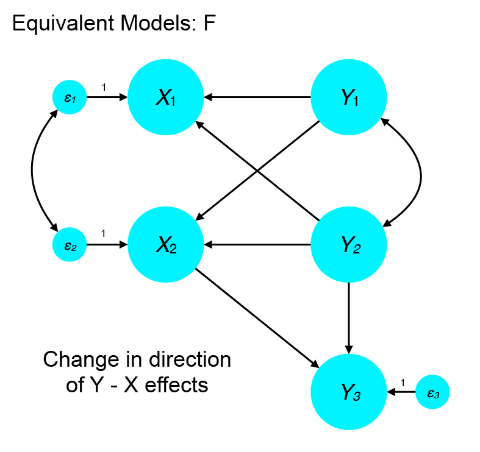

<style type="text/css">
body{ font-size: 20px; max-width: 1600px; margin: auto; padding: 1em; }
code.r{ font-size: 20px; }
p { padding-top: 10px; padding-bottom: 10px; }
pre { font-size: 16px; }
</style>


```{r setup, include=FALSE}
if (!require(pacman)) { install.packages("pacman"); library(pacman) }
p_load(knitr, MASS, tidyverse, viridis, lavaan, modelr, semPlot, psych, nonnest2, AICcmodavg, semTools)
knitr::opts_chunk$set(echo = TRUE) #print code by default
options(digits=3)
set.seed(15092) #to make simulated data the same across computers

#small function to plot all SEM diagrams using
semPaths_default <- function(lavObject, sizeMan=15, ...) {
  require(semPlot)
  semPaths(lavObject, nCharNodes = 0, sizeMan=sizeMan, sizeMan2=4, sizeLat = 13, sizeLat2=7, ...)
}

```

# Finish local fit discussion

# Problems with emphasizing global fit

Tomarken and Waller (2003) note the following problems with models that appear to fit well according to global statistics:

1.  There are many equivalent models that fit equally well
2.  There may be several alternative models that could fit better
3.  Important variables may be omitted (that would affect fit)
4.  Fit of lower-order components may be poor
5.  An ill-fitting partition (component) may be masked within a well-fitting overall model
6.  Global stats may be insensitive to particular kinds of misspecification (esp. in mean structure models)
7.  One may make post hoc modifications to the model that reduce the validity and reproducibility of the results.

They also offer the following advice for avoiding overreliance on global fit statistics:

1.  Acknowledge plausible equivalent models and design studies to rule out these alternatives
2.  Compare the fit of a candidate model against nonequivalent alternatives (e.g., one-factor versus three-factor)
3.  Acknowledge potentially important variables that were omitted from the model or not measured. How might these alter the conclusions?
4.  Report and evaluate lower-order model components
5.  Test components of the model to verify fit in each (this can proceed hierarchically)
6.  Design studies with sensitivity to detect non-trivial misspecifications and include measures to flag trivial misspecifications (I think this is quite hard in practice)
7.  Clearly distinguish between a priori models and post hoc modifications, or models generated from a search process.


# Equivalent models

Equivalent models have the same degrees of freedom but specify different relationships among variables. Furthermore, equivalent models fit the data equally well, providing identical fit statistics and sample likelihood. These can pose a problem in SEM when our core conclusions rest on specifying the directionality of a relationship if changing the cause and effect would result in equivalent fit.

In general, directed (causal) relations cannot be inferred from covariance data without strong assumptions about the processes that generated the data. For example, if one variable causes another, the cause must precede the effect in time. Likewise, causal relationships are more plausible if one variable is manipulated experimentally and its effects on dependent variables are measured. Thus, the problem of equivalent models largely points to a limitation of relying on observational techniques and correlational measures.

-  *Observational equivalence*: one model generates every probability distribution (univariate or multivariate) generated by an alternative model. In other words, the models cannot be distinguished because the data they generate is identical.
-  *Covariance equivalence*: every covariance matrix possible under one model could be equally generated by another. This leads to the same residual structure and conditional independence relationships.

## Lee-Hershberger replacing rules for structural models

-  Within a block of variables at the beginning of a structural model that is just identified and with unidirectional relations to subsequent variables, *direct effects, correlated disturbances, and equality-constrained reciprocal effects are interchangeable*. This means we can replace $Y1 \rightarrow Y2$ with $Y1 \leftarrow Y2$, $Y2 \leftrightharpoons Y1$, or $D1 \leftrightarrow D2$.

-  At subsequent places in the model where two *endogenous* variables have the same causes and their relations are unidirectional, all of the following may be substituted for one another: $Y1 \rightarrow Y2$ with $Y1 \leftarrow Y2$, $Y2 \leftrightharpoons Y1$ (equality-constrained), or $D1 \leftrightarrow D2$.

Limitations of replacing rules:

1.  They may not be transitive: reapplying replacing rules from previous applications may not generate additional versions of the model that are all equivalent.
2.  The replacing rules can generate a new structural model whose conditional independence relationships are not identical (a problem with *d*-separation, as we'll discuss vis-a-vis causality).

## Examples of equivalent models

From Mulaik (2009)

{width=500px}

$Y1$ causes $Y2$

{width=500px}

$Y2$ causes $Y1$

{width=500px}

Note that this model does not include any causal path between $Y1$ and $Y2$, which seems like a conceptually distinct position from Models A and B.

{width=500px}

{width=500px}

{width=500px}

## What to do?

### After the data are collected

From Hershberger 2006

1.  Use an index for judging model quality that is not based on global goodness-of-fit or likelihood. For example the information complexity criterion (ICOMP) approach tries to quantify model misfit (residual covariances) relative to its complexity (correlations among parameter estimates, where greater correlation indicates complexity). See `semGOF` package. Among equivalent models, a model with lower ICOMP would be preferred.

2.  Eliminate equivalent models that have problems during estimation such as many iterations, negative variance estiamtes, or parameters that have to be constrained to avoid improper solutions. This is a heuristic approach.

3.  Combine $R^2$ measures for endogenous variables into a single measure (e.g., mean) and prefer the model with the highest value. This is also heuristic and relatively untested.

4.  Examine extended individual case residuals (EICR). Although the residual covariance matrix is identical among equivalent models, the residuals in terms of predicted versus observed scores on manifest variables are not. Thus, according to Raykov and Penev (2001), a model that minimizes individual case residuals should be preferred over equivalents.

### Before the data are collected

1.  Try to come up with situations where reversing some paths, even if ancillary, is implausible. Recall that the L-H replacing rules only yield equivalent models when two endogenous variables have the same causes.

Consider this example:

```{r, fig.height=3, fig.width=5}
m <- '
Happiness ~ 0.3*Money + 0.3*Love
Travel ~ 0.4*Happiness + 0.3*Money
'

d <- simulateData(m, sample.nobs=500)

#groundtruth
f1.syn <- '
Happiness ~ Money + Love
Travel ~ Happiness + Money
'
f1 <- sem(f1.syn, d)
semPaths_default(f1)
fitmeasures(f1)["chisq"]
```

is not equivalent to this:

```{r, fig.height=3, fig.width=5}
#not equivalent
f2.syn <- '
Happiness ~ Money + Love + Travel
Travel ~ Money
'
f2 <- sem(f2.syn, d)
semPaths_default(f2)
fitmeasures(f2)["chisq"]
```

Why not? Love is not a cause of Travel in either model, so the causes of the endogenous variables are not the same (does not satisfy rule 2). 

This, on the other hand, would be equivalent according to rule 1. The relations among exogenous variables are just identified and have unidirectional effects on other variables. Thus, we can shift the $Money \leftrightarrow Love$ relationship from an unanalyzed association to a directed effect.

```{r, fig.height=3, fig.width=5}
#equivalent
f3.syn <- '
Love ~ Money
Happiness ~ Money + Love
Travel ~ Happiness + Money
'
f3 <- sem(f3.syn, d, conditional.x=FALSE)
semPaths_default(f3)
fitmeasures(f3)["chisq"]
```

```{r, fig.height=3, fig.width=5}
#equivalent
f4.syn <- '
Happiness ~ Love
Travel ~ Happiness + Money
Money ~ Happiness
'
f4 <- sem(f4.syn, d, conditional.x=FALSE)
semPaths_default(f4)
fitmeasures(f4)["chisq"]
```


2.  The closer the model is to saturated, the larger the number of equivalent models. When possible, try to test a relatively sparse structural model. More specifically, in saturated *blocks*, there is little information to adjudicate directionality. Thus, it is useful to include structural variables that are thought to be *unrelated* to others.

3.  Models with many paths suffer from many equivalents. Can you test your key hypotheses in models with fewer variables?

4.  Consider including ancillary variables that are not related to the original set in the model. In particular, consider adding antecedents (predictors) of variables in a source block such that they do not have any relationship to the focal (destination) block:

# Are two models nested, non-nested, or equivalent?

Bentler and Satorra (2010) defined a useful nested model test:

1.  Conduct typical SEM on Model $M1$. Save the $df_{M1}$ and model-implied covariance $\hat{\boldsymbol{\Sigma}}(\Theta)$.

2.  Conduct a SEM on an alternative model $M2$ using the $\hat{\boldsymbol{\Sigma}}(\Theta)$ as data (not raw). Save the $\chi^2_{M2}$ and $df_{M2}$.

3.  Compute $d =  df_{M1} - df_{M2}$ and set a small criterion, $\epsilon$, on $\chi^2$ for equivalence (e.g., .001)

4.  Test for relationship between models:
    +  If $d > 0$ and $\chi^2_{M2} < \epsilon$, the models are *nested*.
    +  If $d = 0$ and $\chi^2_{M2} < \epsilon$, the models are *equivalent*.
    +  If $d < 0$ or $\chi^2_{M2} \geq \epsilon$, the models are *not* nested.

The primary idea is that when there are more degrees of freedom in $M1$ than $M2$ *and* the model-implied covariance matrix can be reproduced by $M2$, then $M1$ is nested in $M2$.


# Model evidence, K-L distance

"All models are wrong but some are useful" - *George Box*

The goal of most statistical modeling is to approximate the key factors that generated our empirical data. The data generation processes are usually complex and largely unknown, so our models will almost always be deficient in many ways. Nevertheless, we may wish to know how close one model is to the unknown truth relative to a comparator model. This is the substance of model selection theory -- i.e., how one selects among models based on relative evidence.

Kullback-Leibler information quantifies the information lost when lost when a simple model, *g* is used to approximate the true model, *f*:

$$
I(f,g) = \int{f(x) \textrm{log} \left( \frac{f(x)}{g(x|\theta)} \right) dx}
$$
This can also be thought of as the distance between our model, *g* and the population (unknown) model, *f*.


In the simplest case, we can think of trying to identify a probability distribution (e.g., Gaussian) that best describes a given empirical sample. Recall from the M-L lecture our attempt to fit a Gaussian distribution using a Gamma distribution. The sample likelihood for the Gamma, even at optimized (fitted) parameters, can never be as close as a Gaussian fit.

*ML Gamma fit*
```{r}
X <- rnorm(5000, mean=50, sd=sqrt(50))
gfit <- suppressWarnings(fitdistr(X, "gamma"))
gfit$loglik
datafromgam <- rgamma(n=5000, shape=gfit$estimate["shape"], rate=gfit$estimate["rate"])
```

*ML Gaussian fit*
```{r}
gfit <- suppressWarnings(fitdistr(X, "normal"))
gfit$loglik
datafromgauss <- rnorm(n=5000, mean=gfit$estimate["mean"], sd=gfit$estimate["sd"])

df <- data.frame(model=rep(c("groundtruth", "gamma", "gauss"), each=5000), 
                           v=c(X, datafromgam, datafromgauss))
                 
ggplot(df, aes(x=v, color=model)) + geom_density()
```

The sample *LL* is an approximation of a K-L distance between a model and 'truth', but read on to AIC below...

In general, we do not know the true model, which means we cannot compute the exact K-L distance. Fortunately, however, we are often interested in *relative* distance -- that is, how much better is model A than model B? In this circumstance, the K-L distance derivation includes two terms: one is based on the expectation under the 'true' model (can't compute that!), the other is based on the *relative* distance between the model and the truth. 

Since we can't compute the first term, it means we do not have a measure of *absolute* fit using likelihood-based and K-L methods. But, because we can compute the relative distance, we can also compute the relative distance *between* two or more models. As a result, we can compare *relative evidence* across a set of candidate models. All may be bad, or all may be good, by some absolute criterion, but we can ascertain which is relatively best. Global fit criteria in SEM often give some information about the absolute fit (esp. residual-based methods). Likelihood methods (K-L distance) are more about relative evidence.

K-L distances are on a true ratio scale (i.e., a meaningful zero point and equal interval spacing). As a result, *differences* in distances can be compared, and a zero K-L difference implies identical relative fit. Moreover, K-L distances tend to become larger as the sample size increases. By analogy, AIC differences among models tend to be larger in large samples compared to small ones. This does not mean that the scaling or interpretation changes! Rather, it underscores that discriminating among models becomes easier in large samples.

## Akaike Information Criterion (AIC)

The derivation of the AIC was a major breakthrough in information theory and statistics because it provides a statistical link between K-L distance (a more theoretical notion) and maximum likelihood-based methods.

The AIC provides an approximation of the relative distance of the fitted model and the unknown (true) mechanisms that generated the data. Importantly, it is a *large sample* criterion (based on asymptotic properties, so 1000s, ideally) and is also not especially meaningful if the models in question are simply inappropriate or poor (e.g., fitting a binary outcome with a continuous model).

$$
AIC = -2 \textrm{log} (\mathcal{L}(\hat{\theta}|y)) + 2k
$$
where $k$ is the number of free parameters, and $\mathcal{L}(\hat{\theta}|y)$ is the sample likelihood.

Note that by multiplying the *LL* by -2, the criterion is now scaled such that *lower* values are better. By contrast, for *LL*, higher values indicate better fit (greater likelihood of the data given the model).

## Corrected AIC

Because AIC is based on a large sample derivation (i.e., its statistical properties are ideal as the sample size goes to infinity), it may select overly complex models in smaller samples (think hundreds, not thousands). This led to the derivation of a variant of AIC, usually denoted $AIC_C$ (Sugiura, 1978), that includes an additional penalty for sample size:

$$
AIC_C = -2 \textrm{log} (\mathcal{L}(\hat{\theta}|y)) + 2k + \frac{2k(k+1)}{n - k -1}
$$
When your cases:parameters ratio is below 40 (which it usually is!), Burnham and Anderson recommend this over AIC. But this was derived for univariate (one DV) regression, not SEM. There is not an equivalent in SEM (that I know of), but also not a specific reason that the above derivation is not approximately correct.

# Comparing relative evidence of candidate SEMs

One of the most important considerations when comparing non-nested models is that the set of endogenous variables is *the same* and on the same scale! This is often misunderstood in applied papers and can lead to bizarre circumstances where AICs differ by thousands of points. That's not impossible, but more likely to reflect differences in the likelihood function that render models non-comparable using LL-based methods (incl. AIC/BIC).

Recall that the sample likelihood is computed on the *endogenous* variables. Thus, if the endogenous set changes (e.g., changing the direction of an arrow), LL methods cannot necessarily be compared. In `lavaan`, this relates to the `conditional.x` option. See `?lavOptions`. If it is `FALSE`, then model-implied statistics, including LL, reflect both exogenous and endogenous variables. This is likely what you'd want in cases where you're testing alternative models with paths direction changes that would make an endogenous variable exogenous, or vice versa.

If you're not sure, check the unrestricted (saturated) LL for the two candidate models. If they are not identical, you cannot use AIC/BIC to compare them. You might also check your setting of `conditional.x` in `lavaan`. Fortunately, `lavaan` will usually provide a warning: "WARNING: some models are based on a different set of observed variables." If you see that, *watch out*! Your models are almost definitely not comparable, either in terms of LRT (nested) or AIC/BIC (non-nested) comparisons since both are based on the sample likelihood.

## Comparing non-nested models

See this paper from Ed Merkle: https://arxiv.org/pdf/1402.6720.pdf. And the corresponding `nonnest2` package in R.

Briefly, the Vuong test is often a useful way to compare evidence among models, including non-nested models. The package plays well with `lavaan`.

(Some quotes from Hallquist & Pilkonis, 2010)

## Efficiency (AIC)

AIC is an asymptotically efficient criterion for model selection, which means that it tends to select the model that minimizes prediction error as sample size increases. More generally, AIC is an information criterion primarily concerned with minimizing the relative Kullback-Leibler (K-L) distance between a statistical model and the unknown mechanisms giving rise to the observed data (Claeskens & Hjort, 2008). 

An underlying assumption of AIC is that the “truth” of the data is very complex (i.e., many causal factors of varying strengths) and that no one “true model” exists (Burnham & Anderson, 2002). Thus, AIC is useful for selecting the best approximate model using a finite number of parameters when “truth” is countably infinite.

## Consistency (BIC)

By contrast, the BIC originates from the Bayesian tradition in statistics and is concerned with the statistical property of consistency, which refers to the one “true model” being selected with increasing probability as sample size increases (Yang, 2005). Underlying the property of consistency are several assumptions worth examining: (1) a single “true” model exists that best represents the mechanisms that gave rise to the observed data, (2) one of the models in the set of models tested is the “true” model, and (3) the focus of model selection is to identify the “true” model rather than to provide a close approximation to the truth. Given these assumptions, Burnham and Anderson (2002) have argued against the use of consistent model selection criteria in the biological, medical, and social sciences because such data are highly complex, there is a low likelihood of including the “true model” in any set of models considered, and it is unlikely that a single “true model” exists.

## Comparing models based on AIC or BIC differences

Summarizing extensive simulation work, Burnham and Anderson (2002) offer useful rules-of-thumb for inferring the degree of certainty afforded to a particular model relative to the best fitting model in the set: 

-  models within 0–2 points on the AIC also have substantial support
-  models in the 4–7 point range have considerably less support
-  models greater than 10 points apart have almost no support. 

Moreover, AIC values for a set of models can be subtracted from the model with the lowest AIC value and these difference scores can be transformed into a set of Akaike weights that represent the evidential weight of a particular model relative to all other models in the set (Burnham & Anderson, 2002). The important general point is that conclusions drawn from latent variable models would benefit from being contextualized in terms of model selection uncertainty and the degree of support for one model over alternatives.

For details on Akaike weights or evidence ratios, I would recommend checking out the `AICcmodavg` package. See demo below.

#Demo

From Brown Ch. 8, Fig 8.1. This is a measure of coping styles administered to 275 college students. There are four first-order latent variables, which reflect different ways of coping with stress: Problem Solving, Cognitive Restructuring, Express Emotions, and Social Support. The authors also anticipated that there are two higher-order factors that account for correlations among the first-order factors: Problem-Focused Coping and Emotion-Focused Coping.

## First-order CFA

```{r}
rawdat <- '
1.00
0.78  1.00
0.80  0.77  1.00
0.56  0.51  0.48  1.00
0.52  0.51  0.46  0.78  1.00
0.59  0.51  0.51  0.80  0.79  1.00
0.16  0.15  0.17  0.14  0.18  0.16  1.00
0.19  0.13  0.18  0.14  0.16  0.16  0.81  1.00
0.12  0.17  0.17  0.17  0.20  0.16  0.75  0.80  1.00
0.16  0.13  0.17  0.15  0.16  0.18  0.56  0.52  0.50  1.00
0.16  0.14  0.18  0.15  0.16  0.18  0.51  0.58  0.51  0.81  1.00
0.16  0.15  0.14  0.16  0.16  0.14  0.52  0.57  0.52  0.80  0.79  1.00
'

#standard deviations of variables
sds <- as.numeric(strsplit('1.40  2.10  1.30  2.30  2.40  1.90  2.00  2.90  2.30  3.10  2.20  1.20', '\\s+', perl=TRUE)[[1]])

cormat <- getCov(rawdat)

#this is the covariance matrix to be analyzed
covmat <- lavaan::cor2cov(cormat, sds)

rownames(covmat) <- colnames(covmat) <- c("P1", "P2", "P3", "C1", "C2", "C3", "E1", "E2", "E3", "S1", "S2", "S3")

#to get Vuong test to work as expected, need raw data, not just a covmat
df <- mvrnorm(n=275, mu=rep(0, 12), Sigma=covmat, empirical = TRUE)

bmodel <- '
ProbSol =~ P1 + P2 + P3
CogRest =~ C1 + C2 + C3
ExpEmo =~ E1 + E2 + E3
SocSupp =~ S1 + S2 + S3

#explicitly name factor correlations
ProbSol ~~ CogRest
ProbSol ~~ ExpEmo
ProbSol ~~ SocSupp
CogRest ~~ ExpEmo
CogRest ~~ SocSupp
ExpEmo ~~ SocSupp
'

#l1fac_m <- sem(bmodel, sample.cov=covmat, sample.nobs = 275)
l1fac_m <- sem(bmodel, df)
summary(l1fac_m, fit.measures=TRUE, standardized=TRUE)
semPaths_default(l1fac_m, sizeMan=7)
```

## Second-order CFA

What about a model with a higher-order factor structure: Problem-Focused versus Emotion-Focused?

```{r}
hcfa <- '
ProbSol =~ P1 + P2 + P3
CogRest =~ C1 + C2 + C3
ExpEmo =~ E1 + E2 + E3
SocSupp =~ S1 + S2 + S3

PFCope =~ ProbSol + CogRest
EFCope =~ ExpEmo + SocSupp
'

#hcfa_m <- sem(hcfa, sample.cov=covmat, sample.nobs = 275)
hcfa_m <- sem(hcfa, df)
summary(hcfa_m, fit.measures=TRUE, standardized=TRUE)
semPaths_default(hcfa_m, sizeMan=7)
```

## Model comparison

Are these models nested?

```{r}
anova(l1fac_m, hcfa_m)
nonnest2::vuongtest(l1fac_m, hcfa_m)
aa <- aictab(list(l1fac_m, hcfa_m))

```

## Bentler NET approach

We can test whether models are nested, equivalent, or not nested using Bentler's nesting and equivalent testing procedure. As mentioned above, this involves fitting model 1 using a candidate SEM, saving the model-implied covariance matrix, then fitting model 2 using that matrix as the input. We examine the difference in degrees of freedom. If $df_1 - df_2 > 0$ and the $\chi^2$ of model 2 is essentially zero (usually < .001) then we say model 1 is nested in model 2. Note that this is an asymmetric test. Model 1 may not be nested in model 2, but the converse (2 nested in 1) could be.

## Is saturated model nested in hierarchical model?

Following Bentler steps:

```{r}
df1 <- fitmeasures(l1fac_m)["df"] #degrees of freedom for saturated factor model (no higher-order structure)
mimplied_l1fac <- fitted(l1fac_m)$cov #model implied cov

#now use the model-implied covariance as the data to analyze for hcfa_m
hcfa_m_fromcov <- sem(hcfa, sample.cov=mimplied_l1fac, sample.nobs = 275)
df2 <- fitmeasures(hcfa_m_fromcov)["df"]
d <- df1 - df2
cat("df for NET: ", d, "\n")
chi2 <- fitmeasures(hcfa_m_fromcov)["chisq"]
cat("Chi-square for NET test: ", chi2, "\n")

```

We see that the degrees of freedom difference is negative. Thus, the saturated model is not nested in the hierarchical model. This makes sense intuitively in that the hierarhical model imposes some structure on the factor model, whereas the saturated model estimates unique covariances among factors.

## Is the hierarchical model nested in the saturated model?

We can reverse the NET test (in terms of what is $M1$ versus $M2$). To test whether the hierarchical CFA is nested in the saturated model, we first fit the saturated CFA, then test the hierarchical model using the model-implied covariance matrix from the saturated model.

```{r}
#is the H CFA nested in the saturated (first-order)
df1 <- fitmeasures(hcfa_m)["df"]
mimplied_hcfa <- fitted(hcfa_m)$cov

#now use the model-implied covariance as the data to analyze for hcfa_m

hcfa_m_fromcov <- sem(bmodel, sample.cov=mimplied_hcfa, sample.nobs = 275)
df2 <- fitmeasures(hcfa_m_fromcov)["df"]
d <- df1 - df2
cat("df for NET: ", d, "\n")
chi2 <- fitmeasures(hcfa_m_fromcov)["chisq"]
cat("Chi-square for NET test: ", chi2, "\n")
```

Here, we see the expected result for a nested model: the df difference is positive (1) and the $\chi^2$ of the second model (using the model-implied covariance of the first) is 0. Thus, the hierarchical CFA model is nested in the saturated first-order factor model.

## Conducting NET the easy way

The `semTools` package provides a `net()` function that will compute nesting/equivalence tests for all pairs of models passed in (as separate arguments). This package also provides the `moreFitIndices` function, which provides the $AIC_C$ as `aic.smallN`.

```{r}
#the easy way
semTools::net(l1fac_m, hcfa_m)
semTools::moreFitIndices(l1fac_m)
```