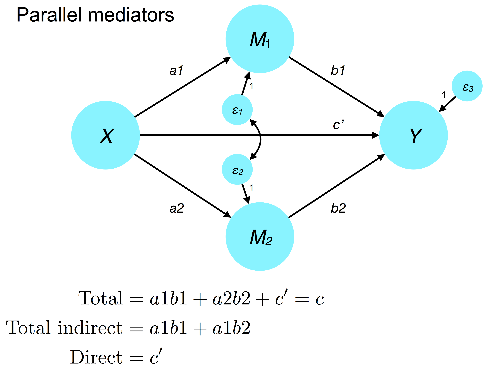
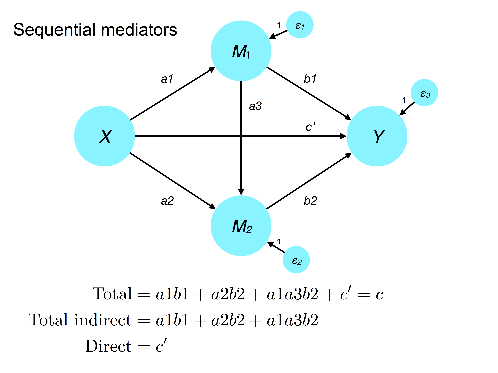
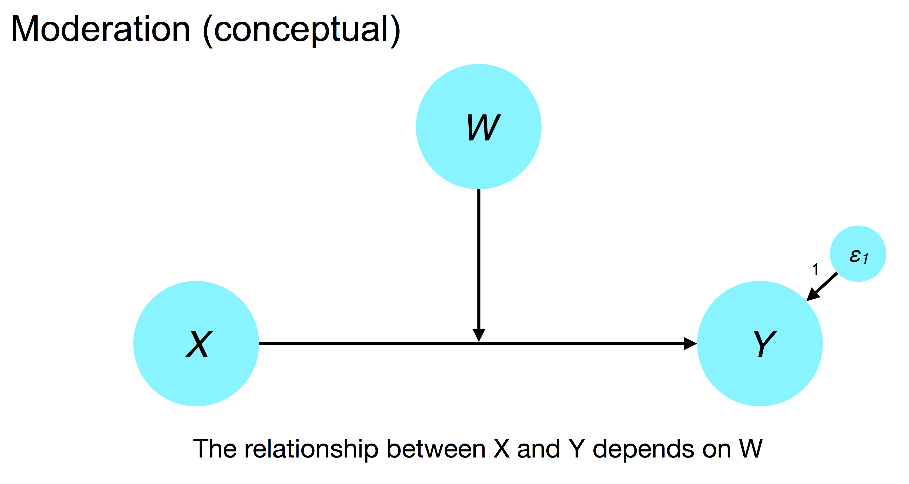
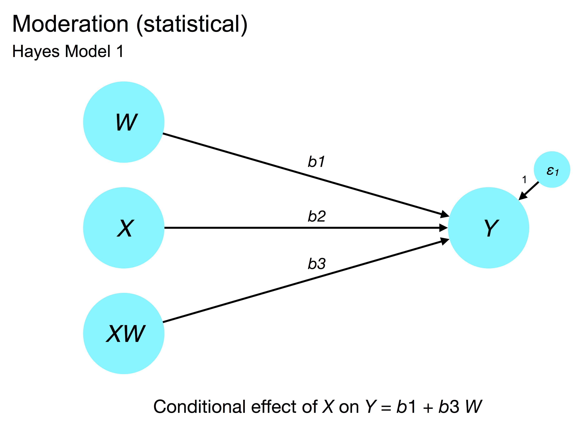
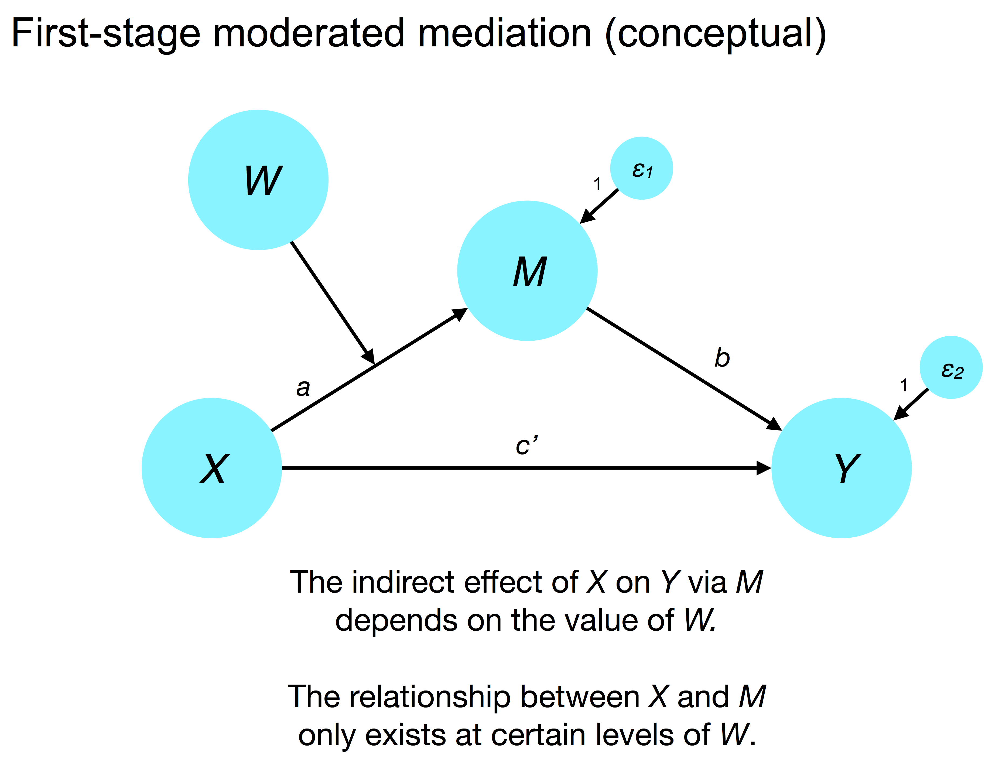
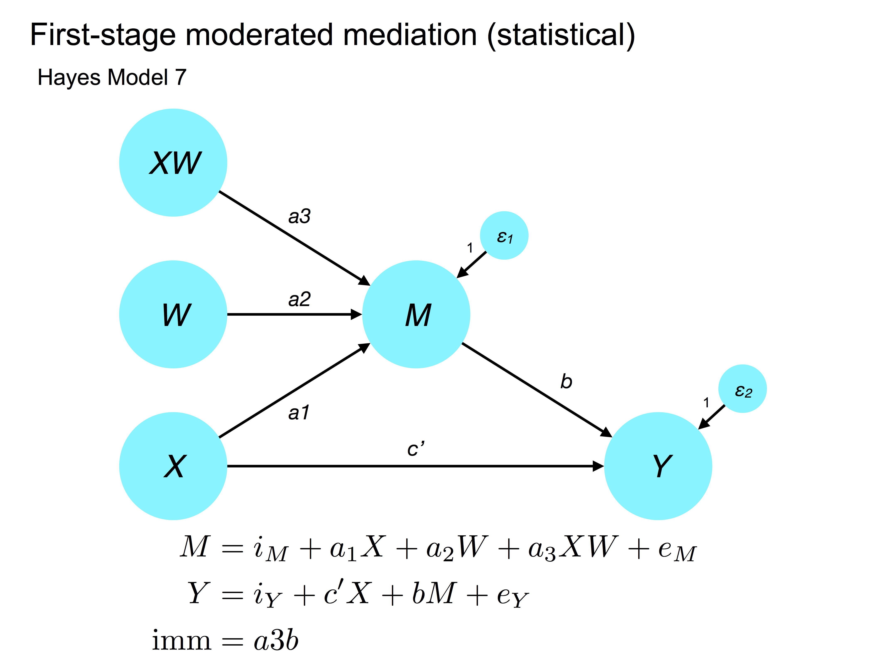
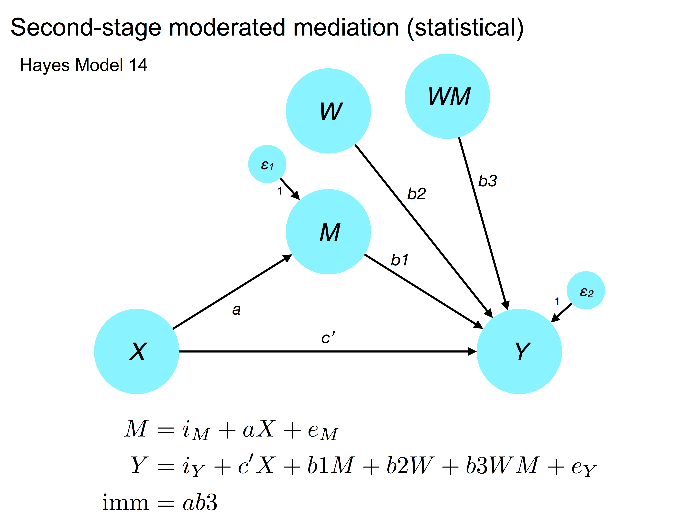

<style type="text/css">
body{ font-size: 20px; max-width: 1600px; margin: auto; padding: 1em; }
code.r{ font-size: 20px; }
p { padding-top: 10px; padding-bottom: 10px; }
pre { font-size: 16px; }
</style>


```{r setup, include=FALSE}
if (!require(pacman)) { install.packages("pacman"); library(pacman) }
p_load(knitr, MASS, tidyverse, viridis, lavaan, modelr, semPlot, psych, nonnest2, AICcmodavg, semTools, DiagrammeR)
knitr::opts_chunk$set(echo = TRUE) #print code by default
options(digits=3)
set.seed(15092) #to make simulated data the same across computers

#small function to plot all SEM diagrams using
semPaths_default <- function(lavObject, sizeMan=15, ...) {
  require(semPlot)
  semPaths(lavObject, nCharNodes = 0, sizeMan=sizeMan, sizeMan2=4, sizeLat = 13, sizeLat2=7, ...)
}

```

This is a review from earlier in the semester (path analysis)

# Types of relationships among variables

## Direct effect

Direct effects represent the relationship between a predictor and an outcome (endogenous variable) that are not mediated by any other variable (Bollen, 1987). This could mean either *ignoring* potential mediating variables (i.e., they are not included in the model) or including them. In causal mediation analysis, the direct effect represents the effect of an independent variable (e.g., treatment) on an outcome (e.g., depression) holding a candidate mediator constant a level that would occur under the corresponding level of the treatment (Imai).

```{r}
grViz("digraph regression {
graph [rankdir = LR bgcolor=transparent]

forcelabels=true;

node [shape = box, fontcolor=gray25 color=gray80]

node [fontname='Helvetica']
X;

node [fillcolor=gray90 style=filled]
Y;

edge [color=gray50 style=filled]
X -> Y [label='Direct']
}")
```


```{r}
grViz("digraph regression {
graph [rankdir = LR bgcolor=transparent]

forcelabels=true;

node [shape = box, fontcolor=gray25 color=gray80]

node [fontname='Helvetica']
X; M;

node [fillcolor=gray90 style=filled]
Y;

edge [color=gray50 style=filled]
X -> Y [label='Direct']
X -> M
M -> Y
}")
```

## Indirect effect

Indirect effects represent the effect of a predictor on an outcome via one or more intervening (mediating) variables. Thus, the idea is that the outcome is related to a predictor *because* the predictor influences a mediating variable, which in turn influences the outcome.

### Single mediator
```{r}
grViz("digraph regression {
graph [rankdir = LR bgcolor=transparent]

forcelabels=true;

node [shape = box, fontcolor=gray25 color=gray80]

node [fontname='Helvetica']
X; M;

node [fillcolor=gray90 style=filled]
Y;

edge [color=gray50 style=filled]
X -> Y [label='Direct']
X -> M
M -> Y
}")
```

### Multiple mediators
```{r}
grViz("digraph regression {
graph [rankdir = LR, bgcolor=transparent, layout=dot]

forcelabels=true;

node [shape = box, fontcolor=gray25 color=gray80]

node [fontname='Helvetica']
X; M1; M2;

node [fillcolor=gray90 style=filled]
Y;

edge [color=gray50 style=filled]
X -> Y [xlabel='e']
X -> M1 [label='a']
M1 -> M2 [label='b']
M2 -> Y [label='c']
M1 -> Y [label='d']
}")
```
In a multiple mediation model, one consider the direct effect ($e$) of a predictor $X$ on a criterion $Y$ after accounting for all mediating variables (here, $M1$ and $M2$).

### Specific indirect effect

Multiple mediation also exposes the new concept of specific indirect effects, which summarize the association between a predictor, $X$ and outcome $Y$ via one or more *specific* intervening pathways. For example, in the above model, we could measure how much of the relationship between $X$ and $Y$ is transmitted via the $X \rightarrow M1 \rightarrow Y$, which would be $a \cdot d$.

### Total indirect effect

The total indirect effect is the sum of all indirect pathways between $X$ and $Y$ (i.e., excluding the $X \rightarrow Y$ path).

### Testing indirect effects

When we think about the *magnitude* of an indirect effect, it is best to conceptualize it as a *product* of the pathways between the predictor and outcome. Thus, the specific indirect effect of $X$ on $Y$ via the $X \rightarrow M1 \rightarrow M2 \rightarrow Y$ pathway is the product of the corresponding parameter estimates $a \cdot b \cdot c$.

## Total effect

The total effect of $X$ on $Y$ is the sum of the direct effect and the *total* indirect effects.

# Mediation

In psychological science, the primary goal of mediation analyses is to understand what intervening variables or mechanisms explain the relationship between a predictor/independent variable and some outcome of interest.

For example, imagine that we conduct a randomized clinical trial (RCT) of cognitive behavioral therapy (CBT) for depression versus treat as usual (TAU). We find that patient randomized to CBT tend to experience greater reductions in depression symptoms than TAU patients. Although this is an exciting outcome, we have little understanding of *why* CBT was efficacious. Our theory might suggest that CBT improves depression by reducing negative automatic thoughts or enhancing metacognitive awareness. These could be considered two candidate mediators.

## We have an effect!

```{r}
grViz("digraph regression {
graph [rankdir = LR bgcolor=transparent]

forcelabels=true;

node [shape = box, fontcolor=gray25 color=gray80]

node [fontname='Helvetica']
CBT;

node [fontname='Helvetica']
Depression;

edge [color=gray50 style=filled]
CBT -> Depression [label='d = -.8 ***']
}")
```

In this diagram, we see that CBT (a dummy coded variable where 1 = CBT and 0 = TAU) is associated with .8 SD reductions, on average, on a depression measure (e.g., the Beck Depression Inventory).

The core question of mediation is what were the specific mechanisms of the CBT intervention that caused the greatest reduction in symptoms?

```{r}
grViz("digraph regression {
graph [rankdir = LR bgcolor=transparent]

forcelabels=true;

node [shape = box, fontcolor=gray25 color=gray80]

node [fontname='Helvetica']
CBT; Depression; 'Causal Stuff'

edge [color=gray50 style=filled]
CBT -> 'Causal Stuff' -> Depression
}")
```


The ideal scenario when testing mediation is to have:

-  Clear hypotheses about causality: A influences B, which in turn modulates C.
-  Established temporal precedence: A precedes B, and B precedes C.
-  (Experimental) Control over the independent variable (A) and mediating variable (B)

Even though our theory or hypotheses may conform to these standards, often our data are weaker. For example, we may have cross-sectional data. Or we may have longitudinal data in which the independent variable precedes the mediator, but we did not manipulate either (i.e., observational designs).

Even when we have longitudinal data, temporal precedence and theory alone are often insufficient to establish causality. For example, we may observe that social skills at age 7 predict lower academic performance at age 10, which in turn predicts lower income at age 21. However, can we be confident that poor social skills cause academic problems? Probably not -- we could have measured academic performance at 7 and social skills at 10 and seen a similar pattern (negative regression coefficient). Likewise, if some shared causal process (e.g., behavioral dysregulation) underlies both variables, then their apparent prospective relationship may reflect nothing more than a shared liability process.

These are deeper considerations we'll revisit when we discuss causality in SEM. For now, we will focus mostly on statistical mediation, which is the set of methods we use to identify mediation from covariance relationships.

## What explains our effect?

Statistical mediation is first and foremost and account of whether the association between two variables, $X$ and $Y$, can be explained by indirect effects via one or more mediators $M_1, M_2, ..., M_n$. Is the effect of $X$ on $Y$ explained by the indirect effects of $X$ on mediating variables? This is a matter of parcellating the *total effect* of $X$ on $Y$ into the *direct* and *indirect* components.

The basic mediation model from regression analysis is based on three related regression equations.

### Total effect

Adopting the notation of Andrew Hayes on conditional process analysis (e.g., Hayes, 2018, *Introduction to mediation, moderation, and conditional process analysis: A regression-based approach*), the magnitude of the relationship between the predictor $X$ and outcome $Y$ can be quantified by:

$$
Y = i_Y + cX + e_Y
$$

where $c$ is the regression coefficient that summarizes the *total* effect of $X$ on $Y$. If $X$ is a 0/1 group variable, such as our CBT versus TAU example, then $c$ quantifies the mean difference between the treatment (1) and control (0) group.

### Effect of $X$ on $M$

One key part of mediation is the strength of the relationship between the predictor, $X$, and the mediating variable $M$. If $X$ does not influence $M$, it is hard to imagine how it $M$ could explain the relationship the between $X$ and $Y$ (Shrout and Bolger, 2002). For example, if CBT does not reduce the frequency of negative automatic thoughts, it is hard to imagine how automatic thoughts are a mediator of depression symptom change in CBT.

Thus, we wish to quantify the relationship:

$$
M = i_M + aX + e_M
$$

where $a$ is the strength of association between the predictor and mediator.

### Effect of $M$ on $Y$

For mediation to be plausible, we also expect that there must be a meaningful relationship between the mediator and the outcome. Otherwise, how could it be a proximate cause of the outcome?

$$
Y = i_Y + c'X + bM + e_Y
$$

Notice that in this equation, the effect of the predictor/IV $X$ on the outcome is typically included, representing the idea that the total effect reflects both a direct component ($c'$) and indirect component ($a \cdot b$). The $c'$ coefficient represents the expected change in the outcome for $Y$ a unit change in the predictor $X$ at a given level of the mediator $M$. In the two group case (1/0 $X$), the direct effect $c'$ represents the expected mean difference between groups at the same (candidate) level of the mediator.

Likewise, the coefficient $b$ represents the effect of the mediator $M$ on the outcome $Y$ at a given level of the predictor (aka controlling for $X$). In the case of a 0/1 $X$, the $b$ coefficient captures the effect of the mediator on the outcome in the control (0) group.

## Making inferences on the indirect (mediated) effect

One crucial conceptual point is that the total effect $c$ can be separated into the direct and indirect components:

$$
c = ab + c'
$$

Because the indirect effect is a product, its sign and therefore interpretation depends on the signs of the $a$ and $b$ paths. For example, if $a$ and $b$ are negative, then $c$ will be positive.

Many times, the goal of mediation analysis is to conduct a null hypothesis significance test: is $ab$ significantly different from zero? As in conventional parametric statistics, this means we must be concerned with the putative distribution underlying the statistic. Can we assume that values of $ab$ are drawn from a normal sampling distribution? If so, a $z$ statistic would be appropriate.

Long story short, the distribution of $ab$ tends to be positively skewed, invalidating the use of typical distributions such as Gaussian or *t*. Instead, the optimal strategy is to conduct *nonparametric bootstrap resampling* and estimate the empirical sampling distribution of $ab$ (Mackinnon et al., 2002, *Psyc Methods*). We can then use the percentiles of this distribution (usually 2.5th and 97.5th) to infer whether $ab$ is significantly different from zero.

### Sidebar: Nonparametric bootstrap resampling

Nonparametric bootstrap resampling is a powerful and general tool to infer the distribution of one or more parameters drawn from an unknown sampling distribution. The intuition is that if our sample represents a random subset of possible cases drawn from the population of interest, then we could potentially obtain a plausible replication sample by resampling the data *with replacement*. That is, if we have $N = 200$ cases that represent a random sample of the population of interest, then if we drew observations from our sample one at a time with equal probability until we reached $N = 200$, we would have a replication sample. This process necessarily means that we will select some observations several times and others not at all. 

We repeat the resampling process many times (typically $k = 1,000-10,000$), estimating our model in each bootstrap sample. This gives us $k$ estimates of our parameter(s) of interest. These $k$ estimates form an *empirical sampling distribution* that allow us to infer the probability that the parameter falls in a given region (e.g., between .1 and .4) or differs from some value (e.g., > 0). Sidebar to sidebar: this approach has formal similarities to Bayesian statistics where we setup a *sampler* to draw plausible values for all parameters from the joint posterior distribution. In the same way, draws from this posterior can be used to make inferences on the value of parameters from unknown statistical distributions.

### Sidebar: no need for X and Y to be correlated for mediation to exist

I won't belabor the details (if you want to know more, see Cerin & MacKinnon, 2009; Hayes, 2009; Shrout & Bolger, 2002), but please know that the old Barron and Kenny approach to mediation required that X and Y be associated. Subsequent work has demonstrated that mediation can exist even when X and Y are not correlated. This typically happens when the direct ($c'$) and indirect effects ($ab$) are roughly equal, but opposite, in magnitude. In this scenario, the total effect, $c$, will be around zero.

## Threats to mediation (adapted from Little)

### Plausible equivalent models

The problem of equivalent models can also rear its head when considering mediation. In particular, when considering full mediation, we can reverse the direction of the effects and achieve identical fit

```{r}
grViz("digraph regression {
graph [rankdir = LR bgcolor=transparent]

forcelabels=true;

node [shape = box, fontcolor=gray25 color=gray80]

node [fontname='Helvetica']
X; M; Y;

edge [color=gray50 style=filled]
X -> M -> Y
}")
```

is equivalent to 

```{r}
grViz("digraph regression {
graph [rankdir = LR bgcolor=transparent]

forcelabels=true;

node [shape = box, fontcolor=gray25 color=gray80]

node [fontname='Helvetica']
X; M; Y;

edge [color=gray50 style=filled]
Y -> M -> X
}")
```

Let's try it out!

```{r}
medmodel <- '
Y ~ 0.3*1 + 0.3*X + 0.5*M
M ~ 0.5*1 + 0.4*X
X ~ 0.9*1
'

data <- lavaan::simulateData(medmodel, sample.nobs=500, meanstructure=TRUE)
psych::describe(data)
cor(data)
```

```{r}
m1_syntax <- '
  M ~ X
  Y ~ M
'

m1 <- sem(m1_syntax, data=data, fixed.x=FALSE, conditional.x=FALSE)
summary(m1)
semPaths_default(m1)
```

versus:

```{r}
m2_syntax <- '
  M ~ Y
  X ~ M
'

m2 <- sem(m2_syntax, data=data, fixed.x=FALSE, conditional.x=FALSE)
summary(m2)
semPaths_default(m2)
```

If you're unsure of equivalence or nesting, remember NET!

```{r}
semTools::net(m1, m2)
```

Also note that models with the $c'$ path included are saturated and therefore fit the data equally, and perfectly, well.

But if we switch what is the predictor/IV $X$ versus the mediator $M$, these are not equivalent models.

```{r}
m3_syntax <- '
Y ~ X
X ~ M
'

m3 <- sem(m3_syntax, data, conditional.x=FALSE, fixed.x=FALSE)
summary(m3, fit.measures=TRUE)
semPaths_default(m3)
```

This model is not nested in the mediation models above!

```{r}
#there's a small bug in net for some models where it objects to variable name ordering
semTools::net(m1, m2, m3)
```

Remember that a good theory of the role of each variable, and their likely temporal precedence, should guide your understanding of plausible models.

### No unmodeled third variable confounders

Random assignment to experimental conditions is one of the few ways to handle this problem. Random assignment should nullify the relationship between $X$ and possible confounders. This does not handle the problem of confounders undermining the relationship between $M$ and $Y$, which should be handled by including these as covariates of the $Y$ regression equation.

More generally, any unmodeled variables that a correlated with $M$ and/or $Y$ could undermine the validity of our mediation tests because they could provide a plausible alternative explanation.

### Measured variables are proxies for true causal variables

*Proxy causal variables*. An independent variable/predictor may be highly correlated with a true, but unmeasured, cause of the DV ($Y$). For example, imagine that we believe that leaves changing colors and falling off of trees causes decreases in temperature by altering available oxygen (mediator) in the atmosphere. We might observe data consistent with this mediation hypothesis (although oxygen is probably distributed more quickly by wind), but in actuality, changes in temperature reflect the orientation of the local land mass relative to the sun.

*Proxy mediator variables.* If we measure a broad mediator (e.g., SES), but it is simply highly correlated with something more specific and causal (e.g., food insecurity), we may obtain mediation results spuriously.

*Proxy dependent variables.* Lastly, one's DV may also be a proxy and/or there may be a variable upstream in the causal chain:

```{r}
grViz("digraph regression {
graph [rankdir = LR bgcolor=transparent]

forcelabels=true;

node [shape = box, fontcolor=gray25 color=gray80]
Y1 [style=filled, fontname='Helvetica']; 

node [fontname='Helvetica']
X; M; Y2

edge [color=gray50 style=filled]
X -> M -> Y1 -> Y2
}")
```

If we measure Y2, but not Y1, then our conclusion about how $M$ influences the relationship between $X$ and $Y2$ may be misleading.

### Differential reliability of measurement

Lastly, if measures have different reliabilities, this will have a differential on attenuation of the mediated effects. As Little notes, this is most problematic when a measure is reliable and meaningful in one group, but not another. For example, if we are measuring social media knowledge in young versus old people, there is a chance that the reliability will be poorer in older people who have less exposure to Snapchat, Tumblr, Tindr, etc. This could lead mediation to appear more as between-groups moderation. This reminds us of the importance of measurement invariance and, when possible, the value of including a measurement model of our key constructs to account for unreliability. As we talked about in week 1, in standard regression and path analysis, we assume that predictors are measured with perfect reliability.


## Multiple mediators

### Parallel mediators

When there is no (hypothesized) relationship between mediators, but one believes that the total effect of $X$ on $Y$ reflects multiple mediators, this is called a *parallel mediator model*. The mediators are permitted to be correlated to account for their covariance, but one does not include directed paths among mediators since this alters the presumed causal chain.

Recall from the discussion above that when we have parallel mediators, we can partition indirect effects into *specific* versus *total*. Moreover, in a parallel mediator model, the scale of the mediators does not influence the magnitude of the *specific* indirect effects since those are in the units of the $X - Y$ association. Therefore, once can test whether the specific indirect effects are different in magnitude between competing mediators. This is done using the conventional equality constraint approach with an LRT or Wald test.



### Sequential mediators

There can also be chains among mediators in which one mediator is thought to cause another. These increases the number of specific indirect effects and also makes a stronger statement about causal ordering. Nevertheless, sequential mediation can be a powerful test of a hypothesis that involves multiple steps (e.g., in development). Notice also how indirect (mediated) effects can be the product of more than two coefficients.



# Moderation

Whereas mediation is concerned with *why* a given effect occurs (what's under the hood), moderation focuses on when the relationship between two variables, $X$ and $Y$, depends on a moderating variable, $W$. Moderators can be categorical, as in the case of gender moderating the relationship between emotional arousal and physical aggression. This largely amounts to group differences in the magnitude of a regression coefficient.

Moderators can also be continuous, such as the effect of environmental enrichment on academic performance depending on IQ. In clinical, psychology, moderation underlies the classic question of what interventions work for whom? Said differently, what characteristics of the person might alter the efficacy of psychotherapy (the IV, $X$) on symptom changes (the outcome, $Y$)?



## Statistical implementation of moderation

As detailed by Hayes' (2018) book, basic moderation (what he calls 'Model 1') describes how the effect of a *focal predictor*, $X$, on the outcome, $Y$, is a linear function of the moderating variable, $W$. You may have learned in regression that moderation involves including an interaction between two predictors. If the interaction is significant, the effect of X and Y is moderated by W. This is a bit of an oversimplification, but right in spirit.



More formally, the idea is that the effect of X on Y depends on W as follows:

$$
Y = i_Y + (b1 + b3 W) X + b2 W + e_Y
$$
If we expand the linear function in parentheses and rearrange a bit, we obtain:

$$
Y = i_Y + b1 X + b2 W + b3 XW + e_Y
$$

which looks like a typical two-way interaction model (remember always to include the individual predictor effects!).

In this model, the test of the $XW$ effect quantifies whether moderation is supported. More specifically, $b3$ represents the effect of a one unit change in $W$ on the association between $X$ and $Y$. If $W$ is a 1/0 dummy-coded variable as in a simple two-group analysis, then $b3$ quantifies the group difference in the association of $X$ and $Y$.

### Interpreting effects of individual predictors in a moderation model

Darlington and Hayes (2017) warn that the coefficients for two predictors in a regression model that includes their interaction should not typically be thought of as 'main effects' (unless $X$ and $W$ are catgorical). Rather, $b1$ and $b2$ represent something closer to simple effects in this model. When the two-way $XW$ interaction is included, $b1$ is the relationship between $X$ and $Y$ when $W = 0$. Likewise, $b2$ is the effect of $W$ on $Y$ when $X = 0$. One challenge that inheres in this representation is that $X$ or $W$ may not have meaningful or at least interpretable zero points.

### The importance of centering in moderation analysis

Mean-centering $X$ and $W$ before computing their interaction is almost always the appropriate decision for two reasons. First, this eliminates what West calls non-essential collinearity. In other words, the interaction can be collinear with either predictor simply because of the scaling of the variables, which is largely eliminated by centering (esp. when the variables are bivariate normal). This collinearity affects the individual predictor effects, $b1$ and $b2$, but not the interaction, $b3$. Second, centering improves the interpretability of $b1$ and $b2$ by shifting their interpretation: under mean centering, $b1$ reflects the relationship between $X$ and $Y$ at the *mean* of $W$.

## Interpreting moderation effects

### Binary moderator

When the moderator is binary (e.g., two groups), the $b3$ coefficient (i.e., the interaction) quantifies the difference between the reference group (0) and treatment group (1).

### Continuous moderator

When moderators are continuous, the most common approach is to plot the relationship between $X$ and $Y$ at different levels of $W$. One effective convention is to plot the predicted $X - Y$ association at the mean of $W$ +/- 1 SD (i.e., three plots).

### Understanding the regions of significance in a moderated effect

Visually examining the association of $X$ and $Y$ at different levels of the moderator $W$ helps to give an intuition of the values of $W$ where moderation is likely to exist (i.e., the $X-Y$ slope is non-zero). But to test this formally, one needs to estimate the $X-Y$ relationship at different candidate values of $W$ and test the significance of the relationship (i.e., at what level of $W$ are $X$ and $Y$ significantly related?).

One way to handle this is the 'pick a point' method in which one computes the predicted $X-Y$ relationship at a given value of $W$ and tests the significance of the slope (a kind of *simple slopes* analysis). This can be accomplished by centering $W$ at the candidate value. Under this approach, $b1$ provides the simple slope, standard error, and appropriate *p*-value for the relationship of $X$ and $Y$ at the candidate value of $W$.

The generalization of this approach is called the Johnson-Neyman technique, which identifies the values of $W$ at which the relationship between $X$ and $Y$ is significant (Bauer & Curran, 2005). Although I'm not aware of a `lavaan`-friendly package for this, you might check out `probemod`, which implements this approach in standard regression models. https://cran.r-project.org/web/packages/probemod/index.html


# Moderated mediation

## First-stage

In the Hayes (2015) nomenclature, first-stage moderated mediation refers to a model in which the $a$ path in a mediation model depends on a moderating variable $W$. Depending on the value of $W$, there is a non-zero relationship of $X$ and $M$. Extending the discussion of basic mediation above, the idea is that mediation cannot exist if $X$ and $M$ are unrelated. In a first-stage moderated mediation, $X$ and $M$ are uncorrelated at specific values of $W$ -- that is, the indirect effect of $X$ on $Y$ via $M$ depends on the modation of the $X \rightarrow M$ path by $W$.



As in the simple moderation case, we implement this conditional model by expanding the interactions between $X$ and $W$ in the equation predicting $M$.



## Second-stage

In second-stage moderated mediation, the relationship between $M$ and $Y$ is moderated by $W$. This is called model 14 in the Hayes nomenclature.



# Other resources

The mediation package provides useful metrics in simpler regression-type analyses:
http://ademos.people.uic.edu/Chapter14.html#2_mediation_analyses

Here is a comprehensive list of conditional process models (the general model that includes combinations of mediation and moderation). These are implemented in Mplus, but can easily be ported to `lavaan`.
http://offbeat.group.shef.ac.uk/FIO/mplusmedmod.htm

This is the (new) bible of mediation and moderation:
https://www.guilford.com/books/Introduction-to-Mediation-Moderation-and-Conditional-Process-Analysis/Andrew-Hayes/9781609182304

Note that there is a second edition coming out soon (early next year, I think), so you may want to hold off on buying it.

This paper has a nice `lavaan` walkthrough of more complex moderated mediation analyses:
https://www.ncbi.nlm.nih.gov/pmc/articles/PMC4616155/

## Computing interactions among latent variables

Sometimes we are interested in computed observed x latent or latent x latent interactions for tests of moderation. This is somewhat complicated and there are several approaches available. Little describes a product-indicator approach to computing interactions among latent variables. This procedure can be implemented in any SEM software, including `lavaan`. Fortunately, rather than having to figure this out yourself, there is a handy function called `indProd` in the `semTools` package. Check it out if it pertains to your question!