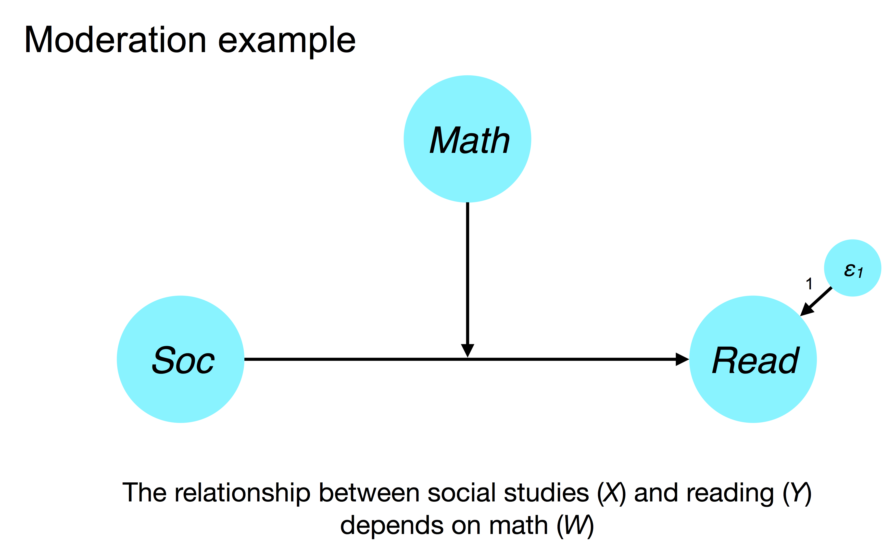
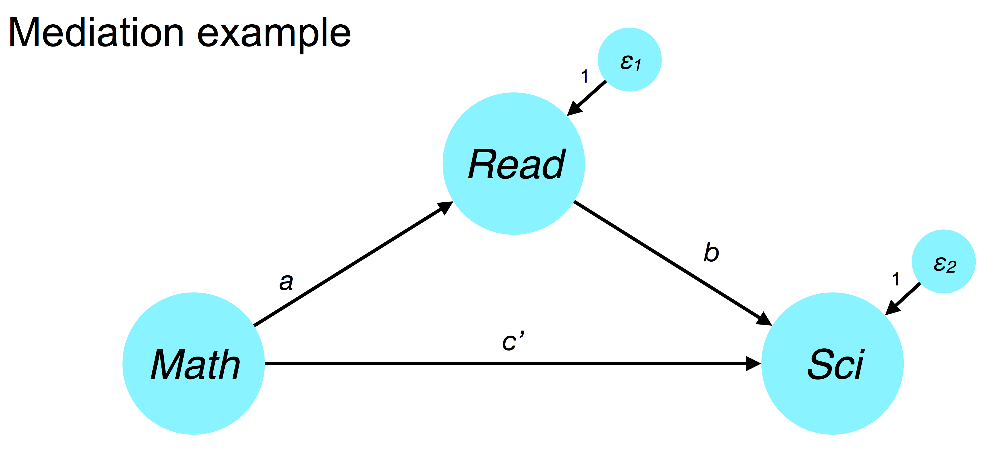
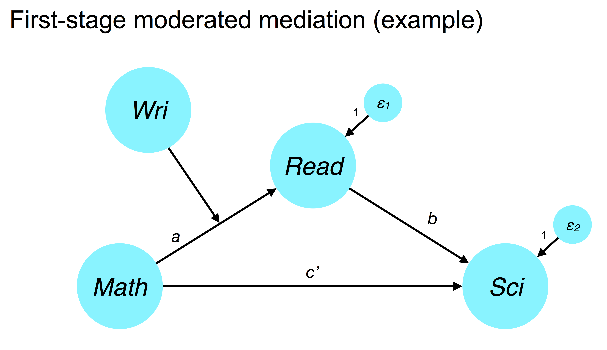
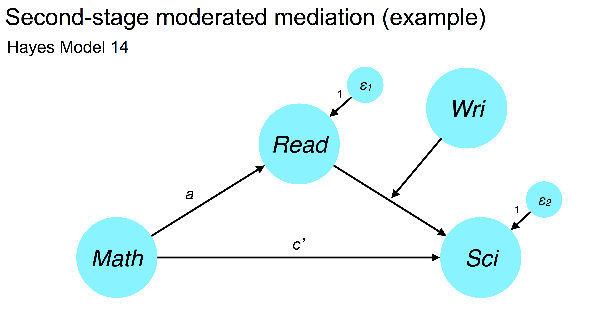

<style type="text/css">
body{ font-size: 20px; max-width: 1600px; margin: auto; padding: 1em; }
code.r{ font-size: 20px; }
p { padding-top: 10px; padding-bottom: 10px; }
pre { font-size: 16px; }
</style>


```{r setup, include=FALSE}
if (!require(pacman)) { install.packages("pacman"); library(pacman) }
p_load(knitr, MASS, tidyverse, viridis, lavaan, modelr, semPlot, psych, nonnest2, AICcmodavg, semTools, DiagrammeR, readr)
knitr::opts_chunk$set(echo = TRUE) #print code by default
options(digits=3)
set.seed(15092) #to make simulated data the same across computers

#small function to plot all SEM diagrams using
semPaths_default <- function(lavObject, sizeMan=15, ...) {
  require(semPlot)
  semPaths(lavObject, nCharNodes = 0, sizeMan=sizeMan, sizeMan2=4, sizeLat = 13, sizeLat2=7, ...)
}

```

Code for this demo adapted from here: https://nickmichalak.blogspot.com/2016/07/reproducing-hayess-process-models.html

# Example dataset

The dataset for this example contains standardized test scores on reading, writing, math, science, and social studies. There are also binary indicators (e.g., `hisci`) that encode whether someone received a high score on a given test. We also want to compute centered versions of each variable to aid interpretation in moderation-related models.

Following Hayes, I will use the convention $X$ for independent variable/predictor, $M$ for mediator, $W$ for moderator, and $Y$ for outcome.

```{r}
df <- read_csv("mediation_data.csv")
df <- df %>% mutate_at(vars(read, write, math, science, socst), funs(c=scale))
```

# Moderation with a continuous moderator

Hayes Process model 1

Does the relationship between performance on reading ($Y$) and social studies ($X$) tests depend on math ability ($W$)?



```{r}
library(lavaan)

# create interaction term between centered X (socst) and W (math)
df <- df %>% mutate(socst_x_math = socst_c * math_c)

# parameters
moderation_model <- '
  # regressions
  read ~ b1*socst_c
  read ~ b2*math_c
  read ~ b3*socst_x_math
  
  # define mean parameter label for centered math for use in simple slopes
  math_c ~ math.mean*1
  
  # define variance parameter label for centered math for use in simple slopes
  math_c ~~ math.var*math_c
  
  # simple slopes for condition effect
  SD.below := b1 + b3*(math.mean - sqrt(math.var))
  mean := b1 + b3*(math.mean)
  SD.above := b1 + b3*(math.mean + sqrt(math.var))
  '

# fit the model using nonparametric bootstrapping (this takes some time)
sem1 <- sem(model = moderation_model,
            data = df,
            se = "bootstrap",
            bootstrap = 1000)

# fit measures
summary(sem1, fit.measures = TRUE, standardized = TRUE, rsquare = TRUE)
```
```{r}
#compute bias-corrected estimates of bootstrapped confidence intervals
parameterEstimates(sem1, boot.ci.type = "bca.simple",
                   level = .95, ci = TRUE, standardized = FALSE)
```

# Simple mediation

Hayes Process model 4

Is the relationship between `science` and `math` mediated by `read`?




```{r}
# parameters
mediation_model <- '
    # direct effect
      science ~ cp*math_c
      direct := cp
  
    # regressions
      read_c ~ a*math_c
      science ~ b*read_c
  
    # indirect effect (a*b)
      indirect := a*b
  
    # total effect
      total := cp + (a*b)
'

# fit model
sem2 <- sem(model = mediation_model, data = df, se = "bootstrap", bootstrap = 1000)

# fit measures
summary(sem2, fit.measures = TRUE, standardize = TRUE, rsquare = TRUE)
```

# First-stage moderated mediation

Does the indirect effect of `math` ($X$) on `science` ($Y$) via `read` ($M$) depend on `write` ($W$)? More specifically, does writing ability moderate the relationship betwen math and reading? For example, perhaps only people with high writing and math ability tend to score higher on a reading test. If this is true, then the indirect effect of math on science via reading depends on writing as well.




```{r}
#compute math x writing interaction term
df <- df %>% mutate(math_x_write = math_c*write_c)

moderated_mediation_1 <- '
  # regressions
    read_c ~ a1*math_c
    science ~ b*read_c
    read_c ~ a2*write_c
    read_c ~ a3*math_x_write
    science ~ cdash*math_c

  # mean of centered write (for use in simple slopes)
    write_c ~ write.mean*1

  # variance of centered write (for use in simple slopes)
    write_c ~~ write.var*write_c

  # index of moderated mediation
    imm := a3*b    

  # indirect effects conditional on moderator (a1 + a3*a2.value)*b
    indirect.SDbelow := a1*b + a3*-sqrt(write.var)*b
    indirect.mean := a1*b + a3*write.mean*b
    indirect.SDabove := a1*b + a3*sqrt(write.var)*b

'

# fit model
sem3 <- sem(model = moderated_mediation_1, data = df, se = "bootstrap", bootstrap = 1000)

# fit measures
summary(sem3, fit.measures = TRUE, standardize = TRUE, rsquare = TRUE)
```

```{r}
#compute bias-corrected confidence intervals
parameterEstimates(sem3, boot.ci.type = "bca.simple", level = .95, ci = TRUE, standardized = FALSE)
```

# Second-stage moderated mediation

Mediated effects could also be moderated at what Hayes calls the 'second stage' (i.e., the relationship between $M$ and $Y$). In the Hayes Process model world, this is also called Model 14. For example, does the indirect effect of `math` ($X$) on `science` ($Y$) via `read` ($M$) depend on `write` ($W$) because it moderates the relationship betwen math and reading? Perhaps only people with high writing and reading ability tend to do well in science. If this is true, then the indirect effect of math on science via reading depends on writing as well.



```{r}
#compute math x writing interaction term
df <- df %>% mutate(read_x_write = read_c*write_c)

moderated_mediation_stage2 <- '
  # regressions
    read_c ~ a*math_c
    science ~ b1*read_c
    science ~ b2*write_c
    science ~ b3*read_x_write
    science ~ cdash*math_c

  # mean of centered write (moderator; for use in simple slopes)
    write_c ~ write.mean*1

  # variance of centered write (moderator; for use in simple slopes)
    write_c ~~ write.var*write_c

  #index of moderated mediation
    imm := a*b3

  # indirect effects conditional on moderator (a1 + a3*b2.value)*a
    indirect.SDbelow := a*b1 + a*-sqrt(write.var)*b3
    indirect.mean := a*b1 + a*write.mean*b3
    indirect.SDabove := a*b1 + a*sqrt(write.var)*b3
'

# fit model
sem4 <- sem(model = moderated_mediation_stage2, data = df, se = "bootstrap", bootstrap = 1000)

# fit measures
summary(sem4, fit.measures = TRUE, standardize = TRUE, rsquare = TRUE)
```

```{r}
#compute bias-corrected confidence intervals
parameterEstimates(sem3, boot.ci.type = "bca.simple", level = .95, ci = TRUE, standardized = FALSE)
```

# Multiple-groups moderation

In a two-group case, treating moderator as a 0/1 variable is an easy way to handle mediation in SEM. When a moderating variable, $W$, is categorical, but has many levels (e.g., 5 groups), setting up dummy codes and computing all of the relevant interactions is very painful and laborious. 

The better route is to treat the moderator $W$ as a grouping variable such that any path in the model could be moderated by group. This allows one to test categorical moderation of parameters not often considered in regression, such as latent variable variance estimates across groups.