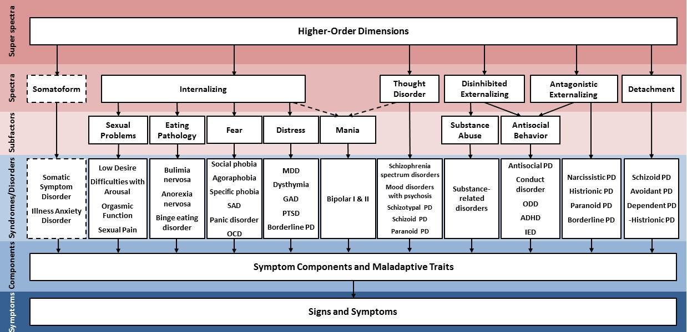
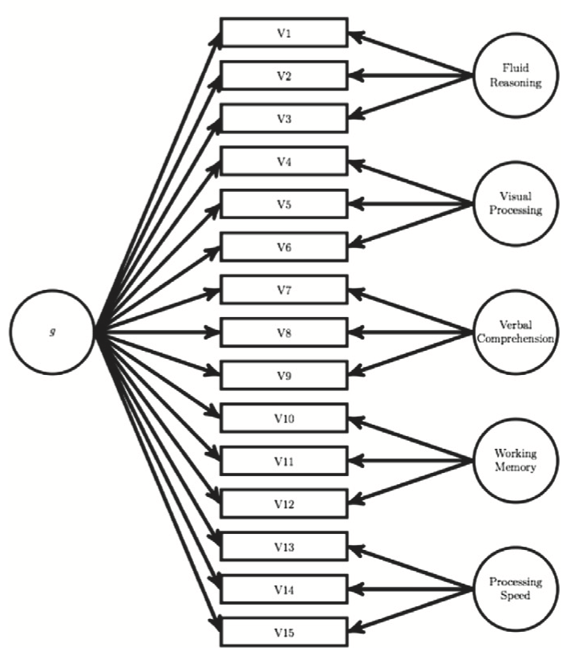
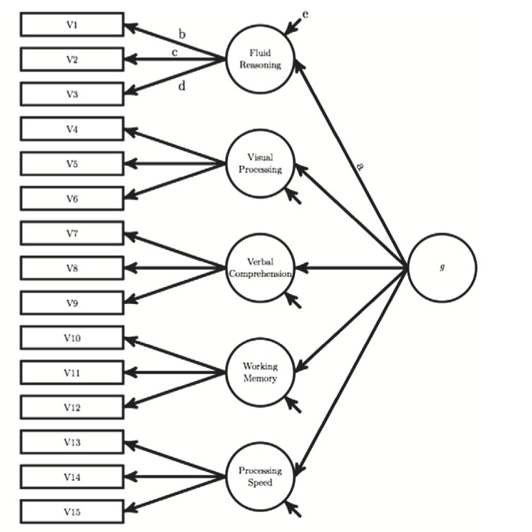
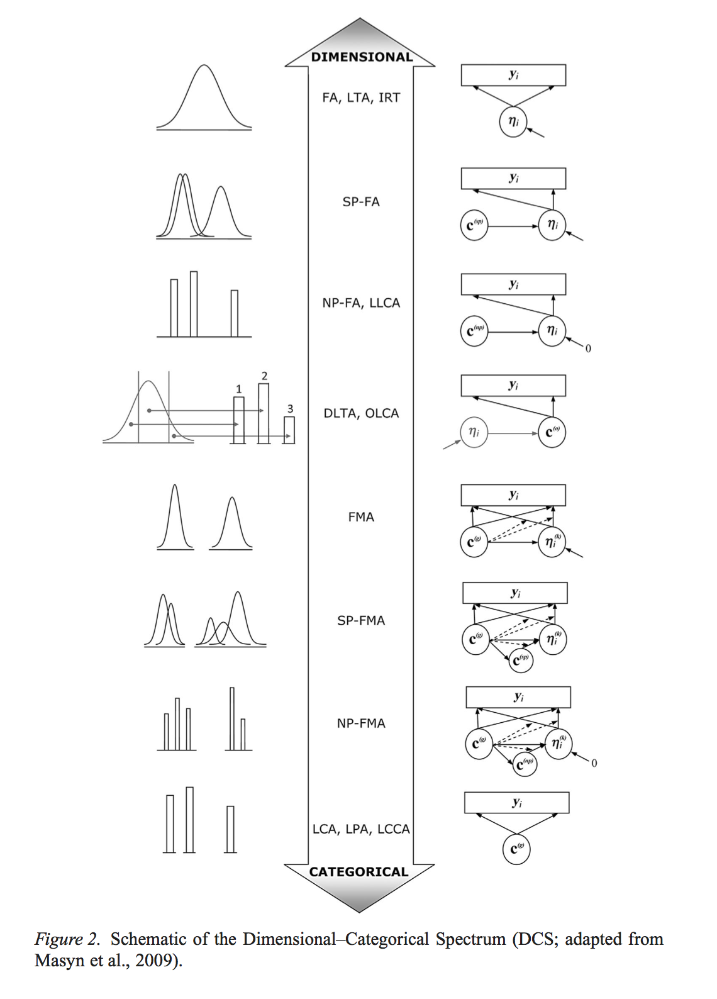

<style type="text/css">
body{ font-size: 20px; max-width: 1600px; margin: auto; padding: 1em; }
code.r{ font-size: 20px; }
p { padding-top: 10px; padding-bottom: 10px; }
pre { font-size: 16px; }
</style>


```{r setup, include=FALSE}
if (!require(pacman)) { install.packages("pacman"); library(pacman) }
p_load(knitr, MASS, tidyverse, viridis, lavaan, modelr, semPlot, psych, nonnest2, AICcmodavg, semTools, DiagrammeR)
knitr::opts_chunk$set(echo = TRUE) #print code by default
options(digits=3)
set.seed(15092) #to make simulated data the same across computers

#small function to plot all SEM diagrams using
semPaths_default <- function(lavObject, sizeMan=15, ...) {
  require(semPlot)
  semPaths(lavObject, nCharNodes = 0, sizeMan=sizeMan, sizeMan2=4, sizeLat = 13, sizeLat2=7, ...)
}

```

# Katie E.

## How do you set up multilevel models in SEM?

We will discuss on 12/7.

## Is it possible to do latent class analysis using SEM? Using Lavaan?

Yes, this can be done, but not in `lavaan`. Although Yves Rosseel mentions this as a future direction, I don't believe work on this has begun in earnest. You will need to use *Mplus* for most 'general latent variable models' that include continuous and categorical variables.

# Vanessa B.

## How does longitudinal data play into SEM?

We will talk about this on 11/30.

## When is and isn't it appropriate to discuss causality in SEM?

We will discuss on 11/16.

# Jason G.

## How might we set up a longitudinal study within SEM framework?

To be discussed 11/30!

## How might we set up a model where we were interested in accounting for the shared variance among highly correlated observed variables (e.g., MRI volumes), but also isolating the unique contributions of these observed variables on some outcome variable?

You might fit a factor model to the volumes to separate out the common variance, but then use the disturbances as predictors of the outcome of interest. This can be done by defining a latent variable explicitly that represents the disturbance:

```{r}
HS.model <- ' visual  =~ x1 + x2 + x3
              textual =~ x4 + x5 + x6
              speed   =~ x7 + x8 + x9 

x1d =~ 1*x1 #define disturbance factor with loading 1.0 onto indicator (as in RAM notation)
x1 ~~ 0*x1 #zero residual variance of indicator (all loads onto disturbance)

#under standard model, disturbances are uncorrelated with factors
x1d ~~ 0*visual
x1d ~~ 0*textual
x1d ~~ 0*speed

#now if we have a criterion, we can use the x1-specific variance as a predictor
# ageyr ~ x1d

#we can also allow for general and specific variance to predict
ageyr ~ x1d + visual
'

fit <- cfa(HS.model, data=HolzingerSwineford1939)
summary(fit, fit.measures=TRUE)
```

# Chloe B.

## What are the major tenets of APIM modeling? Is path analysis or SEM proper generally used for APIM models?

In APIMs, there are a few basic questions:

-  Are there actor effects? Self predicts self (e.g., my narcissism predict my angry outbursts)
-  Are there partner effects? Self predicts other (e.g., my narcissism predicts your tendency to be withdrawn)
-  Are the actor effects similar between members of the couple? For example, is the association of one's narcissism with one's angry outbursts similar between men and women in heterosexual couples?
-  Are the partner effects similar between members of the couple?
-  If both actor and partner effects are similar, we call this 'indistinguishable dyads' meaning that there is no systematic difference as a function of individual characteristics (e.g., sex.)

Here's some made-up APIM-relevant data:

```{r}
apim_syntax <- '
anger_male ~ 0.3*narc_male
anger_female ~ 0.4*narc_female

#assortative mating/homophily
narc_male ~~ 0.1*narc_female

anger_male ~ 0.1*narc_female
anger_female ~ 0.5*narc_male

anger_male ~~ 0.2*anger_male
anger_female ~~ 0.2*anger_female
'

simData <- lavaan::simulateData(apim_syntax, sample.nobs=500)
#psych::describe(simData)
cor(simData)
```

Here's a handy function I wrote a while back for an APIM-related project:

```{r}
runAPIM <- function(df, DV, predictors, partners=c("_0", "_1"), additional="", printall=FALSE) {
  require(lavaan)
  #by default, only print indistinguishable dyads model (printall=FALSE)
  
  indistinguishable_syn <- ""
  for (p in 1:length(predictors)) {
    indistinguishable_syn <- paste0(indistinguishable_syn, DV, partners[1], additional, " ~ a", p, "*", predictors[p], partners[1], additional,
        " + p", p, "*", predictors[p], partners[2], additional, "\n ",
        DV, partners[2], additional, " ~ a", p, "*", predictors[p], partners[2], additional,
        " + p", p, "*", predictors[p], partners[1], additional, "\n")
  }
  
  afree_syn <- pfree_syn <- allfree_syn <- indistinguishable_syn
  for (p in 1:length(predictors)) {
    afree_syn <- sub(paste0("a", p, "*"), paste0("a", p, partners[1], "*"), afree_syn, fixed=TRUE) #replace first instance of actor with _0
    afree_syn <- sub(paste0("a", p, "*"), paste0("a", p, partners[2], "*"), afree_syn, fixed=TRUE) #replace second instance of actor with _1
    pfree_syn <- sub(paste0("p", p, "*"), paste0("p", p, partners[1], "*"), pfree_syn, fixed=TRUE) #replace first instance of partner with _0
    pfree_syn <- sub(paste0("p", p, "*"), paste0("p", p, partners[2], "*"), pfree_syn, fixed=TRUE) #replace second instance of partner with _1
    
    allfree_syn <- sub(paste0("a", p, "*"), paste0("a", p, partners[1], "*"), allfree_syn, fixed=TRUE) #replace first instance of actor with _0
    allfree_syn <- sub(paste0("a", p, "*"), paste0("a", p, partners[2], "*"), allfree_syn, fixed=TRUE) #replace second instance of actor with _1
    allfree_syn <- sub(paste0("p", p, "*"), paste0("p", p, partners[1], "*"), allfree_syn, fixed=TRUE) #replace first instance of partner with _0
    allfree_syn <- sub(paste0("p", p, "*"), paste0("p", p, partners[2], "*"), allfree_syn, fixed=TRUE) #replace second instance of partner with _1
    
  }

  indistinguishable <- sem(indistinguishable_syn, df, missing="ML", estimator="MLR")
  cat("\n\n-------\nIndistinguishable dyads model:\n------\n")
  summary(indistinguishable, fit.measures=TRUE)
  #standardizedSolution(res, type="std.all")
  
  afree <- sem(afree_syn, df, missing="ML", estimator="MLR")
  
  pfree <- sem(pfree_syn, df, missing="ML", estimator="MLR")
  
  allfree <- sem(allfree_syn, df, missing="ML", estimator="MLR")
  
  if (printall) {
    cat("\n\n-------\nFree actor model:\n------\n")
    summary(afree, fit.measures=TRUE)
    
    cat("\n\n-------\nFree partner model:\n------\n")
    summary(pfree, fit.measures=TRUE)
    
    cat("\n\n-------\nFree actor and partner (saturated) model:\n------\n")
    summary(allfree, fit.measures=TRUE)
  }
  
  print(anova(indistinguishable, afree, pfree, allfree))
  cat(indistinguishable_syn)
  
  return(list(syntax=list(i=indistinguishable_syn, a=afree_syn, p=pfree_syn, all=allfree_syn), indistinguishable=indistinguishable, afree=afree, pfree=pfree, allfree=allfree))
}


#let's use it on our simulatd data
mlist <- runAPIM(simData, DV="anger", predictors="narc", partners=c("_male", "_female"), printall=TRUE)
semPaths_default(mlist$pfree)
```


Many APIMs are variants of path analysis in that the variables are observed. But there is no reason one couldn't use full SEM. This has advantages (e.g., handling measurement error/reliability concerns), but also means establishing measurement invariance (of constructs between dyadic members) is important.

## It would be helpful to briefly review equality constraints when assessing gender differences.

I think this relates to the APIM above, but briefly, here is the syntax for the indistinguishable dyads model compared to the model that equated actor effects, but freed partner effects.

Indistinguishable:
```{r}
cat(mlist$syntax$i)
```

Partner effects freed:
```{r}
cat(mlist$syntax$p)
```

# Gordon S.

## Are there other reasons a model will fail to converge aside from identification? If so, what does that mean, and how do we deal with it?

Yes, it's a bigger dilemma. There is a reasonably thorough discussion here: http://web.pdx.edu/~newsomj/semclass/ho_improper.pdf.

A few thoughts:

-  The most common source of nonconvergence is the scientist -- specifying a bad/impossible model will often lead to nonconvergence or inadmissible solutions (e.g., correlations > 1 for some variables). What kinds of mistakes can one make? Accidentally nonrecursive models, models that are overparameterized, models that fit the data horribly (e.g., omitting a large covariance between variables), trying to make a factor from disparate measures, not checking your correlation matrix first to get a sense of what needs to be captured.

-  Watch out for 'Heywood cases', which refer to negative variance estimates. These are a sign of an inadmissible solution. What to do if you hit one? Look at collinearity among variables. Potentially constrain the variance to be positive.

-  Empirical underidentification can lead to convergence problems. A common cause is a two-indicator factor in a larger model.

-  Check the correlations among variables. If there are weak correlations among indicators, it may be empirically underidentified. If an indicator is used as the reference, but has low correlation with other indicators, it may yield an inadmissible solution.

-  Likewise, check the correlation among latent variables. Sometimes it can be quite high and even exceed 1.0, which will lead to an inadmissible solution.

-  Beware complex (close to saturated) models in small samples. These are most likely not to converge.

-  Beware outliers or assumption failures (multivariate normal, homoscedastic residuals).

In terms of what to do about it, a nonexhaustive list: 

1)  Use a different estimator (e.g., two-stage least squares or weighted least squares)
2)  Provide starting values for some parameters that you think are approximately right
3)  Be prepared to force positivity on variances
4)  If there is a correlation > 1 in the model, it may suggest you've overparameterized (e.g., two factors are measuring exactly the same thing)
5)  Try respecifying the model without a problematic variable
6)  Try to identify whether a key path is omitted
7)  Estimate a saturated model and see if you can prune back to something close to your hypothesis. When does this fail?
8)  Try to build a model from simple parts (e.g., one factor at a time). When does combining models break down?

## What’s the best approach for determining what indicators load onto which factors during an EFA?

Is it strictly based on theory?  Are we justified in using an indicator for a factor if it has a higher loading on another factor?

One consideration here is when EFA is used prior to or as a complement to CFA. People sometimes use EFA to search for what items load onto what factors in CFA, then test the candidate model in CFA. See http://www.tandfonline.com/doi/abs/10.1080/10705519609540030. There are some difficulties in using EFA as a starting point, especially if you impose an orthogonal rotation (cf. the Preacher Tom Swift EFA article from earlier in the semester). Having hypotheses is also ideal to have an a priori CFA model.

The raw correlation matrix is a strong source of information about structure in the model.

In terms of EFA proper, people typically use higher loading of an indicator on one factor than another to justify their decision about latent structure. So if "I like cheese" loads onto both food craving and positive affect factors in a bigger EFA, is it possible to achieve something close to simple structure using a rotation? If not, how similar are the loadings? If we have a loading of .8 on the food craving factor, but .2 on positive affect, this would usually be seen as reasonably good evidence to prefer food craving. Remember that variance explained in EFA is a function of the squared loadings.

But if loadings are ambiguous, like .6 and .45, and this can't be remediated by rotation, many people would err on the side of dropping the item from consideration. Although simple structure is not statistically required in EFA or CFA, it leads to interpretational burdens that many prefer (for good reason) to avoid.

# Frances L.

## I would appreciate reviewing how we use lavTestScore and other packages to figure out which parameters could be freely estimated in our models when examining measurement invariance. 

How do you then use the group.partial function to remove the constraints on different types of parameters? 

`lavTestScore` with the `add` argument computes the Lagrange multiplier test for estimating specific parameters currently fixed to zero (i.e., not estimated) in the model. This is equivalent to the standard modification indices.

```{r}
HS.model <- '
    visual  =~ x1 + b1*x2 + x3
    textual =~ x4 + b2*x5 + x6
    speed   =~ x7 + b3*x8 + x9

    #constrain second loadings to equality
    b1 == b2
    b2 == b3
'
fit <- cfa(HS.model, data=HolzingerSwineford1939)

# the score test for adding two (currently fixed
# to zero) cross-loadings. Does this improve fit substantially?
newpar = '
    visual =~ x9
    textual =~ x3
'
lavTestScore(fit, add = newpar)
```
Likewise, if a model has equality constraints imposed, `lavTestScore` can provide information about changes in model fit if we free those constraints.

```{r}

# test 1: release both two equality constraints
# this will compute the total change in fit for all constraints
# as well as the individual constraints and their sum
lavTestScore(fit, cumulative = TRUE)

```

You can specify which ones to free using the `release` argument if you need a multivariate statistic (i.e., joint improvement for many constraints), though you have to use the order of constraints listed in `parTable()`. Or you can examine the univariate stats to identify specific constraints.

## How do we think about higher-order latent variables in connection with causal mechanisms and unobserved developmental or cognitive processes? Is this commonly used and modeled in the literature? 

Hierarchical factor models and bifactor models have become popular. For example, in psychopathology research, there is increasing interest in hierarchical models that reflect putative shared liability factors across diagnoses.



This builds on the internalizing/externalizing distinction of Achenbach and, later, Krueger.

The bifactor model instead assumes that there is a general factor underlying all indicators, as well as specific factors that model the remaining variance.



Compare this to a hierarchical model:



# Daryl C.

## How do we conduct power analyses to see if we have a large enough sample size for proposed SEM analyses?

See Muthén and Muthén 2002, How to Use a Monte Carlo Study to Decide on Sample Size and Determine Power, *Structural Equation Modeling*. Very briefly, we try to simulate the parameters of interest at different levels of plausible strength and different sample sizes. We simulate many replication datasets and see how often we 'hit the target' in terms of achieving 80% power (or whatever you specify). Power is defined as the proportion of replications where the parameter of interest is significant. So if we simulate 10,000 replications of a model at a sample size of 100 and 8,000 of them have p < .05, we have 80% power. We also want to makes sure that we maintain 95% *coverage* on the parameters. That is, the 95% confidence interval of each parameter should include the 'true' population parameter in 95%+ of the replications. We can also examine bias in our simulations, which refers to systematic (mean) deviations between the fitted and true parameters.

The `simsem` package wraps around `lavaan` and provides some useful tools for conducting power analyses for a given model:

https://github.com/simsem/simsem/wiki/Example-11:-Power-Analysis-in-Model-Evaluation

https://github.com/simsem/simsem/wiki/Example-21:-Power-of-Rejecting-Misspecified-Models-with-Varying-Sample-Size

## What are some common/general critiques of SEM as an analysis method that we might expect to hear from reviewers or other readers of our work should we choose to use SEM in publications?

You may encounter concerns about making sure to 'look under the hood' of the model (recall Tomarken & Waller). Beyond global fit statistics, what is the evidence that the model captures the data? Occasionally, and unfortunately, you may hear that the assumptions of latent variable models (esp. conditional independence) are unlikely to be met in empirical data. This objection underlies the network approach to modeling covariance (e.g., Cramer et al., 2010, Comorbidity: A network perspective, *Behavioral and Brain Sciences*). Instead of fitting an *a priori* network model, they advocate a data-driven algorithm based on a graphical model. I have lots of opinions about this, but briefly, don't feel constrained to enforce standard conditional independence assumptions in SEM (e.g., independence of measurement errors).

# Lia R.

## If you use SEM with cross sectional data, how would you suggest framing your results/what should we expect to hear from reviewers (if anything) about this issue?  

I don't think you need to be apologetic about SEM in a cross-sectional sample, especially for measurement-related questions. In terms of framing results, if you have a strong hypothesis about directionality in the structural component, reviewers may object if you do not consider a) equivalent models, or b) alternative models. Even if your model fits the data reasonably well according to global fit statistics, another model may fit even better. Statistics should be a form of principled argumentation, so using SEM, we generally want to a) consider and test alternative hypotheses, and b) check the robustness of our model to other explanations. For example if we find that greater emotion dysregulation predicts more severe interpersonal problems, does this hold if we covary neuroticism from both variables? Can we rule out the possibility that interpersonal problems predicts emotion dysregulation?

You may also take flak if you try to publish a SEM with mediocre fit (e.g., CFI .9). In such cases, you should document why you accepted the model and what additional checks you conducted to ensure the validity of the conclusions.

## Tips for using SEM for EMA data--would you suggest taking another SEM course specific to longitudinal data analysis or would the basics learned in this course translate?

It's certainly a bigger topic... I believe Nilam Ram's longitudinal SEM course delves into this. But briefly, there are some key issues to be aware of. First, there is typically strong temporal structure in EMA data. My anger now is probably related to my anger 30 minutes from now. Many EMA studies focus only on 'contemporaneous effects' (all data from a single prompt), but this likely misses very important and interesting parts of the data. And honestly, why collect data intensively if you will only essentially look at cross-sectional effects? You eliminate recall biases and are closer to episodic representation, so that's good. But under a contemporaneous-only analysis, you assume that observations are fungible and that the process under consideration is weakly stationary (that we've dropped into a sequence of observations that could have been obtained just as easily if we started the study today or next week).

In terms of temporal structure, we should typically consider some form of autoregressive covariance. Some info here: https://onlinecourses.science.psu.edu/stat502/node/228. But here is some intuition.

### Variance components

No assumption of correlation among residuals.

$$
\begin{bmatrix}
\varepsilon_1 & 0 & \cdots & 0 \\ 
0 & \varepsilon_2 & \cdots & \vdots\\
\vdots & \cdots & \varepsilon_3 & \vdots\\
0 & \cdots & \cdots & \varepsilon_p
\end{bmatrix}
$$
The variance component structure (VC) is the simplest, where the correlation of errors within a subject are presumed to be 0.

## Compound Symmetry

\[\sigma^2 \begin{bmatrix} 1.0 & \rho & \rho & \rho \\ & 1.0 & \rho & \rho \\ & & 1.0 & \rho \\ & & & 1.0 \end{bmatrix} = \begin{bmatrix} \sigma_b^2+\sigma_e^2 & \sigma_b^2 & \sigma_b^2 & \sigma_b^2 \\ & \sigma_b^2+\sigma_e^2 & \sigma_b^2 & \sigma_b^2 \\ & & \sigma_b^2+\sigma_e^2 & \sigma_b^2 \\ & & & \sigma_b^2+\sigma_e^2 \end{bmatrix}\]

The simplest covariance structure that includes within-subject correlated errors is compound symmetry (CS).  

## First Order Autoregressive AR(1)
\[\sigma^2 \begin{bmatrix} 1.0 & \rho & \rho^2 & \rho^3 \\ & 1.0 & \rho & \rho^2 \\ & & 1.0 & \rho \\ & & & 1.0 \end{bmatrix}\]

The autoregressive (Lag 1) structure considers correlations to be highest for time adjacent times, and a systematically decreasing correlation with increasing distance between time points.  For one subject, the error correlation between time 1 and time 2 would be \(\rho^{t_1-t_2}\) .  Between time 1 and time 3 the correlation would be less, and equal to \(\rho^{t_1-t_3}\).  Between time 1 and 4, the correlation is less yet, as \(\rho^{t_1-t_4}\), and so on.  Note, however, that this structure is only applicable for evenly spaced time intervals for the repeated measure.

## Spatial Power
\[\sigma^2 \begin{bmatrix} 1.0 & \rho^{\frac{|t_1-t_2|}{|t_1-t_2|}} & \rho^{\frac{|t_1-t_3|}{|t_1-t_2|}} & \rho^{\frac{|t_1-t_4|}{|t_1-t_2|}} \\ & 1.0 & \rho^{\frac{|t_2-t_3|}{|t_1-t_2|}} & \rho^{\frac{|t_2-t_4|}{|t_1-t_2|}} \\ & & 1.0 & \rho^{\frac{|t_3-t_4|}{|t_1-t_2|}} \\ & & & 1.0 \end{bmatrix}\]

When time intervals are not evenly spaced, a covariance structure equivalent to the AR(1) is the spatial power (SP(POW)).  The concept is the same as the AR(1) but instead of raising the correlation to powers of 1, 2,, 3, … , the correlation coefficient is raised to a power that is actual difference in times (e.g. \(|t_1-t_2|\) for the correlation between time 1 and time 2).  This method requires having a quantitative expression of the times in the data so that it can be specified for calculation of the exponents  in the  SP(POW) structure.  If an analysis is run wherein the repeated measures are equally spaced in time, the AR(1) and SP(POW) structures yield identical results.

# Jordan C.

## How can we implement longitudinal data in SEM?

We will talk about this on 11/30.

## And specifically, how can we use longitudinal data in SEM to infer causality?

We will discuss on 11/16.

# Alison S.

## What is the conceptual/statistical connection is between cross-lagged autoregressive SEMs and something like growth mixture modeling (/maybe parallel process growth mixture modeling-since there’s the idea that predictors of one might influence another at different time points).

Growth mixtures assume that there are latent trajectory classes -- subpopulations -- that differ in terms of their growth parameters. Basic autoregressive SEMs typically assume a single population and try to capture the level of autocorrelation, typically using a single parameter per process, $\alpha$. And the cross-lagged paths are also thought to represent fixed, proportional, change over time.

##  Additionally what is the statistical distinction between FA and LCA?

The principal distinction is that factor analysis is based on *continuous* latent variables, whereas latent class analysis (LCA) is based on *categorical latent variables*. A categorical latent variable is multinomial such that each case has a probability of membership (assignment) into each class. Masyn et al., 2010, *Social Development* has a nice paper called *Exploring the Latent Structures of Psychological Constructs in Social Development Using the Dimensional–Categorical Spectrums*. Here's the quick version:




For example, if we fit a *k*-class model, then each case has a probability of being assigned into each class. Here's a very simple Gaussian mixture model (diagonal covariance structure within class):

$$
\begin{align*}
f(\boldsymbol{y}) &= \sum_{k=1}^{K}{\pi_k \mathcal{N}(\boldsymbol{\mu}_{k}, \boldsymbol{\Sigma}{_k})} \\
\sum_{k=1}^{K}\pi_k &= 1 \\
\end{align*}
\\
$$
where $\boldsymbol{\Sigma}_k$ is a diagonal covariance matrix in each latent class (i.e., conditional independence among variables within class).

Here, the categorical latent variable is $\pi$ which represents the multinomial distribution of class membership in $k$ classes.
In this situation, $\pi$ is a categorical latent variable that follows a multinomial distribution. That is, we are estimating the probability that each observation came from class *k* that has class-specific means ($\mu_k$) and covariance ($\Sigma_k$).

# Nate H.

## One thing that I've been curious about is that Bayesian SEM has gained a considerable following over the past few years. Is the idea that parameter estimates have priors that help reduce uncertainty in the variables being used? 

Yes, the idea is that every parameter in the model has a prior distribution, typically something relatively broad and uninformative. For example, factor loadings are assumed to be normally distributed with a mean of zero (and a large variance). This has some advantages, such as not allowing inadmissible parameter estimates (e.g., negative variances).

We can also use our prior knowledge about the appropriate range of a parameter to give a somewhat more specific prior. This is sometimes called an 'informative prior' or 'empirical prior' (e.g., if we use parameters from another study). We have to be careful about being too specific since that could lead to bias in the conclusions about our data.

## Also, I've been wondering if you have hundreds of indicators on one latent variable with fewer observations if there is a principled way of fitting a factor model if you assume that certain indicators will be much more predictive of the construct that another.

E.g. 140 DMN nodes and if I want to construct one latent variable with 83 subjects of data, it is ill-advised to include all 140 indicators. So, how would one in a principled way go about selecting the subset of indicators that finally gets used?

In general, yes, you must be very careful about having a huge indicator/variable space. With 140 variables, you have almost 10,000 covariances. This is an example of a $p \gg n$ problem where you have many more parameters than cases. Speaking of Bayes, there are variants of factor models that impose sparsity onto the structure such that only a handful of those 140 nodes is allowed to 'play' in the model. https://arxiv.org/abs/1211.3706. There are also regularized variants of factor analysis: https://link.springer.com/article/10.1007/s11336-017-9575-8.

But that's getting toward the bleeding edge of SEM. If you want to be more practical about it, people sometimes work on sums or averages of indicators. This is reasonable if you are confident that the sum is homogeneous and unidimensional (think parallel indicators). There is a related literature on *parceling* in SEM where you sum up or average subsets of indicators prior to factor analysis based on rational criteria such as correlation patterns, random splits, etc. https://www.ncbi.nlm.nih.gov/pmc/articles/PMC2877522/. You may also want to consider clustering the statistics for your 140 variables to see whether you could identify a pattern that would help to figure out structure in the data. Perhaps *k*-means clustering could help identify what variables to combine/parcel.
