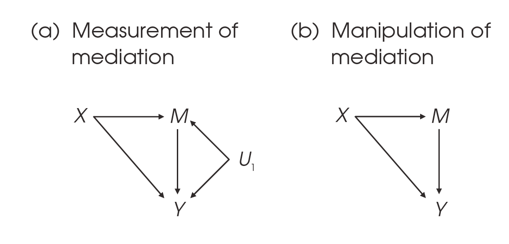

\newcommand{\ci}{\thinspace\perp\!\!\perp\thinspace}
\newcommand{\nci}{\thinspace\not\mkern-7mu{\perp\!\!\perp}\thinspace}

<style type="text/css">
body{ font-size: 20px; max-width: 1600px; margin: auto; padding: 1em; }
code.r{ font-size: 20px; }
p { padding-top: 10px; padding-bottom: 10px; }
pre { font-size: 16px; }
</style>


```{r setup, include=FALSE}
if (!require(pacman)) { install.packages("pacman"); library(pacman) }
p_load(knitr, MASS, tidyverse, viridis, lavaan, modelr, semPlot, psych, nonnest2, AICcmodavg, semTools, DiagrammeR, dagitty, dagR)
knitr::opts_chunk$set(echo = TRUE) #print code by default
options(digits=3)
set.seed(15092) #to make simulated data the same across computers

#small function to plot all SEM diagrams using
semPaths_default <- function(lavObject, sizeMan=15, ...) {
  require(semPlot)
  semPaths(lavObject, nCharNodes = 0, sizeMan=sizeMan, sizeMan2=4, sizeLat = 13, sizeLat2=7, ...)
}

```

# Graphs

Graph theory is a branch of mathematics concerned with representing pairwise relationships between objects. Graphs are composed of *nodes* (also called vertices) and *edges* (also called connections or links). For our purposes in SEM, latent and observed variables are the nodes, and covariances are the edges. In the simplest saturated graph with three variables, we have three nodes and three edges:

```{r}
grViz("
digraph g {
  # a 'graph' statement
  graph [overlap = true, fontsize = 12, rankdir=LR]

  # nodes for observed and latent
  node [shape = circle, fontname = Arial]
  A [xlabel='node'] B C

  edge [dir=none, fontname = Arial]
  A -> B
  B -> C
  A -> C [xlabel='edge']
  
}")
```

In more complex situations, we may represent only a subset of all possible edges among nodes.

```{r}
grViz("
digraph g {
  # a 'graph' statement
  graph [overlap = true, fontsize = 12]

  # nodes for observed and latent
  node [shape = circle, fontname = Arial]
  A [xlabel='node'] B C D E

  edge [dir=none, fontname = Arial]
  A -> B
  C -> B
  C -> D
  A -> E [xlabel='edge']
}")
```

# Directed acyclic graphs (DAGs)

Directed acyclic graphs (DAGs) are a specific type of graph in which we assume causal directionality on all paths in the model. This is equivalent to a recursive SEM in which there are no causal loops and all effects are unidirectional. DAGs do not imply distributional assumptions on any of the variables, and therefore are a nonparametric representation of a causal structure. Likewise, a directed path in a DAG does not imply a specific functional form (e.g., linear) of the relationship.

There are also directed cyclic graphs (DCGs) in which bidirectionality and causal loops are possible. But like nonrecursive SEMs, these are a more complex topic that we will skip. Here is a simple DAG in which we believe that maternal age may explain the apparent association between pre-term birth and maternal cardiovascular disease (CVD). Once we account for maternal age, the association between these variables should, in principle, vanish. That is, pre-term birth and maternal CVD are independent conditioning on maternal age.

```{r}
dag.dat <-
    dag.init(outcome = NULL, exposure = NULL, covs = c(1),
             arcs = c(1,0, 1,-1),
             assocs = c(0,0), xgap = 0.04, ygap = 0.05, len = 0.1,
             x.name = "Preterm birth",
             cov.names = c("Maternal Age"),
             y.name = "Later Life Maternal CVD"
             )

junk <- dag.draw(dag.dat, noxy = T)
```

I hope it is evident that DAGs underlie many of the SEM concepts we've covered thus far in the term.

# Building blocks of DAGs

What are the basic units or building blocks of DAGs?

-  As in regular SEM, a directed edge $\rightarrow$ implies a directional causal effect.
-  As in regular SEM, an undirected edge $\leftarrow\!\rightarrow$ implies that the variables share an unmeasured (latent cause).
-  The absence of an edge between two variables implies that there is no (direct) causal relationship between them.
-  The direct causes of a variable called *parents*.
-  All direct and indirect causes of a variables are called *ancestors*.
-  All variables caused directly by a given variable are called *children*.
-  All variables caused directly or indirectly by a given variable are called *descendents*.
-  A variable with no parents is *exogenous*.
-  A variable with at least one parent is *endogenous*.

As described by Kline, there are three elementary strucutred in DAGs: chains, forks, and inverted forks.

## Chains

A chain represents a set of sequential causal dependencies in which one variable causes another, which in turn causes the next. (Think mediation.) In the simplest case, a *contracted chain* is a causal relationship between two variables in which there are no (plausible) intervening variables that could *block* the causal relationship:

```{r, fig.height=2}
grViz("
digraph g {
  # a 'graph' statement
  graph [overlap = true, fontsize = 12, rankdir=LR]

  # nodes for observed and latent
  node [shape = circle, fontname = Arial]
  A B

  edge [fontname = Arial]
  A -> B
}")
```

More generally, a chain has *three or more* variables that are connected by directed paths:

```{r, fig.height=2}
grViz("
digraph g {
  # a 'graph' statement
  graph [overlap = true, fontsize = 12, rankdir=LR]

  # nodes for observed and latent
  node [shape = circle, fontname = Arial]
  A B C

  edge [fontname = Arial]
  A -> B -> C
}")
```

In this diagram, we assume that there is no direct effect of X on Y (i.e., it's zero). This is related to the concept of full mediation. In the notation of the structural causal model, we denote conditional independence using the symbol $\ci$. In the above diagram, we would say:

$$
A \ci C \: | \: B
$$
That is, A is conditionally independent of C given B. Such a chain also satisfies the *Markov assumption* that C is assumed to be independent of all nondescendents (e.g., other variables D, E, F, that we do not believe are caused  by C) after conditioning on C's *parents*, but not grandparents, great-grandparents, etc., That is, conditioning on the parents of a variable alone is sufficient to determine its relationships with nondescendents. A related point is that if we deactivate B, we block the causal relationship between A and C.

On the other hand, if we do not account for B, then A and C are *not* conditionally independent. Said differently, if we do not control for B, we anticipate that there is a *marginal association* between A and C. This is denoted as:

$$
A \nci C
$$

Altogether, chains are a unit of DAGs that represent causal hypotheses. More specifically, A and C are not independent (marginal association) *because* of the causal path $A \rightarrow B \rightarrow C$.

### What's the risk? Overcontrol bias

If B truly mediates the relationship between A and C, this can be a beautiful thing... we may be close(ish) to having a causal finding. The risk, however, is if we think of B more as a nuisance variable, not a mediator. In this case, if we 'control' for B, we may completely knock out the relationship between A and B. This problem is called *overcontrol bias*.

Let's get out of abstractions. Consider that we are motivated to understand how increasing *mentalizing* (roughly, conceptualizing others' motivation and state of mind) reduces symptoms of *borderline personality disorder* (e.g., intense, stormy relationships).

```{r, fig.height=1.5}
grViz("
digraph g {
  # a 'graph' statement
  graph [overlap = true, fontsize = 12, rankdir=LR]

  # nodes for observed and latent
  node [shape = circle, fontname = Arial, width=1.5, height=1.5]
  Mentalizing BPD

  edge [fontname = Arial]
  Mentalizing -> BPD [label='-.4']
}")
```

We might assess the association of mentalizing and BPD in a large sample of psychiatric outpatients and find an association of $r = -.4$. A well-meaning peer reviewer of our lovely correlational study might point out that the association between mentalizing and BPD might vanish if we controlled for interpersonal problem severity. In this view, perhaps mentalizing competes with interpersonal problems as explanations for the severity of BPD symptoms.

We could control for interpersonal problems:

```{r, fig.height=3}
grViz("
digraph g {
  # a 'graph' statement
  graph [overlap = true, fontsize = 12, rankdir=LR]

  # nodes for observed and latent
  node [shape = circle, fontname = Arial, width=1.5, height=1.5]
  Mentalizing BPD Int_Prob

  edge [fontname = Arial]
  Mentalizing -> BPD [label='0']
  Int_Prob -> BPD [label='.3']
}")
```

In this case, the association of interest vanishes, as the reviewer suggests. What to do? Even though it is sensible to consider that there may be multiple causes of an outcome (see *colliders* below), or that predictors may compete for common variance, from a causality standpoint it is dangerous to be purely empirical about this process.

Rather, recall that the last two steps of the classic Baron and Kenny (1986) test for mediation involve regressing the criterion (BPD) on both the predictor (IV) and mediator. If the direct effect $\textrm{predictor} \rightarrow \textrm{criterion}$ (aka $c'$) is approximately zero in this this model, this is consistent with complete mediation.

Wait, so what if interpersonal problems causally *mediate* the relationship between mentalizing and BPD? 

```{r, fig.height=2}
grViz("
digraph g {
  # a 'graph' statement
  graph [overlap = true, fontsize = 12, rankdir=LR]

  # nodes for observed and latent
  node [shape = circle, fontname = Arial, width=1.5, height=1.5]
  Mentalizing BPD Int_Prob

  edge [fontname = Arial]
  Mentalizing -> Int_Prob [label='-.3']
  Int_Prob -> BPD [label='.3']
}")
```

In this scenario, if we treat Mentalizing and Interpersonal problems as exogenous predictors of BPD without considering the possibility of mediation, *this* is (finally) the overcontrol bias, or the danger of conditioning a cause-effect relationship on a mediator without appreciating the role of the mediating variable.

### What to do about overcontrol bias?

If interpersonal problems truly mediate the relationship between mentalizing and BPD, 'controlling' for this by introducing interpersonal problems as an additional (competing) predictor will misestimate the causal relationship of interest. The simple solution is *not* to condition on the variable that causally mediates the relationship. The more complete account would be to examine the effects in terms of the parcellation of total effects into direct and indirect components.

## Fork (common cause)

In a *fork* arrangement, a common cause explains the co-occurrence of other variables. For example, having the flu causes both fever and fatigue. Thus, there can be a spurious relationship between fever and fatigue, but not a causal one, once we account for flu.

```{r, fig.height=2, fig.width=3}
# g <- dagitty('dag {
#     Flu [pos="1,0"]
#     Fever [pos="0,1"]
#     Fatigue [pos="2,1"]
# 
#     Flu -> Fever
#     Flu -> Fatigue
# }')
# plot(g)

grViz("
digraph g {
  # a 'graph' statement
  graph [overlap = true, fontsize = 12]

  # nodes for observed and latent
  node [shape = circle, fontname = Arial, width=1, height=1]
  Flu Fever Fatigue

  edge [fontname = Arial]
  Flu -> Fever
  Flu -> Fatigue
}")
```

In the notation of directed acyclic graphs, we say:

$$
\begin{align*}
\textrm{Fever} &\ci \textrm{Fatigue} \: | \: \textrm{Flu} \\
\textrm{Fever} &\nci \textrm{Fatigue}
\end{align*}
$$

That is, fever and fatigue are unrelated to each other after accounting for the flu. This is certainly an oversimplification in that other common causes (e.g., Lyme disease) could also cause fever and fatigue to co-occur. In that case, we might think of conditioning the association of fever and fatigue on multiple causes.

Note that this is identical to the notation for a chain because it makes the same statement about the conditional independence relationships. This is an equivalent model! But it is conceptually distinct in terms of the causal hypothesis. In a fork, there is a 'back-door path' between Flu and Fever such that the variables at either end of the common cause (here, Fever and Fatigue) may have a spurious association, but not a causal relationship. Fever does not cause Fatigue, but they may be associated because of Flu.

What is another equivalent DAG for these three variables?

In conventional statistical terms, forks correspond to confounding. In our example, Flu is a confounder that explains the spurious association between Fever and Fatigue.

### What to do about this?

Broadly speaking, if we wish to understand the causal relationship between A and B, but the relationship may be confounded by a set of variables, $C_1 , C_2, ..., C_n$, the conventional advice would be be to condition the association between A and B on $\textbf{C}$. In so doing, the true causal relationship can be identified.

## Inverted fork (common outcome)

The third three-variable relationship is called an *inverted fork*. In this arrangement, one varible is caused by the other two. Extending our flu example, consider this:

```{r}
grViz("
digraph g {
  # a 'graph' statement
  graph [overlap = true, fontsize = 12]

  # nodes for observed and latent
  node [shape = circle, fontname = Arial, width=1, height=1]
  Flu Lyme Fever

  edge [fontname = Arial]
  Flu -> Fever
  Lyme -> Fever
}")
```

In this arrangement, fever is a common outcome of flu and Lyme disease. Fever is called a *collider* variable, which refers to a variable with at least two parents. This term evokes the idea that separate forces are colliding or combining to cause the outcome. Importantly, in causal thinking, the collider (Fever) blocks any association between the causes (Flu and Lyme). In DAGs, a path that has a collider is called *closed*, *blocked*, or *inactive*. More formally, the conditional relationships among variables in a collider arrangement are:

$$
\begin{align*}
\textrm{Flu} &\ci \textrm{Lyme} \\
\textrm{Flu} &\nci \textrm{Lyme} \: | \: \textrm{Fever}
\end{align*}
$$

That is, Flu and Lyme are independent of each other when we do not condition on other variables (incl. Fever). They are separate diseases with different pathophysiology. But if we condition on the common outcome (Fever, which is the collider), then we expect that Flu and Lyme are *not* conditionally independent. As Kline says, "Controlling for a common outcome of two unrelated measures induces a spurious association between them" (p. 168).

Let's test it out by simulating data in which Flu and Lyme are independent, but both predict Lyme.

```{r}
sim_syn <- '
Fever ~ 0.4*Flu
Fever ~ 0.4*Lyme
Flu ~~ 0*Lyme
'

sim_data <- lavaan::simulateData(sim_syn, sample.nobs=500, empirical = TRUE)
round(cor(sim_data), 3)
```

But what is the relationship between Flu and Lyme when we account for (condition on) fever? This is the partial correlation of Flu and Lyme, controlling for Fever.

```{r}
library(ppcor)
with(sim_data, pcor.test(Flu, Lyme, Fever))
```

Disturbing, right?! The relationship between Flu and Lyme conditioning on Fever is spurious. This has been called Berkson's paradox.

### Tenure

(Example from Felix Elwert)

Imagine that scientific originality and productivity are independent in the population. This means that they do not share a common cause, and neither causes the other:

$$
\textrm{Originality} \ci \textrm{Productivity}
$$

And graphically:

```{r, fig.height=2}
grViz("
digraph g {
  # a 'graph' statement
  graph [overlap = true, fontsize = 12]

  # nodes for observed and latent
  node [shape = circle, fontname = Arial, width=1.3, height=1.3]
  Originality Productivity
}")
```

In addition, imagine that either originality or productivity can cause promotion to tenure. In this scenario, tenure is a collider variable in that it is a common outcome of originality and/or productivity.


```{r, fig.height=2}
grViz("
digraph g {
  # a 'graph' statement
  graph [overlap = true, fontsize = 12]

  # nodes for observed and latent
  node [shape = circle, fontname = Arial, width=1.3, height=1.3]
  Originality Productivity Tenure

  edge [fontname = Arial]
  Originality -> Tenure
  Productivity -> Tenure

}")
```

Blind to this fact, what if we dreamed up a study to examine the relationship originality and productivity in tenured faculty? Perhaps we think that tenured faculty have a strong positive relationship between these variables, whereas untenured faculty do not.

In this situation, by testing the association of originality and productivity in tenured faculty, we have conditioned on the collider. In so doing, we could easily detect an apparent association between originality and productivity even when none exists in nature. Furthermore, observing such an association may tempt us to consider causal hypotheses, or to imagine that there may be a common cause (fork) that explains the association between originality and productivity in tenured faculty.

### What to do about this?

If there is a causal relationship between two variables, but we condition on a collider (or a descendent of a collider) -- a common outcome --  then we cannot accurately infer the causal relationship between cause and effect. The general solution is *not* to condition on the collider. This highlights how tricky it can be to include covariates in a regression or SEM without thinking deeply about the causal role of the covariate. Controlling for a covariate that is a collider can misspecify the effect of interest.

This problem (conditioning on a collider) has several names: endogenous selection bias (i.e., conditioning on an endogenous variable), selection bias, collider stratification bias, M-bias, Berkson's bias, 'explaining away' bias, or conditioning bias.

# *d*-Separation

(adapted from Elwert 2013)

If there are three fundamental types of three-variable relationships, in larger path models, it becomes much more challenging to understand if a path transmits association betwen two variables or not. And if we can't figure out if a path transmits association, any conclusions about *causation* become even more tenuous.

The concept of *d*-separation (d is for 'directional') helps to solve this challenge for chains, forks, and inverted forks. More specifically, a path is *d*-separated (aka *closed* or *blocked* from transmitting association) under the following conditions:

1.  The path contains a noncollider that has been conditioned on, either a mediator or a common cause:

$$
\begin{align*}
 A \rightarrow \boxed{C} \rightarrow B \quad &\textrm{chain} \\
 A \leftarrow \boxed{C} \rightarrow B \quad &\textrm{common cause/confounder}\\
\end{align*}
$$

2.  The path contains a collider that has *not* been conditioned on, and no descendent of any collider on the path has been conditioned on either.

$$
A \rightarrow C \leftarrow B \quad \textrm{common outcome/inverted fork}
$$

If a path is not *d*-separated, it is sometimes called *d*-connected. Note that in this framework *conditioning on* refers to the ability to perfectly stratift values of the variable. For example, if we have two conditions, mentalization-based therapy and treatment as usual, and a candidate mediator, reflective functioning, then perfect conditioning requires that we can stratify (equate) levels of reflective functioning between groups (see causal mediation below). If we can only control for a variable using a regression/SEM-based approach, a path may not be fully *d*-separated and some association may survive.

It is useful to examine *d*-separation to a) control for spurious sources of association between causes and effects, and b) not conditioning on colliders (or descendents) to avoid inducing spurious relationships. This depends on the assumption of *faithfulness*, which states that the direct and indirect effects of $X$ on $Y$ do not sum to zero (i.e., cancel out). If they did, then the marginal association could be zero, but there could be meaningful causation under the hood. See here for additional details: http://mlg.eng.cam.ac.uk/zoubin/SALD/Intro-Causal.pdf.

## d-sep tl;dr

If a pair of variables is *d*-connected (aka unblocked, open), this means that not every path connecting them is *d*-separated. Likewise, this implies statistical association/dependency between the variables.

If there is an open path that is *non-causal*, then it is called a *biasing path*.

As Kline notes, if every pair of variables is connected by an edge, then none of the variables are *d*-separated because there is no implication of conditional independence. Consequently, a saturated model stakes no statistical bets that could be refuted by the data. Related: a saturated (structural) model has $df_M = 0$ and no *d*-separations.

## *d*-sep example

Let's setup the Kline *d*-sep example using the `dagitty` package in R, which is a powerful tool for examining DAGs and their implications for SEMs.

Kline's model is:

```{r, fig.height=2}
grViz("
digraph g {
  # a 'graph' statement
  graph [overlap = true, fontsize = 12, rankdir=LR]

  # nodes for observed and latent
  node [shape = circle, fontname = Arial]
  X A B Y

  edge [fontname = Arial]
  X -> A
  A -> B
  B -> Y
}")
```

Here's the DAG in R:

```{r, fig.height=1.2, fig.width=3}
g <- dagitty('dag {
    X [pos="1,0"] 
    A [pos="2,0"]
    B [pos="3,0"]
    Y [pos="4,0"]
    X -> A -> B -> Y
}')
plot(g)
```

```{r}
impliedConditionalIndependencies(g, "missing.edge")
```

So, if X and Y are *causally* related, the testable prediction is that they should be conditionally independent after we account for either $A$, $B$, or *both*.

# Identifying causal effects

The broad objective of examining causality in DAGs is to examine whether a causal relationship is supported in our data. The possibility of unmeasured confounders often limits our confidence in causal conclusions, but this should not discourage us from pursuing the objective. Rather, ruling out unmeasured confounders is a kind of causal assumption (Robins & Wasserman, 1999).

Examining *d*-separation in a SEM context can be useful because it allows us to examine the testable causal implications of our model. If our model asserts that two variables should be conditionally independent (i.e., a path that is omitted, and therefore zero), but the modification indices suggests a substantial effect, this may contradict part of our theory of causation.

More generally, to make a causal claim, two variables must be *d*-separated. That is, conditioning their association on some set of other variables should render the target pair *conditionally independent*. If this is not possible, then the DAG does not have a strong basis for testing causal hypotheses. Moreover, each conditional independence in a DAG represents a testable hypothesis in the SEM.

## Weak contradiction

If the path between two variables was hypothesized to be dependent (associated), but is independent (uncorrelated), this is a weak contradiction of our causal model.

## Strong contradiction

If the path between two variables was thought to be independent, but instead the path is non-zero, this is a strong contradiction of our causal model and indicates that the DAG (or at least SEM) needs to be modified.

## Weak versus strong causation

Assuming weak causation implies that there is a quantifiable causal relationship between two variables, but that the values of parameters capturing the relationship can take on a set of plausible values. At the very weakest end, we might assume that a structural path is nonzero.

A strong causal assumption indicates that one assumes a specific value for a parameter. Most commonly, this is the assumption that omitted paths in SEMs are exactly zero. But in other disciplines such as physics or chemistry, it is not uncommon that a specific value is thought to hold (e.g., Planck's constant).

## Covariate adjustment

If we wish to identify the causal relationship between X and Y, we must first remove any part of the association that could be spurious. In DAGs, this is called *identification by covariate adjustment*. That is, controlling for a *sufficient set* of covariates is one method for identifying a specific causal effect. This control procedure removes all spurious components (back-door paths).

More specifically, a sufficient set blocks all non-causal paths between a cause (often called 'exposure') and effect (often called 'outcome'), but leaves open all causal paths (front-door paths). A path between two variables (regardless of the number of links between them) is blocked (*d*-separated) by a set of covariates $Z$ if at least one of the following is true:

1.  The path $p$ contains a chain $x \rightarrow m \rightarrow y$ or a fork $x \leftarrow m \rightarrow y$ such that $m$ is in $Z$.
2.  The path $p$ contains a collider $x \rightarrow m \leftarrow y$ such that $c$ is *not* in $Z$ and $Z$ does not contain any descendent of $c$.

A *minimal sufficient adjustment set* is a set of covariates that renders a path conditionally independent and no subset of the set is itself sufficient (i.e., irreducible).

The dangers of conditioning on the wrong set of covariates include:

1.  We fail to remove all confounding biases.
2.  We introduce new biases through overcontrol.

The `dagitty` package can help us determine the sufficient covariate sets for a DAG. But one important point is that if we have a cause $C$ and effect $E$, then noncausal paths the terminate on the cause, such as $X \rightarrow C$, are the primary paths that must be blocked. These are called backdoog paths.

## Instrumental variables

One way to identify direct causal effects is to introduce instrumental variables. These satisfy two properties:

1.  They are correlated with the cause, $C$.
2.  They are uncorrelated with the error term of the effect, $E$.

More formally, an variable, $I$, is an instrument if:

1.  $I$ is *d*-separated from $E$ in a modified DAG in which the $C \rightarrow E$ path is removed; and
2.  $I$ is not *d*-separated from $C$ in the modified graph.

Thus, instruments cannot be associated with any causal determinants of the outcome variable $E$. Consider Kline's Figure 8.4c:

```{r, fig.height=1.5, fig.width=2.5}
g <- dagitty('dag {
    A [pos="0,0"]
    B [pos="1,0"]
    X [pos="1,1"]
    Y [pos="2,1"]
    U1 [pos="2,3"]

    A -> B -> Y
    X -> Y
    A -> X
    Y <- U1 -> X
}')
plot(g)
```

Here causal direct effect of X on Y is not identified. One way to visualize this is to delete the $X \rightarrow Y$ path. There are still two unblocked paths:

$$
X \leftarrow A \rightarrow B \rightarrow Y \\
X \leftarrow U1 \rightarrow Y
$$

The second of these is not closed by conditioning the $X-Y$ relationship on $U1$. Thus, covariate adjustment does not solve this problem.

Is there an instrumental variable that helps? Yes, $A$ has that potential... But at the moment, it is connected with $Y$ even if we delete the $X \rightarrow Y$ path because of the path $A \rightarrow B \rightarrow Y$. But if we condition A on B (think regress A on B), then $A | B$ is *d*-separated from $Y$.

$$
(A | B) \ci Y
$$

# Causal mediation

As Pearl [says](http://causality.cs.ucla.edu/blog/index.php/2013/10/26/comments-on-kennys-summary-of-causal-mediation): "Today we know that SEM in fact provides a formal basis for causal inference; no other formalism can compete with SEM’s clarity, coherence, and precision." 

In a *measurement-of-mediation* model, the cause is manipulated, but the mediator is not. In this scenario, over replications of the experiment, X will be isolated from confounders that affect M or Y.

A better model (generally) is the *manipulation-of-mediation* model in which both X and M are independently manipulated. For example, self-efficacy and arousal may be mediators that could be independently manipulated in an experiment.



## Assumptions

(From Kenny)

1.  No unmeasured confounding of the XY relationship; that is, any variable that causes both X and Y must be included in the model.
2.  No unmeasured confounding of the MY relationship.
3.  No unmeasured confounding of the XM relationship.
4.  Variable X must not cause any confounder of the MY relationship.

## The value of SEM

Muthén and Asparouhov (2015, Structural Equation Modeling) demonstrate that failing to account for measurement error can substantially distort estimates of causal indirect and direct effects. This depends especially on measurement error in the mediator. Thus, when possible, fit a full SEM when testing mediation to increase the ability to identify a causal relationship.

Good article on causal mediation:
https://www.ncbi.nlm.nih.gov/pmc/articles/PMC3139764/

# Other resources on causality

http://dagitty.net/primer/

https://cran.r-project.org/web/packages/dagitty/vignettes/dagitty4semusers.html

Video of DAGs: https://www.youtube.com/watch?v=lRyG7zL9du8

