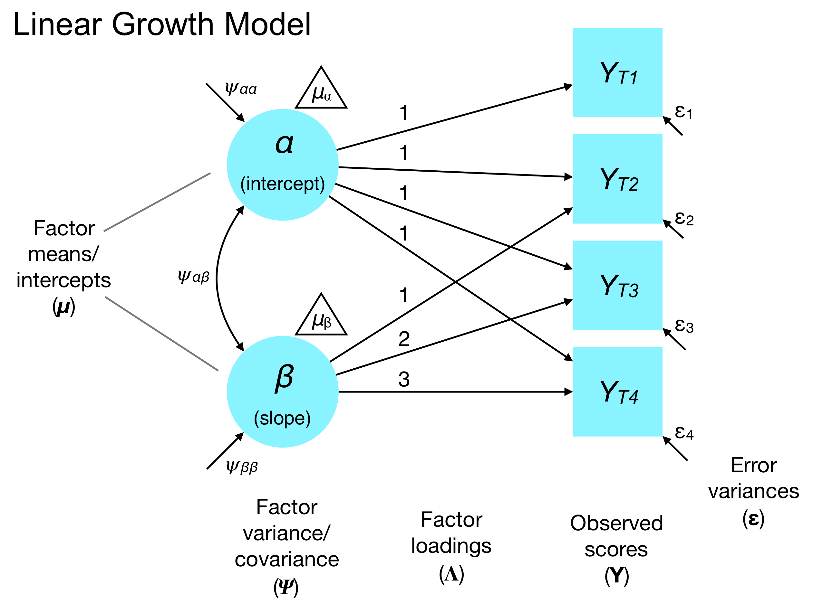

This document was adapted in part from Michael Clark's SEM course: http://m-clark.github.io/docs/sem/latent-growth-curves.html

I'm still in the midst of adapting this for our purposes, so for now, there is more overlap (and outright copying) with the Clark course than will be the case in the near future.

```{r setup, include=FALSE}
if (!require(pacman)) { install.packages("pacman"); library(pacman) }
p_load(knitr, MASS, tidyverse, viridis, lavaan, modelr, semPlot, semTools, DiagrammeR, dagitty, dagR, d3heatmap, lme4, brms)
knitr::opts_chunk$set(echo = TRUE) #print code by default
options(digits=3)
set.seed(15092) #to make simulated data the same across computers

#small function to plot all SEM diagrams using
semPaths_default <- function(lavObject, sizeMan=15, ...) {
  require(semPlot)
  semPaths(lavObject, nCharNodes = 0, sizeMan=sizeMan, sizeMan2=4, sizeLat = 13, sizeLat2=7, ...)
}
```

# Latent Curve Modeling (LCM)

Standard *latent curve models* (LCMs) instantiate the same representation of longitudinal data as multilevel models (aka hierarchical linear modeling). Both models seek to represent *initial standing* and *rate of change* in a process measured over time. Moreover, they typically quantify *interindividual* variation in growth parameters. For example, perhaps some individuals start out with greater motivation to influence climate policy, but their motivation diminishes quite rapidly. Others, however, might have low motivation that increases over time as they learn more about climate change.

## Fixed versus random effects

Fixed effects in SEM and multilevel models represent the *point estimate* of a relationship intended to capture the overall association in the sample. For example, how much does cognitive functioning decline per year of age? If we say a person's IQ on the Wechsler Adult Intelligence Test declines 0.26 points per year in a regression model, this reflects a fixed effect estimate of the *average* rate of change. However, perhaps some individuals experience slower or more rapid changes. Thus, the value of -0.26 may not capture each person, but instead represents the average (expected) effect.

```{r}
df <- data.frame(rate=rnorm(1000, -0.26, 0.02))
ggplot(df, aes(x=rate)) + geom_histogram(bins=20, color="blue", fill="grey80") + theme_bw(base_size=15) +
  xlab("IQ change per year") + geom_vline(xintercept = mean(df$rate), size=1.5) + 
  geom_label(aes(x=mean(df$rate - 0.015), y=155, label="Point estimate"), fill="white") +
  geom_segment(x=mean(df$rate) + sd(df$rate), xend=mean(df$rate) - sd(df$rate), y=3, yend=3, color="red", size=1.5) + 
  geom_label(aes(x=mean(df$rate - 0.015), y=18, label="Between-person\nvariation"), fill="white")
```

## Random effects

Data is often clustered, e.g. students within schools or individuals measured over time.  The standard linear model assumes *independent* observations. Recall the so-called 'iid' (independent and identically distributed) assumption in the standard GLM:

$$
\begin{align*}
Y &= B_0 + B_1 X_1 + \varepsilon \\
\varepsilon &\sim \mathcal{N}(0, \sigma^2)
\end{align*}
$$

However, when there are multiple observations per person, or similarities within a cluster (e.g., employees in organizations), this violates the independence assumption. One popular way to deal with these challenges is a class of models called mixed-effects models, or simply mixed models. They are mixed because there is a combination of *fixed effects* and *random effects*.

The *random effects* allow each cluster to have its own unique estimate of a parameter in addition to the overall fixed effect. In growth models, we typically allow person-specific random deviations in the intercept and slope parameters that are normally distributed around the overall intercept and slope (i.e., the fixed effects).  Mixed models are a balanced approach between ignoring these unique contributions, and over-contextualizing by running separate regressions for every cluster.

Thus, the idea is that rate of change in IQ due to aging may differ between persons, and this interindividual variation is often of great interest in longitudinal analyses. What variables predict higher versus lower rates of change? This would have policy implications for preventing cognitive aging, for example.

# LCM formality

We will only discuss clustering in the context of longitudinal data (as opposed to students in classrooms or employees within organizations). The unconditional LCM represents the outcome for the *i*th person at the *t*th time (occasion) as:

$$
y_{it} = \alpha_i + \lambda_t \beta_i + \varepsilon_{it}
$$

Thus, the model represents a person-specific intercept ($\alpha_i$) and slope ($\beta_i$) according to the following equations (note that this mirrors multilevel models):

$$
\begin{align*}
\alpha_i &= \mu_\alpha + \zeta_{\alpha i} \\
\beta_i &= \mu_\beta + \zeta_{\beta i}
\end{align*}
$$

Here, $\mu_\alpha$ is the mean intercept (starting point) in the sample (i.e., the point estimate or fixed effect) and $\mu_\beta$ is the mean rate of change. The deviations from these point estimates ($\zeta_{\alpha i}$ and $\zeta_{\beta i}$) are assumed to reflect a disturbance that captures person-specific variation relative to the sample. The unconditional LCM also assumes:

$$
\begin{bmatrix}
\zeta_{\alpha i} \\
\zeta_{\beta i}
\end{bmatrix}
\sim \mathcal{N} \left(
\begin{bmatrix}
0 \\
0
\end{bmatrix},
\begin{bmatrix}
\psi_{\alpha \alpha} & \\
\psi_{\alpha \beta} & \psi_{\beta \beta}
\end{bmatrix}
\right)
$$
That is, the subject-specific deviations (disturbances) are normally distributed with a zero mean and variances for intercepts and slopes. We also permit there to be covariance between the intercepts and slopes.

Note that if there is *positive* covariance $\psi_{\alpha \beta}$, then individuals with higher intercepts change more, whereas those with lower intercepts change less. This typically yields a 'fanning out pattern' in the trajectories (ala multifinality). By contrast, *negative* intercept-slope covariance usually reflects a 'fanning in' pattern (ala equifinality).

## Combined expression

We can put the equations for the trajectory equation ('L1' in MLM parlance) with the cluster-level model ('L2' in MLM parlance) to understand the combined (aka 'reduced form') expression of the LCM:

$$
y_{it} = (\mu_\alpha + \lambda_t \mu_\beta) + (\zeta_{\alpha i} + \lambda_t \zeta_{\beta i} + \varepsilon_{it})
$$

This expression puts the fixed effects (point estimates in the sample) in the first parentheses and the random effects (subject or observation-specific deviations) in the second parentheses.

Note that we assume that the disturbance of $y_{it}$ (i.e., residual variation) is uncorrelated with the disturbances in the intercepts and slopes for person *i*:

$$
\begin{align*}
\textrm{COV}(\varepsilon_{it}, \zeta_{\alpha i}) = 0 \\
\textrm{COV}(\varepsilon_{it}, \zeta_{\beta i}) = 0
\end{align*}
$$

Recall our unconditional LCM:



Thus, the point estimates for the intercepts and slopes reflect the *means* of the factors. And the subject-specific deviations around the point estimates are the *variances* of the factors. In this model, our $\Psi$ matrix is therefore:

$$
\boldsymbol{\Psi} = \begin{bmatrix}
\psi_{\alpha \alpha} & \\
\psi_{\alpha \beta} & \psi_{\beta \beta}
\end{bmatrix}
$$

and our $\boldsymbol{\alpha}$ vector (means of factors) is:

$$
\boldsymbol{\alpha} = [ \mu_\alpha , \mu_\beta ]
$$

Also notice that we do not have paths connecting the $\varepsilon$ disturbances (in $boldsymbol{\Theta}$) with the variances or covariances of the factors in $\boldsymbol{\Psi}$. This is consistent with the idea that measurement errors are independent of the disturbances/variances of the growth factors.

# Understanding LCMs by simulating data

One of the best ways to understand how mixed models and LCMs work is to simulate data from a model containing both fixed and random effects for growth parameters. Recall that the simple unconditional LCM contains parameters that represent *starting point* (aka intercept) and *rate of change* (aka slope). 

The LCM also asserts that interindividual variation in these parameters is normally distributed around the sample average trajectory.

Here, we will simulate balanced data (all subjects are observed at all waves) of four time-points for 500 individuals (subjects).  We will only investigate the trend ('growth'), and allow subject-specific intercepts and slopes.

```{r randomEffectsSim}
set.seed(1234)
n = 500 #500 subjects
timepoints = 4
time = rep(0:3, times=n)
subject = rep(1:n, each=4)
```

The sample average trajectory, i.e., the 'fixed' effects, will be $\mu_\alpha = .5$ and $\mu_\beta = .25$. This means our $\alpha$ vector, which contains the mean structure of latent factors in SEM is:

$$
\boldsymbol{\alpha} = \begin{bmatrix}
.5 & .25
\end{bmatrix}
$$

We will model a weak correlation between subject-specific intercepts and slopes $\psi_{\alpha \beta} = .2$ and unit variances for the individual differences in intercept and slope, $\psi_{\alpha \alpha} = 1$, $\psi_{\beta \beta} = 1$. Thus our variance/covariance matrix for the growth factors is:

$$
\boldsymbol{\Psi}=
\begin{bmatrix}
1 & \\
.2 & 1
\end{bmatrix}
$$

First, we will simulate the between-person (interindividual) variation in the growth parameters. That is, we simulate *only* the individual change component of the growth trajectory. This is person-specific variation around the sample average trajectory (capturing normative change). Remember that in SEM terms, these are the $\zeta_{\alpha i}$ and $\zeta_{\alpha b}$ parameters.

We will simulate the random effects ($\zeta$) from a multivariate normal distribution using the $\boldsymbol{\Psi}$ matrix, consistent with the LCM and mixed effects representation.

```{r createSimData}
randomEffectsCorr = matrix(c(1,.2,.2,1), ncol=2) 
randomEffects = MASS::mvrnorm(n, mu=c(0,0), Sigma = randomEffectsCorr, empirical=T) %>% data.frame()
colnames(randomEffects) = c('Int', 'Slope')
```

Let's take a look at the data thus far. These are just the person-specific deviations around the mean trajectory, but we haven't included the mean trajectory yet. Note that we have 4 rows per subject and a time variable. This 'long' format is typical in MLMs, but not LCMs. The Int column captures person-specific deviation in the starting point. Thus, positive values indicate a starting point *above* the sample mean, whereas negative values indicate a starting point *below* the sample mean.

```{r inspectSimData, echo=FALSE}
library(DT)
data.frame(Subject=subject, time=time, randomEffects[subject,]) %>% 
  datatable(options=list(dom='t'), rownames=F, width='50%') %>% formatRound(~Int+Slope, 4)
```

To simulate an observation of a process (e.g., happiness) for a given indiviudal $i$ and timepoint $t$, we simply add the random effects for the intercept $\zeta_{\alpha i}$ to the overall intercept $\mu_\alpha$, and likewise for the slopes $\mu_\beta + \zeta_{\beta i}$. We then add the so-called 'level 1' error to a given observation $y_{it}$ with standard deviation equal to $\sigma$. Note that these 'level 1' errors represent time-specific error: unexplained variance in $y_{it}$ after considering the person-specific intercept $\alpha_i$ and slope $\beta_i$. In SEM terms, we typically refer to these as error variances, measurement error, or residual variances of the indicators. In the LCM, as in other SEMs, these are represented in the $\boldsymbol{\Theta}$ matrix.

```{r createSimTarget}
#these are the fixed effects
intercept = .5 # mu alpha
slope = .25 # mu beta

sigma = .5 # standard deviation of residual variances for indicators (time-specific error)

outcome = (intercept + randomEffects$Int[subject]) + # fixed intercept + (random) subject-specific intercept deviation
  (slope + randomEffects$Slope[subject])*time + # fixed slope + (random) subject-specific slope deviation
  rnorm(n*timepoints, mean=0, sd=sigma) #level-1 error aka measurement error

d = data.frame(subject, time, outcome)
```

Here are a few values of the outcome for subjects across time:
```{r inspectSimData2, echo=FALSE}
datatable(d, options=list(dom='t'), rownames=F, width='50%') %>% formatRound(~outcome, 4)
```

## Fitting growth curves using a multilevel model

Let's estimate this as a mixed model first[^reml] using the `lme4` package. We are trying to match the *true* parameters from our simulation to the *estimated* parameters in the output. In the MLM, we allow for fixed effects for the intercept and slope ($\mu_\alpha$ and $\mu_\beta$ in LCM notation). These capture the sample-average trajectory (normative change). We also allow for random effects for the intercept and slope ($\psi_{\alpha \alpha}$ and $\psi_{\beta \beta}$), which capture interindividual variation in the intercept and slope.

```{r mixedModel}
#In the model formula, fixed effects are not in parentheses, whereas random effects are in parentheses
mixedModel = lmer(outcome ~ 1 + time + (1 + time|subject), data=d)  # 1 represents the intercept
summary(mixedModel, correlation=F)
```

Our fixed effects are at the values we set for the overall intercept and slope -- approximately 0.5 and 0.2, respectively.  The estimated random effects variances are at 1, the correlation near .2, and finally, our residual standard deviation is near the .5 value we set.

## Analyzing the same data with an LCM

To analyze these data in an LCM, we will fit latent factors for intercept and slope, but with a slightly odd syntax in which factor loadings are fixed to represent a functional form of change (linear), but are not estimated.

Specifically, we'll have a latent variable representing the random intercepts, as well as one representing the random slopes.  All loadings for the intercept factor are 1[^likematrix]. The loadings for the effect of time are arbitrary, but should accurately reflect the time spacing, and typically it is good to start at zero, so that the zero has a meaningful interpretation.

```{r growth_graph, echo=FALSE}
grViz('growth.gv', width='100%', height='25%')
```

For the LCM, our data needs to be in *wide* format, where each row represents a person and we have separate columns for each time point of the target variable, as opposed to the *long* format we used in the previous mixed model.  We can use the `spread` function from `tidyr` to help with that.

```{r wideData, echo=-1}
head(d)
# also change the names, as usually things don't work well if they start with a number.

dWide = d %>%  
  spread(time, outcome) %>% 
  rename_at(vars(-subject), function(x) paste0('outcome', x))
head(dWide)
```

Note that `lavaan` has a specific function, `growth`, to use for these models.  The model syntax is the same as with `sem`, but `growth` 1) enables mean structure (`meanstructure=TRUE`), 2) fixes the intercepts of the observed variables at zero, and 3) frees the intercepts/means of the latent factors.

```{r runGrowth}
model = "
    # intercept and slope with fixed coefficients
    i =~ 1*outcome0 + 1*outcome1 + 1*outcome2 + 1*outcome3
    s =~ 0*outcome0 + 1*outcome1 + 2*outcome2 + 3*outcome3
"

growthCurveModel = growth(model, data=dWide)
summary(growthCurveModel)
```

Most of the output is not of interest since it reflects the peculiar fixed factor loadings of the LCM, but we do get the same five parameter values we are interested in.

Start with the 'intercepts':

```{}
Intercepts:
                   Estimate  Std.Err  Z-value  P(>|z|)
                       
    i                 0.487    0.048   10.072    0.000
    s                 0.267    0.045    5.884    0.000
```

It might be odd to call your fixed effects 'intercepts', but it makes sense if we are thinking of it as a multilevel model as depicted previously, where we actually broke out the random effects as a separate model. The estimates here are pretty much spot on with our mixed model estimates, which are identical to just the standard regression estimates.

```{r fixefs}
fixef(mixedModel)
lm(outcome ~ time, data=d)
```

Now let's look at the variance estimates.  The estimation of residual variance for each y in the LCM distinguishes the two approaches, but not necessarily so.  We could fix them to be identical here, or conversely allow them to be estimated in the mixed model framework.  Just know that's why the results are not identical (to go along with their respective estimation approaches, which are also different by default).  Again though, the variances are near one, and the correlation between the intercepts and slopes is around the .2 value.

```{}
Covariances:
                   Estimate  Std.Err  Z-value  P(>|z|)
  i ~~                                                
    s                 0.226    0.050    4.512    0.000
Variances:
                   Estimate  Std.Err  Z-value  P(>|z|)
    outcome0          0.287    0.041    6.924    0.000
    outcome1          0.219    0.021   10.501    0.000
    outcome2          0.185    0.027    6.748    0.000
    outcome3          0.357    0.065    5.485    0.000
    i                 0.977    0.076   12.882    0.000
    s                 0.969    0.065   14.841    0.000
```

```{r ranefVar}
VarCorr(mixedModel)
```


The differences provide some insight.  LCM by default assumes heterogeneous variance for each time point. Mixed models by default assume the same variance for each time point, but can allow them to be estimated separately in most modeling packages.

As an example, if we fix the variances to be equal, the models are now identical. 

```{r compareMixedLCM, results='hold'}
model = "
    # intercept and slope with fixed coefficients
    i =~ 1*outcome0 + 1*outcome1 + 1*outcome2 + 1*outcome3
    s =~ 0*outcome0 + 1*outcome1 + 2*outcome2 + 3*outcome3

    outcome0 ~~ resvar*outcome0    
    outcome1 ~~ resvar*outcome1
    outcome2 ~~ resvar*outcome2
    outcome3 ~~ resvar*outcome3
"

growthCurveModel = growth(model, data=dWide)
summary(growthCurveModel)
```

Compare to the `lme4` output.

```{r compareVar, echo=F}
print(VarCorr(mixedModel), comp='Var')
```

In addition, the random coefficients estimates from the mixed model perfectly correlate with those of the latent variables.

```{r compareRandomeffects, echo=FALSE}
ranefLatent = data.frame(coef(mixedModel)[[1]], lavPredict(growthCurveModel)) %>% 
  rename(Int_mix = X.Intercept.,
         Slope_mix = time,
         Int_LCM = i,
         Slope_LCM = s)
ranefLatent %>%   round(2) %>% head
ranefLatent %>% cor %>% round(2)
```

Both approaches allow those residuals to covary, though the SEM syntax requires much more specificity. Here is the syntax for letting the *residual variance* of each time point covary with the next. Specifically, this is the syntax for a first-order autoregressive structure (aka AR1). We achieve this by defining different constraints for one-lag, two-lag, and three-lag residual covariances in the indicators. Then we specify the parametric form $\rho$, $\rho^2$, and $\rho^3$ for these lags. Note that we have constrained the residual variances to be equal at each timepoint (homogenous error).

$$
\boldsymbol{\Theta} = \begin{bmatrix}
\varepsilon & \rho & \rho^2 & \rho^3 \\
\rho & \varepsilon& \rho & \rho^2 \\
\rho^2 & \rho & \varepsilon & \rho \\
\rho^3 & \rho^2 & \rho & \varepsilon \\
\end{bmatrix}
$$

```{r lavaan_res_cor_attempt, echo=1}
model = "
    # intercept and slope with fixed coefficients
    i =~ 1*outcome0 + 1*outcome1 + 1*outcome2 + 1*outcome3
    s =~ 0*outcome0 + 1*outcome1 + 2*outcome2 + 3*outcome3

    # all of the following is needed for what are essentially only two parameters 
    # to estimate- resvar and correlation (the latter defined explicitly here)
    outcome0 ~~ resvar*outcome0
    outcome1 ~~ resvar*outcome1
    outcome2 ~~ resvar*outcome2
    outcome3 ~~ resvar*outcome3

    # timepoints 1 step apart; technically the covariance is e.g. a*sqrt(outcome0)*sqrt(outcome1), 
    # but since the variances are constrained to be equal, we don't have to be so verbose.
    outcome0 ~~ a*outcome1
    outcome1 ~~ a*outcome2
    outcome2 ~~ a*outcome3
    
    # two steps apart
    outcome0 ~~ b*outcome2
    outcome1 ~~ b*outcome3
    
    # three steps apart
    outcome0 ~~ c*outcome3
    
    # fix parameters according to ar1
    b == a^2
    c == a^3
"
gcOut = growth(model, data=dWide)
summary(gcOut, standardized=T)

#here is the same approach in the MLM framework
library(nlme)
lmeOut = lme(outcome ~ time, random= ~1 + time|subject, data=d, correlation=corAR1(form=~ time | subject), method='ML')
summary(lmeOut, correlation=F)  # compare Residual StdDev to resvar^.5, and phi to 'a/resvar' or std.all 'a' from lavaan
```

If you're curious, here are the equivalent Bayesian multilevel models implemented using `stan` and the `brms` package
```{r brmcomparison, echo=FALSE, eval=F}
test = brms::brm(outcome ~ time + (1+time|subject), d, cores=4)
summary(test)
test = brms::brm(outcome ~ time + (1+time|subject), autocor = cor_ar(~time|subject), data= d, cores=4)
summary(test)
```

# Parallel process LCM example

From Michael Clark
```{r}
# parallel process --------------------------------------------------------
# See EXAMPLE 6.13 in Mplus User's Guide

# let's simulate data with a negative slope average and positive correlation among intercepts and other process slopes
set.seed(1234)
n = 500
timepoints = 4
time = rep(0:3, times=n)
subject = rep(1:n, each=4)

# first we'll draw intercepts with overall mean .5 and -.5 for the two
# processes, and let them have a slight correlation. Their variance is 1.
intCorr = matrix(c(1,.2,.2,1), ncol=2) 
colnames(intCorr) = rownames(intCorr) = c('i1', 'i2')
intCorr

interceptP1 = .5
interceptP2 = -.5

ranInts = MASS::mvrnorm(n, mu=c(0,0), Sigma = intCorr, empirical=T)
ranInts = data.frame(ranInts)
head(ranInts)
cor(ranInts)
colMeans(ranInts)

# now create slopes with intercept/mean .4, -.4, but the same positive
# relationship with their respective intercept. Their variances are also 1.
slopeP1 = .4
slopeP2 = -.4

s1 = .3*ranInts$i2  + rnorm(n)
s2 = .3*ranInts$i1  + rnorm(n)

ranef = data.frame(ranInts, s1, s2)
head(ranef)


# so we have slight positive correlations among all random intercepts and slopes
y1 = (interceptP1 + ranef$i1[subject]) + (slopeP1+ranef$s1[subject])*time + rnorm(n*timepoints, sd=.5)
d1 = data.frame(Subject=subject, time=time, y1)
head(d1)

library(ggplot2)
ggplot(aes(x=time, y=y1), data=d1) + 
  geom_line(aes(group=Subject), alpha=.1) + 
  geom_smooth(method='lm',color='red')


y2 = (interceptP2 + ranef$i2[subject]) + (slopeP2+ranef$s2[subject])*time + rnorm(n*timepoints, sd=.5)
d2 = data.frame(Subject=subject, time=time, y2)

# process 2 shows the downward overall trend as expected
ggplot(aes(x=time, y=y2), data=d2) + 
  geom_line(aes(group=Subject), alpha=.1) + 
  geom_smooth(method='lm',color='red')

# Widen from long form for lavaan
library(tidyr)
negslopepospath1 = d1 %>% spread(time, y1)
colnames(negslopepospath1) = c('Subject', paste0('y1', 1:4))
head(negslopepospath1)

negslopepospath2 = d2 %>% spread(time, y2)
colnames(negslopepospath2) = c('Subject', paste0('y2', 1:4))

# combine
dparallel = dplyr::left_join(negslopepospath1, negslopepospath2)
head(dparallel)

mainModel = "
i1 =~ 1*y11 + 1*y12 + 1*y13 + 1*y14
s1 =~ 0*y11 + 1*y12 + 2*y13 + 3*y14


i2 =~ 1*y21 + 1*y22 + 1*y23 + 1*y24
s2 =~ 0*y21 + 1*y22 + 2*y23 + 3*y24

s1 ~ i2
s2 ~ i1
"

mainRes  = growth(mainModel, data=dparallel)
summary(mainRes)
fscores = lavPredict(mainRes)
broom::tidy(data.frame(fscores))
lm(s2~., fscores)

cor(fscores)
qplot(s1, i2, data=data.frame(fscores)) + geom_smooth(method='lm', se=F)
fv = lavPredict(mainRes, 'ov')
summary(mainRes, standardized=T)
d3heatmap::d3heatmap(cor(fv, fscores))
d3heatmap::d3heatmap(cor(select(dparallel, -Subject), ranef), Rowv = F, Colv = F)


process1Model = "
  i1 =~ 1*y11 + 1*y12 + 1*y13 + 1*y14
  s1 =~ 0*y11 + 1*y12 + 2*y13 + 3*y14
"
p1Res = growth(process1Model, data=dparallel)
fscoresP1 = lavPredict(p1Res)

process2Model = "
  i2 =~ 1*y21 + 1*y22 + 1*y23 + 1*y24
  s2 =~ 0*y21 + 1*y22 + 2*y23 + 3*y24
"
p2Res = growth(process2Model, data=dparallel)
fscoresP2 = lavPredict(p2Res)

fscoresSeparate = data.frame(fscoresP1, fscoresP2)

pathMod = "
  s1 ~ i2
  s2 ~ i1
  
  i1~~i2
"

pathModRes = sem(pathMod, data=fscoresSeparate, fixed.x = F)
summary(pathModRes)  # you'd have come to the same conclusions
summary(mainRes)
```

[^reml]: One can set REML=F so as to use standard maximum likelihood and make the results directly comparable to <span class="pack">lavaan</span>.

[^nonlinearfewtimepts]: I personally cannot *see* bends with only four time points, at least such that I couldn't just as easily posit a linear trend.

[^likematrix]: Those familiar with the model matrix for regression will recognize 'intercept as 1'.
