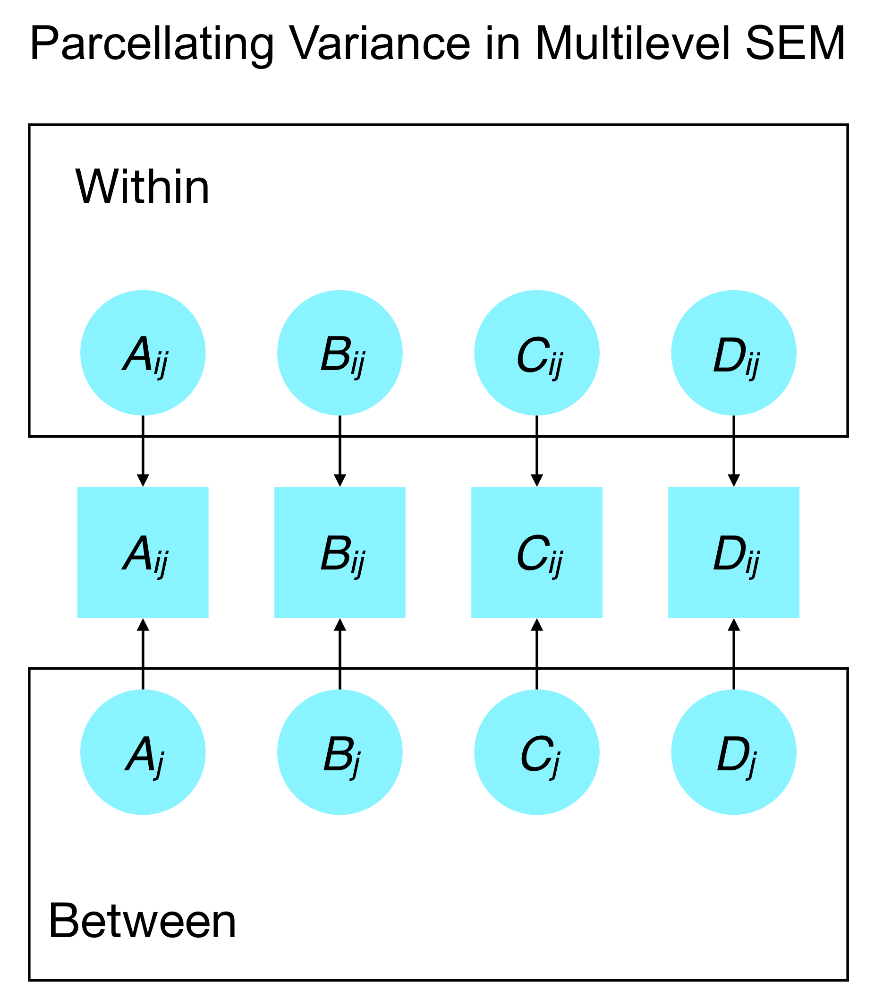
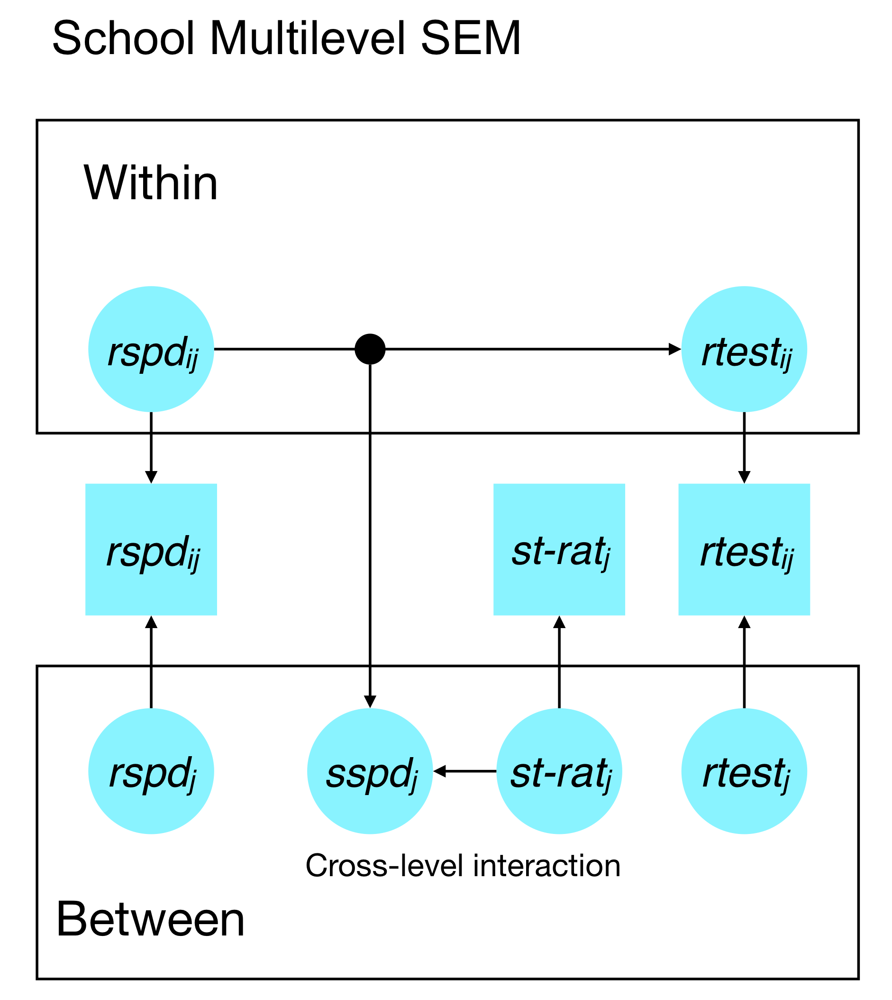
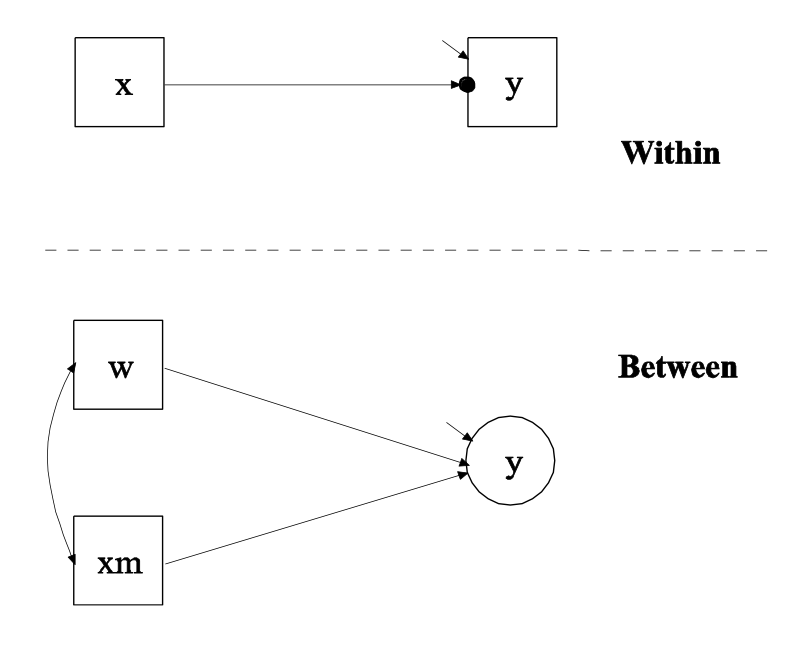
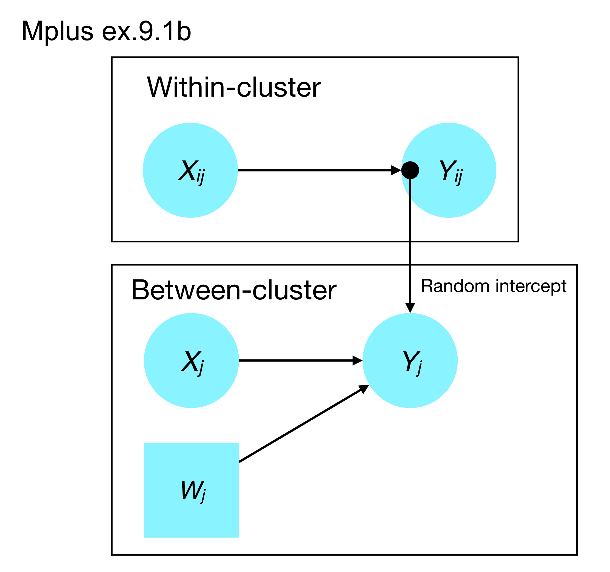
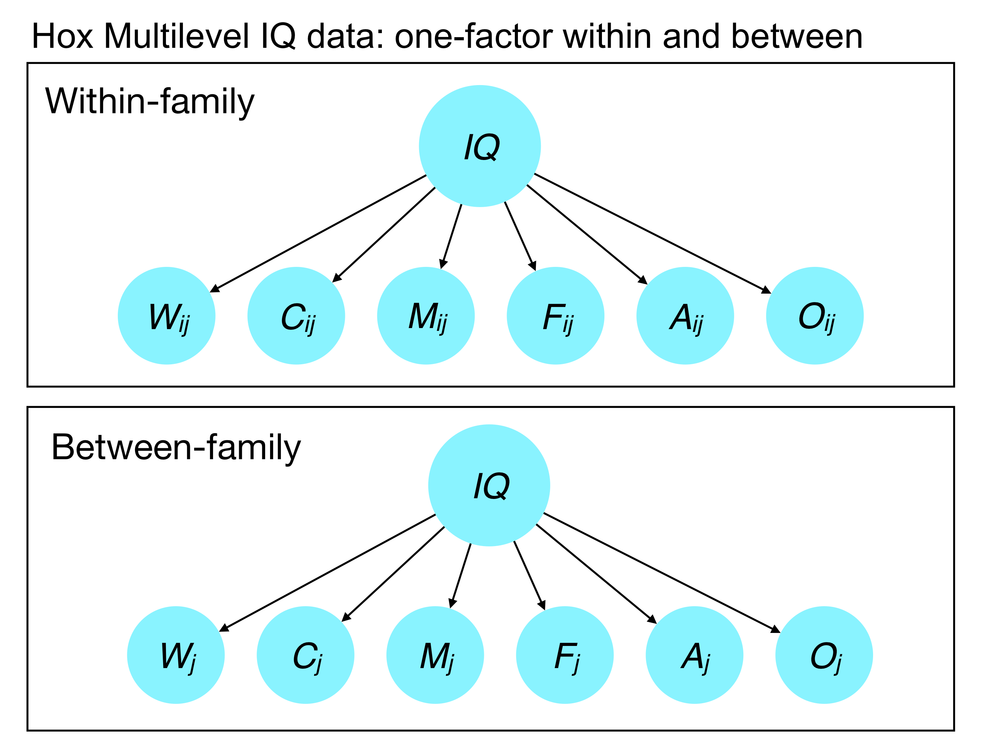
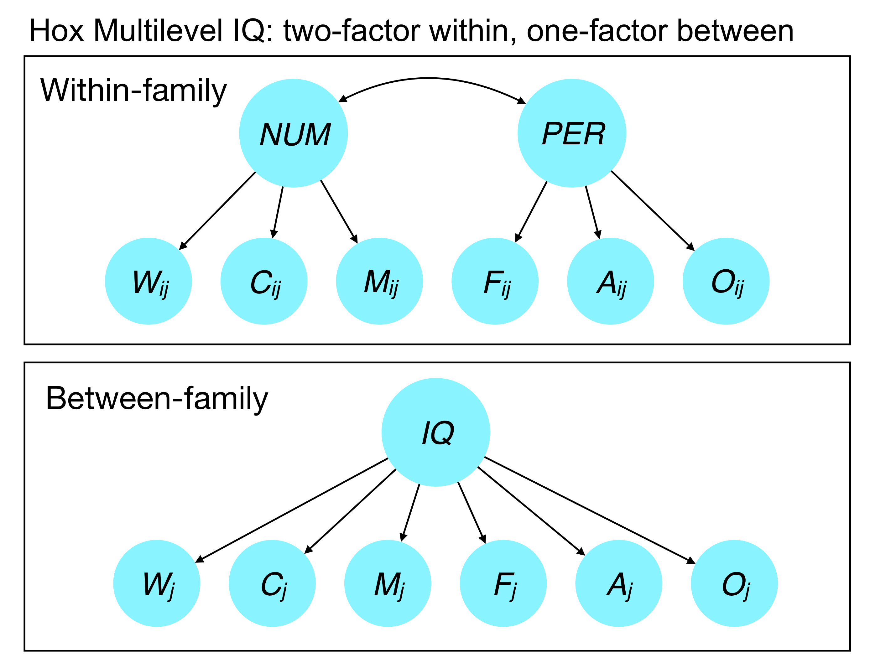

<style type="text/css">
body{ font-size: 20px; max-width: 1600px; margin: auto; padding: 1em; }
code.r{ font-size: 18px; }
p { padding-top: 10px; padding-bottom: 10px; }
pre { font-size: 16px; }
</style>


Note that this `Rmd` file depends on having `Mplus` installed. You can obtain a fully functioning student version for $350 here: https://www.statmodel.com/orderonline/categories.php?category=Mplus-Software/Student-Pricing. 

Or you can use the demo version for free here: https://www.statmodel.com/demo.shtml

The demo version has the following constraints:

1.  Maximum number of dependent variables: 6
2.  Maximum number of independent variables: 2
3.  Maximum number of between variables in two-level analysis: 2
4.  Maximum number of continuous latent variables in time series analysis: 2

At this time, Yves Rosseel, the main developer of `lavaan`, has a prototype of multilevel SEM working for the package, but this has not been released to the general public. I suspect that this will be released in the next 6 months and should provide the functionality to run all of the examples in this RMarkdown file. You can see some of the basic setup here: http://users.ugent.be/~yrosseel/lavaan/tubingen2017/

In the meantime, `Mplus` is probably the most user-friendly program for multilevel SEM, though there is similar functionality in EQS and LISREL. In addition, the `OpenMx` package in `R` is free and supports multilevel analyses, but requires a substantially different approach to syntax and specification.

This RMarkdown also leverages a package called `MplusAutomation`, which allows for effective cross-talk between `Mplus` and `R`. In particular, `Mplus` outputs all information into a text-based file, which makes it difficult to compare outputs across models or to extract specific subsections. If you're interested in how this package works, please see [Hallquist and Wiley](http://dependpsu.weebly.com/uploads/6/4/4/5/64458901/hallquist-wiley_mplusautomation_manuscript_sem_accepted_oct2017.pdf) (in press), *Structural Equation Modeling*.

```{r setup, include=FALSE}
if (!require(pacman)) { install.packages("pacman"); library(pacman) }
p_load(knitr, MASS, tidyverse, lavaan, modelr, semPlot, semTools, DiagrammeR, MplusAutomation, texreg, lme4)
knitr::opts_chunk$set(echo = TRUE) #print code by default
options(digits=3)
set.seed(15092) #to make simulated data the same across computers

#small function to plot all SEM diagrams using
semPaths_default <- function(lavObject, sizeMan=15, ...) {
  require(semPlot)
  semPaths(lavObject, nCharNodes = 0, sizeMan=sizeMan, sizeMan2=4, sizeLat = 13, sizeLat2=7, ...)
}

#Where the mplus binary lives on my computer. Only needed if installed in a non-standard location.
mbin <- "/Users/mnh5174/Applications/Mplus/mplus"
```

# What is multilevel analysis?

In the standard general linear model (GLM), we assume that observations are independent of each other. In particular, we assume that the residuals are distributed iid normal:

$$
\begin{align*}
Y &= B_0 + B_1 X_1 + B_2 X_2 + ... B_p X_p + \varepsilon \\
\varepsilon &\sim \mathcal{N}(0, \sigma^2)
\end{align*}
$$

The assumption of independence is violated when:

1.  There are multiple observations per person (e.g., longitudinal data).
2.  There are known groups in the data that introduce similarity among group members.

Examples of multilevel/clustered data:

1.  Trials of an experimental task nested within individual (e.g., reaction times or accuracy data)
2.  A set of neurons (e.g., a population) measured in each animal, but with the goal of describing the pattern in a group of animals
3.  Longitudinal measurements of questionnaire or interview-based data
4.  Students within classrooms within schools (a so-called three-level model)
5.  Patients within therapy groups

In each case, the goal of multilevel analyses, including multilevel SEM, is to account for both within-cluster and between-cluster variability explicitly. If we were to analyze the data ignoring the group structure, we would overestimate the degrees of freedom (since our observations are non-independent). And we could not separate within- versus betewen-cluster effects; instead, our parameters would reflect an unknown mixture of the two.

## L1 versus L2 effects

Multilevel analysis also allows the researcher to ask specific questions at each level of the model. Let's consider the case of students (L1) nested within schools (L2). More specifically, let's say we're interested in what student- and school-level factors influence test performance. At the school level (aka L2), we hypothesize that the student:teacher ratio influences reading performance such that more students per teacher is associated with poorer performance. By definition, the student:teacher ratio is only meaningful as a school-level variable (setting aside the possibility of classroom variation) and has no variation at the person level. This might look like:

```{r}
tt <- dplyr::tribble(
~student, ~school, ~stratio, ~readtest,
1, "Radio Park", 20, 15,
2, "Radio Park", 20, 12,
3, "Radio Park", 20, 19,
4, "Corl Street", 16, 24,
5, "Corl Street", 16, 27,
6, "Corl Street", 16, 21
)

kable(tt)
```

Notice that there is no student-specific variation in the `stratio`. This is the simplest case for a predictor because there is no concern that it could represent a mixture of student and school effects. That is, stratio cannot predict any L1 variance.

We wish to represent the reading test performance for person *i* in school *j* as a function of reading speed. Some notation:

$$
\begin{align*}
\textrm{readtest}_{ij} &= \beta_{0j} + r_{ij} \\
\beta_{0j} &= \gamma_{00} + \gamma_{01} \textrm{stratio}_j + \mu_{0j} \\
\end{align*}
$$
In this notation, $\gamma_{01}$ represents the school-level effect of student:teacher ratio on test performance. We also allow for there to be normally distributed school-level variation in test performance, $\mu_{0j}$ around the sample average $\gamma_{00}$. To keep the $\beta_{0j}$ equation easy to interpret, L2 predictors are typically centered around the grand mean. This ensures that $\gamma_{00}$ retains the interpretation of the sample average test performance (fixed effect), and $\mu_{0j}$ is school variation around this mean (random effect).

In addition, we might ask: what student characteristics enhance performance on standardized tests? These would be considered L1 predictors because they vary at the level of the student.

For example, students who read more words per minute may perform better on a standardized reading comprehension exam.

```{r}
tt <- tt %>% add_column(readpermin=c(20, 14, 18, 25, 35, 30), .before="school")
kable(tt)
```

## Disaggregating within- versus between-cluster effects

Importantly, the association between an L1 predictors and the outcome could reflect student and/or school variability. Perhaps students read more quickly because of an individual-level (aka L1) factor such as gray matter volume. Or might some schools have policies that promote better reading such that the average reading speed varies by school (i.e., at L2).

Because reading speed is an L1 variable (i.e., individual/student), it may have systematic variation at both the individual (L1) and school (L2) level. In conventional multilevel modeling (MLM), one can disentangle the variance at each level using appropriate centering (Curran & Bauer, 2011). In particular, the usual approach is to center the predictor (reading speed) around the school mean such that we now have a variable that represents deviation in reading speed relative to the school average. Then, we also compute the school means and include those as a predictor at L2. In this way, the effect of per-school reading speed on test performance can be examined specifically. Likewise, individual variation in reading speed not explainable by the school average can also be examined.

More notation from the MLM world. 

$$
\begin{align*}
\textrm{readtest}_{ij} &= \beta_{0j} + \beta_{1j} \textrm{readspeed}_{ij} + r_{ij} \\
\beta_{0j} &= \gamma_{00} + \gamma_{01} \textrm{stratio}_j + \mu_{0j} \\
\beta_{1j} &= \gamma_{10} + \mu_{1j}
\end{align*}
$$

The major difficulty of this representation is that $\textrm{readspeed}_{ij}$ may have variation at the person and school levels. Thus, the main coefficient of interest for this predictor, $\gamma_{10}$, (fixed effect) is an unknown combination of indiviual and school effects. Here, we also allow for the association of reading speed with reading test performance to vary randomly by school, $\mu_{1j}$.

As mentioned above, to handle the problem of $\textrm{readspeed}$ potentially having variation at L1 and L2, we apply the L1 centering + L2 means approach.

The notation for the school-centered reading speed is:

$$
\dot{\textrm{readspeed}_{ij}} = \textrm{readspeed}_{ij} - \bar{\textrm{readspeed}_{j}}
$$

That is, we subtract the school mean reading speed, $\bar{\textrm{readspeed}_{j}}$, from each student in that school.

We then introduce both of these new variables into the model:

$$
\begin{align*}
\textrm{readtest}_{ij} &= \beta_{0j} + \beta_{1j} \dot{\textrm{readspeed}_{ij}} + r_{ij} \\
\beta_{0j} &= \gamma_{00} + \gamma_{01} \textrm{stratio}_j + \gamma_{02} \bar{\textrm{readspeed}_{j}} + \mu_{0j} \\
\beta_{1j} &= \gamma_{10} + \mu_{1j}
\end{align*}
$$

Thus, the school-average reading speed predicts school-level variation in test performance, whereas
school-deviated individual variation predicts the association of individual reading speed on performance.

This is perhaps more evident in the combined equation:

$$
\textrm{readtest}_{ij} = ( \gamma_{00} + \gamma_{01} \textrm{stratio}_j +
\gamma_{02} \bar{\textrm{readspeed}_{j}} +
\gamma_{10} \dot{\textrm{readspeed}_{ij}} ) + \\
( r_{ij} + \mu_{0j} + \mu_{1j} \dot{\textrm{readspeed}_{ij}} )
$$
Note how $\textrm{readspeed}$ enters the model in two ways (individual and school level). As in previous examples, the fixed effects are denoted in the first set of parentheses, and the random effects in the second.

# Multilevel SEM (MSEM) overview

Okay, so we've got our head around standard multilevel models. Where does SEM enter the picture? In multilevel SEM, we use a latent variable approach to parcellate variation between and within clusters, rather than applying a cluster-based centering approach. This is the intuition:



In this representation, we view the observed variables as jointly caused by within- and between-cluster variation as latent variables.

Importantly, this framework also allows for the specification of random slopes such that within-person/cluster variation in the strength of an association between two variables can *itself* be a latent variable at the between-person level. For example, does the within-person association of reading speed with performance depend on student:teacher ratio? Said differently, does student:teacher ratio moderate the relationship between reading speed and performance? This is the multilevel SEM equivalent of *cross-level interaction* in MLM. Our graphical notation is as follows:



So far, however, the expression of multilevel data in a SEM framework has not revealed any new capabilities beyond standard MLM. Why would one consider multilevel SEM? First, some people find it easier to conceptualize of multilevel data structures and models within the SEM framework where we are used to path diagrams. Second, as in other non-multilevel analyses such as mediation, multilevel SEM offers the ability to test hypotheses involving several variables and paths. For an excellent introduction to the value of SEM for testing multilevel mediation, see Preacher, Zyphur, and Zhang (2010), *Psychological Methods*. Third, multilevel SEM allows us to test hypotheses involving *latent* variables, which are hard to implement in standard MLM. In particular, we can consider measurement models in which the covariation among a set of indicators is thought to reflect a latent variable. Fourth, the approach of cluster-mean centering introduces a potential bias in the between-group variance. In particular, having few level 1 observations and a low intraclass correlation will bias estimates of between-cluster effects (Lüdtke et al., 2008). This is especially problematic in cross-level mediation, where it is essential to treat the L1 portion of variance as a latent variable to recover unbiased parameters (Asparouhov & Muthén, 2006). In short, the latent decomposition of within-between in MSEM tends to provide better estimates than the centering method in MLM. 

## Sampling perspective

In MSEM, we have the option of whether to approach clustering from a (population) sampling perspective or a multilevel perspective. The sampling perspective is more typical in epidemiological or demographically representative studies in which we use stratified random sampling to cover the population of interest. This often involves computing sampling weights in which we might try to weight each set of observations so that the overall sample matches the composition of the population. For example, if we undersample African-American males, but wish to include them in the population to which we generalize, we might overweight those observations accordingly so that the parameters are more representative of the general population.

This problem also occurs in situations where individuals are nested in neighborhoods, cities, or states, but we wish to generalize to the overall population (e.g., adults in the USA). Again, we might reweight observations in the estimation in order to estimate a model that is representative of the population of interest. Thus, if we oversample Colorado and undersample Idaho, reweighting could help us recover unbiased parameters that correct for this problem.

According to the sampling perspective, clustering is an important feature of the data, but primarily because we wish to 'uncluster' the data in a representative fashion. That is, we are not interested in whether Colorado or Idaho has higher prevalence rates of depression, but instead we wish to estimate the prevalence of depression in the USA, accounting for the design of the epidemiological survey. If any/all of these questions pertain to your dataset or interest, see the `lavaan.survey` package, which is an add-on to `lavaan` that provides the functionality to handling design weights, clustering, and stratification. For example, we might wish to remove the effect of interviewer on prevalence estimates, rather than examine within-interviewer versus between-interviewer predictors. This could be done by setting up a `svydesign` object in which we account for clustering by interviewer.

FYI, the sampling perspective on clustered data is implements in Mplus using the `TYPE=COMPLEX` specification in the `ANALYSIS` section.

## Multilevel perspective

By contrast, the multilevel perspective on clustered data is that we are specifically interested in parcelling variance at each level of the data structure so that we could examine predictors that explain variance at each level. For example, some researchers in our department (e.g., Dever Carney and Louis Castonguay) are interested in what are the client (L1), therapist (L2), and center/clinic (L3) factors that predict treatment outcomes in psychotherapy. As we talked about above, if a predictor exists at a lower level of the hierarchy (e.g., L1), it may nevertheless have systematic variance at higher levels. Thus, a client factor such as perceived therapeutic alliance may explain client-specific outcomes (L1), but alliance may also vary at the therapist level such that the clients of some therapists (L2) rate alliance higher, on average, relative to other therapists. Thus, even though we view alliance as the experience of a *client*, therapist-average alliance may explain why clients of some therapists do better than others. This is why the disaggregation approach mentioned above is crucial to resolving such questions: within-cluster centering, inclusion of cluster means.

In MSEM, we have the option of using the conventional centering strategy or use latent decomposition (as mentioned above) to disaggregate variance for a lower-level variable at each level.

In Mplus, we use `TYPE=TWOLEVEL` or `TYPE=THREELEVEL` in the `ANALYSIS` section to specify a multilevel model.

# Multilevel SEM specification

The formal specification of multilevel SEM (Muthén & Asparouhov, 2008) is:

$$
\boldsymbol{Y}_{ij} = \boldsymbol{\nu_j} + \boldsymbol{\Lambda}_j\boldsymbol{\eta}_{ij} + \boldsymbol{K_j}\boldsymbol{X}_{ij} + \boldsymbol{\varepsilon}_{ij}
$$

As in non-multilevel SEM, $\boldsymbol{\nu}_j$ captures the intercepts of the variables, but allowing these to vary by cluster. And as usual, we have factor loadings ($\boldsymbol{\Lambda}_j$), factor scores (\boldsymbol{\eta}_{ij}), and the influence of exogenous covariates $\boldsymbol{X}_{ij}$. The important point is that all of these can potentially vary by cluster. I'll spare you the details on how MSEM parcels the structural and measurement models at the within and between levels... But the MSEM can be estimated using maximum likelihood in the typical fashion, with variance being assigned to the appropriate level by latent variable estimation.

# A bit about Mplus MSEM syntax

Unlike `lavaan`, which is a package for `R` that follows most `R` conventions, Mplus is a standalone program that has its own syntax. Although Mplus cannot compete with the all-purpose functionality of `R` for data management and visualization, Mplus has developed a host of useful features for manipulating data, such as within-cluster centering or computing interaction terms.

The basic paradigm of Mplus is that a model consists of three parts: data, model syntax, and model output. By convention, the raw data are provided as a tab-separated file with no column headers, typically using the extension .dat. The Mplus model syntax has its own conventions, such as the use of `ON` to denote the regression of `Y ON X`. Likewise, `WITH` denotes the undirected (residual) association of `X WITH Y`. And factors are specified using `BY`, as in 'measured by': `F1 BY X1 X2 X3`. Mplus syntax also has major sections that define important components of the model, such as the estimator, what data are categorical, what additional outputs to provide, and so on.

By convention, Mplus syntax files are stored as text with the extension .inp. And the output provided by Mplus is also text, stored as .out. There is an impressive array of information in the output file, but its storage as text makes it time-intensive to sift through each section. This is where the `readModels()` command from `MplusAutomation` can help index a number of output files by storing the information in R-friendly data structures such as lists and data.frames.

## WITHIN

If a variable is specified as `WITHIN` in the `VARIABLE` section, then it is assumed to vary *only* within clusters and to have no between component. In the latent decomposition, the between component of the variable is zero. Thus, this statement is used when 1) the variable varies at the within-cluster level, and 2) we wish to assign the totality of its variance at the within-cluster level, assuming that there is no between component.

## BETWEEN

If a variable is specified as `BETWEEN` in the `VARIABLE` section, it is a cluster-level variable that has no variation within-cluster. These are typically called L2 variables. For example, student:teacher ratio would be a `BETWEEN` variable if we are examining students nested in schools.

## Neither WITHIN nor BETWEEN

If we do not specify that a variable is `WITHIN` or `BETWEEN` then Mplus will model its variance at both levels. That is, it will use latent decomposition to parcellate the variance into within- and between-cluster variance. At the between-cluster level, this means we are modeling the random intercept of that variable.

# Getting started with MSEM in Mplus

Let's start with a simple multilevel model that we could fit using conventional MLM software. This is Example 9.1 from the Mplus user's guide.

## Centering approach to disaggregation



The dot on the $y$ box denotes a random intercept of y. That is, there is between-cluster variation in the average level of $y$ that can be modeled at the between level. $x$ is the person-centered L1 predictor. $xm$ is the person mean on $x$. $w$ is a cluster-level covariate (i.e., no within variance).
```
TITLE:	this is an example of a two-level 
	regression analysis for a continuous 
	dependent variable with a random intercept and an observed covariate
DATA:	FILE = ex9.1a.dat;
VARIABLE:	NAMES = y x w xm clus;
	WITHIN = x;
	BETWEEN = w xm;
	CLUSTER = clus;
DEFINE:	CENTER x (GRANDMEAN);
ANALYSIS:	TYPE = TWOLEVEL;
MODEL:
	%WITHIN%	
	y ON x;
	%BETWEEN%
	y ON w xm;
```

```{r}
ex9.1a <- read.table("ex9.1a.dat", col.names = c("y", "x", "w", "xm", "clus"))
kable(head(ex9.1a, n=15))

ex9.1a_mobj <- mplusObject(
  TITLE="this is an example of a two-level 
	  regression analysis for a continuous 
	  dependent variable with a random intercept and an observed covariate",
  VARIABLE="WITHIN = x;
	  BETWEEN = w xm;
	  CLUSTER = clus;",
  DEFINE = "CENTER x (GRANDMEAN);",
  ANALYSIS = "TYPE = TWOLEVEL;
    ESTIMATOR=MLR;",
  MODEL = "%WITHIN%	
	  y ON x;
	  %BETWEEN%
	  y ON w xm;",
  OUTPUT="STDYX RESIDUAL;",
  rdata = ex9.1a
)

ex9.1a_fit <- mplusModeler(ex9.1a_mobj, modelout = "ex9.1a.inp", run=TRUE, Mplus_command = mbin, hashfilename = FALSE)
screenreg(ex9.1a_fit$results, single.row=TRUE, summaries = c("AICC", "CFI", "SRMR.Within", "SRMR.Between"))

#examine w/i and b/w data structure
#ex9.1a <- ex9.1a %>% group_by(clus) %>% mutate(xm_mine=mean(x), xwi=x - xm_mine)
#round(cor(ex9.1), 3)
```

Let's compare that to the `lmer` function in `R`:

```{r}
ex9.1a_lmer <- lmer(y ~ x + w + xm + (1 | clus), ex9.1a, REML=FALSE)
summary(ex9.1a_lmer)
```

You can see that the results are essentially identical.

## Latent decomposition approach to disaggregation

Unlike MLM, MSEM also offers the potential to consider variation in an observed variable as joint function of within- and between-cluster latent components. Let's re-run this analysis, using the decomposition approach.



```
TITLE:	this is an example of a two-level 
	regression analysis for a continuous 
	dependent variable with a random intercept and a latent covariate
DATA:	FILE = ex9.1b.dat;
VARIABLE:	NAMES = y x w clus;
	BETWEEN = w;
	CLUSTER = clus;
DEFINE: CENTER x (GRANDMEAN);
ANALYSIS:	TYPE = TWOLEVEL;
MODEL:
	%WITHIN%	
	y ON x (gamma10);
	%BETWEEN%
	y ON w 
	x (gamma01);
MODEL CONSTRAINT:
	NEW(betac);
	betac = gamma01 - gamma10;
```

```{r}
ex9.1b <- read.table("ex9.1b.dat", col.names = c("y", "x", "w", "clus"))
kable(head(ex9.1b, n=15))

ex9.1b_mobj <- mplusObject(
  TITLE="this is an example of a two-level 
	  regression analysis for a continuous 
	  dependent variable with a random intercept and a latent covariate",
  VARIABLE="BETWEEN = w;
	  CLUSTER = clus;",
  DEFINE = "CENTER x (GRANDMEAN);",
  ANALYSIS = "TYPE = TWOLEVEL;
    ESTIMATOR=MLR;",
  MODEL = "
    %WITHIN%
	    y ON x (gamma10);
	  %BETWEEN%
	    y ON w 
	         x (gamma01);",
  OUTPUT="STDYX RESIDUAL;",
  rdata = ex9.1b
)

ex9.1b_fit <- mplusModeler(ex9.1b_mobj, modelout = "ex9.1b.inp", run=TRUE, Mplus_command = mbin, hashfilename = FALSE)
screenreg(ex9.1b_fit$results, single.row=TRUE, summaries = c("AICC", "CFI", "SRMR.Within", "SRMR.Between"))
#ex9.1 <- ex9.1 %>% group_by(clus) %>% mutate(xm_mine=mean(x), xwi=x - xm_mine)
#ex9.1 %>% group_by(clus) %>% 

```

## Random slopes in MSEM

As in standard MLM, we might expect there to be between-person variation in the strength of an association. For example, are there meaningful interindividual differences in the rate of change in age-related declines in memory? In MSEM, we need to specify these random slopes as latent variables that vary at L2.

Here is example 9.2 from the users guide using the within-between latent disaggregation for $x$, an L1 predictor.

```
TITLE:	this is an example of a two-level 
	regression analysis for a continuous 
	dependent variable with a random slope and a latent covariate
DATA:   FILE = ex9.2c.dat;
VARIABLE:	NAMES = y x w clus;
	BETWEEN = w;
	CLUSTER = clus;
ANALYSIS:	TYPE = TWOLEVEL RANDOM;
MODEL:
	%WITHIN%	
 	s | y ON x;		
	%BETWEEN%	
	y s ON w x;
	y WITH s;
```

```{r}
ex9.2c <- read.table("ex9.2c.dat", col.names = c("y", "x", "w", "clus"))
kable(head(ex9.2c, n=15))

ex9.2c_mobj <- mplusObject(
  TITLE="this is an example of a two-level 
	regression analysis for a continuous 
	dependent variable with a random slope and a latent covariate",
  VARIABLE="BETWEEN = w;
	  CLUSTER = clus;",
  DEFINE = "CENTER x (GRANDMEAN);",
  ANALYSIS = "TYPE = TWOLEVEL RANDOM;
    ESTIMATOR=MLR;",
  MODEL = "
    %WITHIN%	
 	    s | y ON x;		
	  %BETWEEN%	
	    y s ON w x;
	    y WITH s;",
  OUTPUT="STDYX RESIDUAL;",
  rdata = ex9.2c
)

ex9.2c_fit <- mplusModeler(ex9.2c_mobj, modelout = "ex9.2c.inp", run=TRUE, Mplus_command = mbin, hashfilename = FALSE)
screenreg(ex9.2c_fit$results, single.row=TRUE, summaries = c("AICC"))

```


# Hox Family IQ MSEM example

These data are from Joop Hox's multilevel book. The basic structure is that we have six intelligence measures for 400 children from 60 families. Thus, we have children nested within families. If intelligence has a genetic or heritable component, the between-family differences may be of particular interest. The measures are word list, cards, matrices, figures, animals, and occupations.
One possibility is that the intelligence tests all form a single *g* factor at the between-family level such that some families have higher average scores on intelligence measures than others. Another possibility is that the subscales form two factor: numeric (word list, cards, matrices) versus perceptual (figures, animals, occupations) intelligence.

As in the case of standard MLM, in MSEM, we often wish to examine the amount of variation at each level in an unconditional model. For SEM purposes, examining the independence and saturated models is informative. As we've talked about in standard SEM, the independence model gives us a worst case fit where we do not permit item covariation. And the saturated model gives us perfect fit without any parsimony or prediction. This is true of MSEM as well, but we can examine the spectrum between independence and saturated at both the within and between levels.

## Independence model

To get a sense of whether there is structured variance in IQ due to family, we can estimate an independence model for the data in which the IQ variables are assumed to be unrelated at both the within- and between-family levels. This gives us a benchmark for variation at these levels.

Here is the raw Mplus syntax

```
TITLE:  Within independence; Between independence;
DATA: FILE IS "FamIQData.dat";
VARIABLE: NAMES ARE
 family child wordlist cards matrices figures animals occupats;
USEVARIABLES ARE wordlist cards matrices figures animals occupats;
CLUSTER IS family;
ANALYSIS: TYPE IS TWOLEVEL;
 ESTIMATOR IS MLR;
MODEL:
 %WITHIN%
 %BETWEEN%
OUTPUT: STDYX SAMPSTAT;
```

Note that I've printed out the unstandardized estimates here to give a sense of variation in each variable in the original unit. Otherwise, we'd see variances of 1.0 at both levels for the standardized estimates. For other models, however, I primarily report completely standardized effects (std.all in lavaan terms) for interpretability.

```{r}
#import data from spss
hoxdata <- haven::read_spss("FamIQData.sav")

mobj1 <- mplusObject(
  TITLE = "Within independence; Between independence;",
  VARIABLE = "CLUSTER = family;
    USEVARIABLES ARE wordlist cards matrices figures animals occupats;",
  ANALYSIS = "TYPE IS TWOLEVEL;
    ESTIMATOR IS MLR;",
  MODEL = "%WITHIN%
    %BETWEEN%",
  OUTPUT = "STDYX SAMPSTAT;",
  rdata=hoxdata
)
mfit1 <- mplusModeler(mobj1, modelout = "hox_m1.inp", run=1L, Mplus_command = mbin, hashfilename = FALSE)

screenreg(mfit1, single.row=TRUE, summaries = c("AICC", "CFI", "SRMR.Within", "SRMR.Between"))
```

## Saturated model

At the other end of the spectrum, we could estimate a saturated model for both within- and between-cluster variation.

Here is the raw Mplus syntax:

```
TITLE:  Within saturated, Between saturated;
DATA: FILE IS "FamIQData.dat";
VARIABLE: NAMES ARE
 family child wordlist cards matrices figures animals occupats;
USEVARIABLES ARE wordlist cards matrices figures animals occupats;
CLUSTER IS family;
ANALYSIS: TYPE IS TWOLEVEL;
 ESTIMATOR IS MLR;
MODEL:
 %WITHIN%
  wordlist cards matrices figures animals occupats WITH
  wordlist cards matrices figures animals occupats;
 %BETWEEN%
  wordlist cards matrices figures animals occupats WITH
  wordlist cards matrices figures animals occupats; 
OUTPUT: STDYX SAMPSTAT;
```

These are the standardized covariances, aka correlations.

```{r}
mobj2 <- update(
  mobj1, 
  TITLE = ~ "W/i saturated, B/w saturated;",
  MODEL = ~ "
    %WITHIN%
      wordlist cards matrices figures animals occupats WITH
        wordlist cards matrices figures animals occupats;
    %BETWEEN%
      wordlist cards matrices figures animals occupats WITH
        wordlist cards matrices figures animals occupats;")

mfit2 <- mplusModeler(mobj2, modelout = "hox_m2.inp", run=1L, Mplus_command = mbin, hashfilename = FALSE)
screenreg(mfit2, single.row=TRUE, summaries = c("AICC", "CFI", "SRMR.Within", "SRMR.Between"), type="stdyx")
```

## One-factor between-family, one-factor within-family

What about a simple/parsimonious model in which we assume a one-factor structure at the within and between levels?



```
TITLE:  Within one factor; Between one factor;
DATA: FILE IS "FamIQData.dat";
VARIABLE: NAMES ARE
 family child wordlist cards matrices figures animals occupats;
USEVARIABLES ARE wordlist cards matrices figures animals occupats;
CLUSTER IS family;
ANALYSIS: TYPE IS TWOLEVEL;
 ESTIMATOR IS MLR;
MODEL:
 %WITHIN%
  gen_wi BY wordlist* cards matrices figures animals occupats;
  gen_wi@1;
 %BETWEEN%
  gen_bw BY wordlist* cards matrices figures animals occupats;
  gen_bw@1;
OUTPUT: STDYX SAMPSTAT;
```

Note the Heywood case here: there's a negative residual on the animals variable at the between level. One strategy would be to add `animals@0;` to the between syntax to fix the residual variance to 0, but the case is pretty bad in the sense that the negative variance is significant, not trivially below zero. Given how badly the model fits at the within-person level (see SRMR.Within), I would probably give up on this and move on to other models.

```{r}
mobj3 <- update(
  mobj1, 
  TITLE = ~ "W/i one factor; B/w one factor;",
  MODEL = ~ "
    %WITHIN%
      gen_wi BY wordlist* cards matrices figures animals occupats;
      gen_wi@1;
    %BETWEEN%
      gen_bw BY wordlist* cards matrices figures animals occupats;
      gen_bw@1;")

mfit3 <- mplusModeler(mobj3, modelout = "hox_m3.inp", run=1L, Mplus_command = mbin, hashfilename = FALSE)
screenreg(mfit3, single.row=TRUE, summaries = c("AICC", "CFI", "SRMR.Within", "SRMR.Between"), type="stdyx")
```


## One-factor between-family, saturated within-family model

```
TITLE:  Within saturated--Between one factor; Table 14.7, p. 308;
DATA: FILE IS "FamIQData.dat";
VARIABLE: NAMES ARE
 family child wordlist cards matrices figures animals occupats;
USEVARIABLES ARE wordlist cards matrices figures animals occupats;
CLUSTER IS family;
ANALYSIS: TYPE IS TWOLEVEL;
 ESTIMATOR IS MLR;
MODEL:
 %WITHIN%
  wordlist cards matrices figures animals occupats WITH
  wordlist cards matrices figures animals occupats;
 %BETWEEN%
  general BY wordlist* cards matrices figures animals occupats;
  general@1;
OUTPUT: STDYX SAMPSTAT;
```

```{r}
mobj4 <- update(
  mobj1, 
  TITLE = ~ "W/i saturated; B/w one factor;", # Table 14.7, p. 308
  MODEL = ~ "%WITHIN%
  wordlist cards matrices figures animals occupats WITH
  wordlist cards matrices figures animals occupats;
 %BETWEEN%
  general BY wordlist* cards matrices figures animals occupats;
  general@1;")

mfit4 <- mplusModeler(mobj4, modelout = "hox_m4.inp", run=1L, Mplus_command = mbin, hashfilename = FALSE)
screenreg(mfit4, single.row=TRUE, summaries = c("AICC", "CFI", "SRMR.Within", "SRMR.Between"), type="stdyx")
```

## Within two-factor, Between saturated

```
TITLE: Within two factor--Between saturated;
 Table 14.1, p. 301 & Table 14.7, p. 308;
DATA: FILE IS "FamIQData.dat";
VARIABLE: NAMES ARE
 family child wordlist cards matrices figures animals occupats;
USEVARIABLES ARE wordlist cards matrices figures animals occupats;
CLUSTER IS family;
ANALYSIS: TYPE IS TWOLEVEL;
 ESTIMATOR IS MLR;
MODEL:
 %WITHIN%
  numeric BY wordlist* cards matrices;
  percept BY figures* animals occupats;
  numeric@1 percept@1;
 %BETWEEN%
  wordlist cards matrices figures animals occupats WITH
  wordlist cards matrices figures animals occupats; 
OUTPUT: STDYX SAMPSTAT;
```

```{r}
mobj5 <- update(
  mobj1, 
  TITLE = ~ "Within two factor--Between saturated;", # Table 14.1, p. 301 & Table 14.7, p. 308
  MODEL = ~ "%WITHIN%
    numeric BY wordlist* cards matrices;
    percept BY figures* animals occupats;
    numeric@1 percept@1;
   %BETWEEN%
    wordlist cards matrices figures animals occupats WITH
    wordlist cards matrices figures animals occupats;")

mfit5 <- mplusModeler(mobj5, modelout = "hox_m5.inp", run=1L, Mplus_command = mbin, hashfilename = FALSE)
screenreg(mfit5, single.row=TRUE, summaries = c("AICC", "CFI", "SRMR.Within", "SRMR.Between"), type="stdyx")
```

Detailed comparison of within two-factor model against saturated model, including nested chi-square test.
```{r}
compareModels(mfit2$results, mfit5$results, diffTest = TRUE)
```

## Within two-factor, between one-factor



```
TITLE: Within two factor; Between one factor;
DATA: FILE IS "FamIQData.dat";
VARIABLE: NAMES ARE
 family child wordlist cards matrices figures animals occupats;
USEVARIABLES ARE wordlist cards matrices figures animals occupats;
CLUSTER IS family;
ANALYSIS: TYPE IS TWOLEVEL;
 ESTIMATOR IS MLR;
MODEL:
 %WITHIN%
  numeric BY wordlist* cards matrices;
  percept BY figures* animals occupats;
  numeric@1 percept@1;
 %BETWEEN%
  general BY wordlist* cards matrices figures animals occupats;
  general@1;
OUTPUT: STDYX SAMPSTAT;
```

```{r}
mobj6 <- update(
  mobj1, 
  TITLE = ~ "W/i two factor; B/w one factor;",
  MODEL = ~ " %WITHIN%
    numeric BY wordlist* cards matrices;
    percept BY figures* animals occupats;
    numeric@1 percept@1;
   %BETWEEN%
    general BY wordlist* cards matrices figures animals occupats;
    general@1;")

mfit6 <- mplusModeler(mobj6, modelout = "hox_m6.inp", run=1L, Mplus_command = mbin, hashfilename = FALSE)
screenreg(mfit6, single.row=TRUE, summaries = c("AICC", "CFI", "SRMR.Within", "SRMR.Between"), type="stdyx")
```

## Within saturated, between independence

```
TITLE: Within saturated; Between independence; Table 14.7, p. 308;
DATA: FILE IS "FamIQData.dat";
VARIABLE: NAMES ARE
 family child wordlist cards matrices figures animals occupats;
USEVARIABLES ARE wordlist cards matrices figures animals occupats;
CLUSTER IS family;
ANALYSIS: TYPE IS TWOLEVEL;
 ESTIMATOR IS MLR;
MODEL:
 %WITHIN%
  wordlist cards matrices figures animals occupats WITH
  wordlist cards matrices figures animals occupats;
 %BETWEEN%
OUTPUT: STDYX SAMPSTAT;
```

```{r}
mobj7 <- update(
  mobj1, 
  TITLE = ~ "W/i saturated; B/w independence;", # Table 14.7, p. 308
  MODEL = ~ "
    %WITHIN%
      wordlist cards matrices figures animals occupats WITH
        wordlist cards matrices figures animals occupats;
    %BETWEEN%")

mfit7 <- mplusModeler(mobj7, modelout = "hox_m7.inp", run=1L, Mplus_command = mbin, hashfilename = FALSE)
screenreg(mfit7, single.row=TRUE, summaries = c("AICC", "CFI", "SRMR.Within", "SRMR.Between"), type="stdyx")
```

## Within independence, between saturated

```
TITLE: Within independence--Between saturated; Table 14.7, p. 308;
DATA: FILE IS "FamIQData.dat";
VARIABLE: NAMES ARE
 family child wordlist cards matrices figures animals occupats;
USEVARIABLES ARE wordlist cards matrices figures animals occupats;
CLUSTER IS family;
ANALYSIS: TYPE IS TWOLEVEL;
 ESTIMATOR IS MLR;
MODEL:
 %WITHIN%
 %BETWEEN%
  wordlist cards matrices figures animals occupats WITH
  wordlist cards matrices figures animals occupats; 
OUTPUT: STDYX SAMPSTAT;
```

```{r}
mobj8 <- update(
  mobj1, 
  TITLE = ~ "W/i independence; B/w saturated;", # Table 14.7, p. 308
  MODEL = ~ "
    %WITHIN%
    %BETWEEN%
      wordlist cards matrices figures animals occupats WITH
        wordlist cards matrices figures animals occupats;")

mfit8 <- mplusModeler(mobj8, modelout = "hox_m8.inp", run=1L, Mplus_command = mbin, hashfilename = FALSE)
screenreg(mfit8, single.row=TRUE, summaries = c("AICC", "CFI", "SRMR.Within", "SRMR.Between"), type="stdyx")
```

## Within independence, between one-factor

```
TITLE: Within independence--Between one factor
DATA: FILE IS "FamIQData.dat";
VARIABLE: NAMES ARE
 family child wordlist cards matrices figures animals occupats;
USEVARIABLES ARE wordlist cards matrices figures animals occupats;
CLUSTER IS family;
ANALYSIS: TYPE IS TWOLEVEL;
 ESTIMATOR IS MLR;
MODEL:
 %WITHIN%
 %BETWEEN%
  general BY wordlist* cards matrices figures animals occupats;
  general@1;
OUTPUT: STDYX SAMPSTAT;
```

```{r}
mobj9 <- update(
  mobj1, 
  TITLE = ~ "Within independence; Between one factor",
  MODEL = ~ "
    %WITHIN%
    %BETWEEN%
      general BY wordlist* cards matrices figures animals occupats;
      general@1;")

mfit9 <- mplusModeler(mobj9, modelout = "hox_m9.inp", run=1L, Mplus_command = mbin, hashfilename = FALSE)
screenreg(mfit9, single.row=TRUE, summaries = c("AICC", "CFI", "SRMR.Within", "SRMR.Between"), type="stdyx")
```

## Within two-factor, between independence

```
TITLE: Within two factor--Between independence; Table 14.1, p. 301;
DATA: FILE IS "FamIQData.dat";
VARIABLE: NAMES ARE
 family child wordlist cards matrices figures animals occupats;
USEVARIABLES ARE wordlist cards matrices figures animals occupats;
CLUSTER IS family;
ANALYSIS: TYPE IS TWOLEVEL;
 ESTIMATOR IS MLR;
MODEL:
 %WITHIN%
  numeric BY wordlist* cards matrices;
  percept BY figures* animals occupats;
  numeric@1 percept@1;
 %BETWEEN%
OUTPUT: STDYX SAMPSTAT;
```

```{r}
mobj10 <- update(
  mobj1, 
  TITLE = ~ "W/i two factor; B/w independence;", # Table 14.1, p. 301
  MODEL = ~ "
    %WITHIN%
      numeric BY wordlist* cards matrices;
      percept BY figures* animals occupats;
      numeric@1 percept@1;
    %BETWEEN%")

mfit10 <- mplusModeler(mobj10, modelout = "hox_m10.inp", run=1L, Mplus_command = mbin, hashfilename = FALSE)
screenreg(mfit10, single.row=TRUE, summaries = c("AICC", "CFI", "SRMR.Within", "SRMR.Between"), type="stdyx")
```

## Within two-factor, between null

```
TITLE: Within two factor--Between null; Table 14.1, p. 301;
DATA: FILE IS "FamIQData.dat";
VARIABLE: NAMES ARE
 family child wordlist cards matrices figures animals occupats;
USEVARIABLES ARE wordlist cards matrices figures animals occupats;
CLUSTER IS family;
ANALYSIS: TYPE IS TWOLEVEL;
 ESTIMATOR IS MLR;
MODEL:
 %WITHIN%
  numeric BY wordlist* cards matrices;
  percept BY figures* animals occupats;
  numeric-percept@1;
 %BETWEEN%
 wordlist@0 cards@0 matrices@0 figures@0 animals@0 occupats@0; 
OUTPUT: STDYX SAMPSTAT;
```

```{r}
mobj11a <- update(
  mobj1, 
  TITLE = ~ "Within two factor; Between null;", #Table 14.1, p. 301
  MODEL = ~ "
    %WITHIN%
      numeric BY wordlist* cards matrices;
      percept BY figures* animals occupats;
      numeric@1 percept@1;
    %BETWEEN%
      wordlist@0 cards@0 matrices@0 figures@0 animals@0 occupats@0;")

mfit11a <- mplusModeler(mobj11a, modelout = "hox_m11a.inp", run=1L, Mplus_command = mbin, hashfilename = FALSE)
screenreg(mfit11a, single.row=TRUE, summaries = c("AICC", "CFI", "SRMR.Within", "SRMR.Between"), type="stdyx")
```

Different assumption in which we force variance to be at level 1 only, rather than
allowing for it to be at L1 and L2, but constraining L2 to zero.
```{r}
mobj11b <- update(
  mobj1, 
  TITLE = ~ "Within two factor--Between null; Table 14.1, p. 301;",
  VARIABLE = ~ . + "WITHIN ARE wordlist cards matrices figures animals occupats;",
  MODEL = ~ "
    %WITHIN%
      numeric BY wordlist* cards matrices;
      percept BY figures* animals occupats;
      numeric@1 percept@1;
    %BETWEEN%")

mfit11b <- mplusModeler(mobj11b, modelout = "hox_m11b.inp", run=1L, Mplus_command = mbin, hashfilename = FALSE)
screenreg(mfit11b, single.row=TRUE, summaries = c("AICC", "CFI", "SRMR.Within", "SRMR.Between"), type="stdyx")
```

## Model selection

```{r}
SummaryTable(list(mfit1, mfit2, mfit3, mfit4, mfit5, mfit6, mfit7, mfit8, mfit9, mfit10, mfit11a), 
            keepCols = c("Title", "LL", "Parameters", "AICC", 
                         "BIC", "RMSEA_Estimate", "CFI", "SRMR.Within", "SRMR.Between"),
                         sortBy = "AICC")
```