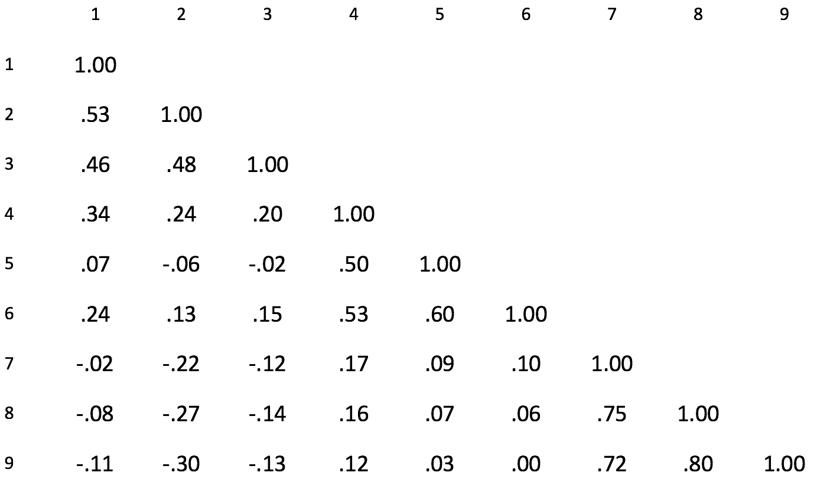
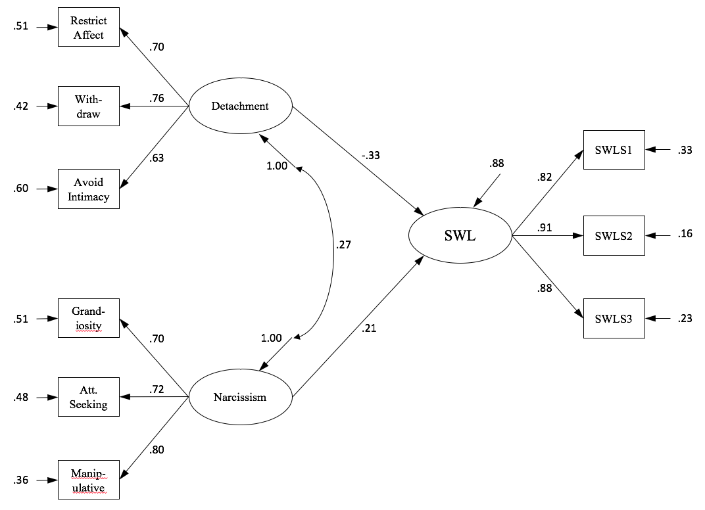
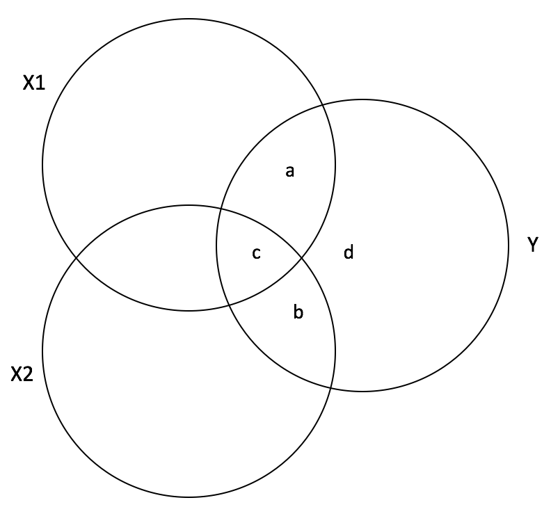

<style type="text/css">
body{ font-size: 24px; max-width: 1400px; margin: auto; padding: 1em; }
code.r{ font-size: 20px; }
</style>

```{r setup, include=FALSE}
if (!require(pacman)) { install.packages("pacman"); library(pacman) }
p_load(knitr, tidyverse, lavaan, modelr, mlbench, lattice, lm.beta, semPlot, DiagrammeR)
knitr::opts_chunk$set(echo = TRUE) #print code by default
options(digits=3) 
```

# Getting to know you

- Name
- Area, year
- Advisor
- Research interests
- Quantitative training thus far
- Experience with SEM?
- What you hope to get out of the course

# Welcome to SEM!

Structural equation modeling is multivariate regression technique that has grown immensely in popularity over the past two decades. This rise reflects at least three related phenomena: 1) the increasing sophistication of quantitative training in the social sciences; 2) the availability of large multivariate datasets; and 3) the computational power to estimate complex, highly parameterized models.

##What is SEM?

Structural equation modeling is not one thing. Rather, it is a family of techniques for testing multivariate hypotheses about the relationships among observed and (often) latent variables. In general, the goal of SEM is to understand structural patterns in the associations among variables. For example, can twenty items on a depression inventory be thought to measure an underlying (hypothetical) construct?

Critically, SEM allows researchers to test hypotheses about observed variables, as well as latent variables that are not directly measured. This opens the door to develop the construct validity of a latent variable (e.g., depression), or to test hypotheses about how constructs are related to each other (e.g., the relationship between anxiety and depression).

SEM has two important components: structure and measurement. 

##Structural model

The structural model represents the relationships among constructs, whether observed or latent. This is closest to standard regression techniques, where believe that one variable causes (or at least is associated with) another.

For example, age often predicts level of performance on working memory tests. Thus, $Age \rightarrow WorkingMemory$. A developmental psychologist might be quick to note that it may not be age that is causal per se. Rather, the proximate cause might be increasing functional integration of brain networks, or some other outcome of aging. We might think of this in terms of age having an indirect effect on working memory via one or more intermediate (mediating) variables:

```{r}
#make up data
df <- matrix(rnorm(1000), nrow=100, ncol=4, 
             dimnames = list(NULL, c("Age", "WorkingMemory", "Education", "NetworkIntegration"))
)

#lavaan model syntax
m <- '
WorkingMemory ~ Age
WorkingMemory ~ NetworkIntegration
WorkingMemory ~ Education
Education ~ Age
NetworkIntegration ~ Age
'
mm <- sem(m, data=df)
suppressWarnings(semPaths(mm, style='lisrel', what="diagram", layout = "spring", 
         nCharNodes=20, sizeMan=25, sizeMan2=10, label.scale=FALSE))

```

Did you notice we just fit our first SEM?! Pretty exciting... I mean, it was technically a path analysis because all variables were observed, but we'll save that discussion for another day.

##Measurement model

The measurement model specifies how observed variables are related to each other to form underlying latent variables.

That is, observed variables are considered *indicators* (i.e., indirect measures) of a latent variable. And latent variables typically represent *hypothetical constructs* in SEM. For example, narcissism is a *construct* that describes the tendency to be grandiose, vengeful, self-enhancing, and potentially vulnerable to rejection. Research on narcissism (e.g., Pincus & Lukowitsky, 2010) suggests that it likely has multiple facets, such as grandiosity versus vulnerability. So, perhaps it is a hypothetical construct composed of separable latent subcomponents. 

The role of a measurement model is to test whether the underlying latent structure of the indicators matches the researcher's theory. For example, a psychometric item intended to capture grandiosity may not correlate with other grandiosity items. Thus, it would likely be a poor indicator of that latent construct. We'll spend more time on the notation next week, but this is the basic idea:

```{r}
grViz("
digraph narc {

  # a 'graph' statement
  graph [overlap = true, fontsize = 12]

  # nodes for observed and latent
  node [shape = circle, fontname = Helvetica]
  'Pathological\nNarcissism'; 'Narcissistic\nGrandiosity'; 'Narcissistic\nVulnerability';
  
  node [shape = box, fontname = Helvetica]
  i1; i2; i3; i4; i5; i6

  # edges
  'Pathological\nNarcissism'->'Narcissistic\nGrandiosity' 'Pathological\nNarcissism'->'Narcissistic\nVulnerability'
  'Narcissistic\nGrandiosity'->'i1' 'Narcissistic\nGrandiosity'->'i2' 'Narcissistic\nGrandiosity'->'i3'
  'Narcissistic\nVulnerability'->'i4' 'Narcissistic\nVulnerability'->'i5' 'Narcissistic\nVulnerability'->'i6'
}")
```

# A bit of math housekeeping

- The use of a 'hat' over a variable denotes an estimator of a quantity. So, $\hat{Y}$ indicates the predicted values of $Y$ from a statistical model.

- Sample means are denoted $\bar{x}$.

- Sample variances are $s^2_x$ and standard deviations are $s_x$.

- Matrices are denoted by boldface capital letters, $\mathbf{X}$.

- Vectors are denoted by boldface lowercase letters, $\mathbf{x}$.

- The transpose of matrix flips a matrix along its diagonal (transposing rows and columns). It is denoted with the prime operator, $\mathbf{X}'$ and the `t()` function in `R`.

- Matrices are composed of rows and columns (we won't deal with arrays of 3+ dimensions). Rows are the first dimension, columns are the second. So, a matrix composed of $n$ observations and $p$ variables is denoted:
$$\underset{n \times p}{\mathbf{X}}$$

In `R`, selecting row `i` in column `j` from matrix `X` is: `X[i,j]`.

- A Row vector is a collection of numbers having *one* row and $m$ columns (i.e., 1 x $m$).

$$
\begin{equation}
\mathbf{x} = \begin{bmatrix} x_1 & x_2 & \cdots & x_m \end{bmatrix} 
\end{equation}
$$

- A column vector is a collection of numbers having many rows and *one* column (i.e., $m$ x 1).

$$
\begin{equation}
\mathbf{x} =\begin{bmatrix}
         x_1 \\
         x_2 \\
         \vdots \\
         x_m
        \end{bmatrix}
  \end{equation}
$$

- Thus, the transpose of a column vector is a row vector, and vice versa:

$$
  \begin{equation}
    \begin{bmatrix}
         x_1 \\
         x_2 \\
         \vdots \\
         x_m
    \end{bmatrix}' = 
    \begin{bmatrix} x_1 & x_2 & \cdots & x_m \end{bmatrix} 
  \end{equation}
$$

- Random variables (i.e., variables whose values are depend on uncertain processes) are denoted by capital letters (e.g., $X$). Most psychometric data are random variables (e.g., height, weight, IQ, depression severity). Realizations of random variables (i.e., draws from the processes that control the variable) are denoted by lower case letters (e.g., $x$).

I will probably screw these up along the way, but I wanted to mention them up front to be on the same page!

# What do we need to learn?

- Review of articles identified by students.

# Covariance review (Welcome back to correlation and regression!)

We'll use housing price data from Boston's 1970 census to review important concepts in correlation and regression. This is a nice dataset for regression because there are many interdependent variables: crime, pollutants, age of properties, etc.


```{r}
#example dataset from mlbench package with home prices in Boston by census tract
data(BostonHousing2)
BostonSmall <- BostonHousing2 %>% select(
  cmedv, #median value of home in 1000s
  crim, #per capita crime by town
  nox, #nitric oxide concentration
  lstat #proportion of lower status
  )

n <- nrow(BostonSmall) #number of observations
k <- ncol(BostonSmall) #number of variables

#show variables
splom(BostonSmall)
```

We can use the `cov()` function in R to get a variance-covariance matrix:
```{r}
from_r <- cov(BostonSmall)
from_r
```

And we can look under the hood to verify that we understand the concept and formula:
```{r}
mycov <- function(x, y) {
  stopifnot(length(x)==length(y))
  sum((x - mean(x))*(y - mean(y)))/(length(x) - 1)
}

cmat <- matrix(NA, nrow=k, ncol=k)
indices <- which(is.na(cmat), arr.ind=TRUE)
cmat[indices] <- apply(indices, 1, function(v) { 
  mycov(BostonSmall[, v[1] ], BostonSmall[, v[2] ])
})

cmat
```

Or we can do the matrix math by hand:

$$\mathbf{S_{xx}} = 1/(N-1)\mathbf{X'X}$$

if $\mathbf{X}$ is a matrix that is already in deviation form (i.e., each variable is mean-centered).

```{r}
#for the mathy among you...
bmat <- as.matrix(BostonSmall) #convert to numeric matrix
n <- nrow(bmat) #number of observations

#1) compute the means for each variable and populate a matrix of the same size
M <- matrix(data=1, nrow=n, ncol=1) %*% colMeans(bmat)

#2) compute the deviation of each score from its variable mean
D <- bmat - M

#3) the covariance matrix is D'D/n-1
C <- t(D) %*% D / (n-1)

C
```

# Covariance <-> correlation
The correlation of x and y is a covariance that has been standardized by the standard deviations of x and y. This yields a scale-insensitive measure of the linear association of x and y.

$$r_{XY}= \frac{s_{XY}}{s_{X} s_{Y}}$$

```{r}
rmat <- array(NA, dim=dim(cmat)) #initialize an empty correlation matrix
variances <- diag(cmat) #variances of each variable are on the diagonal of the covariance matrix
rmat[indices] <- apply(indices, 1, function(v) { cmat[v[1],v[2]] / sqrt(variances[ v[1] ] * variances[ v[2] ]) })
rmat
```

And it's easy to generate a correlation matrix from `R` directly using the `cor()` function:
```{r}
cor(BostonSmall, method="pearson")
```

There is also a handy `cov2cor()` function for converting a covariance matrix to a correlation matrix:
```{r}
cov2cor(cmat)
```

Rearranging the equation above, we can convert correlations to covariances by:
$$s_{XY}= r_{XY} s_X s_Y$$

And `lavaan` has a `cor2cov()` function that takes a covariance matrix and vector of standard deviations.
```{r}
cormat <- cor(BostonSmall)
sds <- apply(BostonSmall, 2, sd)
lavaan::cor2cov(cormat, sds)
```

## Factors affecting correlations

- Linearity: less linear, lower $r$
- Variability: smaller $s$, smaller $r$
- Distribution of scores: e.g., opposing skews, smaller $r$
- Reliability: lower measurement precision in either variable, lower $r$

# Intuitions about covariance structure modeling

A broad goal of SEM is to test hypotheses about the structure of covariance matrices. For example, are two variables related because one causes (or at least predicts) the other? Are two variables correlated because they are both indicators of an underlying construct?

Here's an example of the scientific power we'd like to leverage in SEM (courtesy of Aidan Wright)

## Consider a correlation matrix of items related to subjective well-being, detachment, and narcissism



## What can SEM bring to this problem?

A crucial point about SEM is that the 'goodness' of a model can be thought of in terms of how well it predicts (captures) the full covariance matrix of the data using fewer parameters. So in a covariance matrix, we have

$$p = \frac{k(k+1)}{2}$$

free parameters. That is, we have to estimate each cell in the covariance matrix. In the case of dataset above with 9 variables, we have

$$ p = \frac{9 \cdot 10}{2} = 45$$

parameters: 36 covariances, and 9 variances (diagonal). SEM seeks to capture the full covariance matrix $\mathbf{S_{XX}}$ using a model-implied covariance matrix $\hat{\Sigma}$. If this can be done with fewer than 45 parameters, it suggests that there is some structure underlying the covariance matrix that is more parsimonious than a purely unstructured account. This relates to the degrees of freedom in the model, which we will dive into when discussing identification later in the course.

## Testing a model of covariance structure

We can test how well a candidate model captures the 9 x 9 covariance matrix of these data using fewer than 45 parameters.



We've represented the full covariance matrix using 22 parameters. Not a bad start! (assuming that it captures all 45 covariance values).

# Single-predictor regression

Single-predictor regression (sometimes called 'bivariate regression', though this is confusing) is simply a re-expression of the covariance between two variables. Importantly, regression places variables into the asymmetric roles of *criterion* and *predictor*.

That is, the goal of regression is to predict values of the *criterion* variable based on one or more *predictors*. Whereas correlation is inherently non-directional, regression moves us one step closer to positing a belief that one can estimate the values of the *criterion* if one knows values of the *predictors*. Although this does not imply strong causality, conceptual clarity about the roles of variables in a regression model is essential. And having a clear head about predictor and criterion variable becomes even more essential in SEM!

Here's the basic equation:
$$ \hat{Y} = B_{0} + B_{1}X + \varepsilon $$

The expected change in Y for a one-unit change in X is encoded by $B_1$. Note that by adding $B_0$, we are representing a belief about the mean of $\hat{Y}$. We can re-express $B_1$ in terms of correlation or covariance, as above.

First, let's set the roles of *criterion* and *predictor*. Can we estimate the median home price (*criterion*) on the basis of crime (*predictor*)? Let's fit this equation in `R`:

$$\hat{\textrm{Price}} = B_{0} + B_{1}\textrm{Crime} + \varepsilon$$

```{r}
m <- lm(cmedv ~ crim, BostonSmall)
summary(m)
```

We see that $B_1$ is -.42, indicating a negative relationship between price and crime.

We can obtain the same estimate by knowing the correlation between price and crime, as well as the standard deviations of each:

$$B_1 = r_{XY}\frac{s_Y}{s_X}$$

```{r}
unname(cormat["cmedv","crim"]*(sds["cmedv"]/sds["crim"]))
```

We can also visualize the association between these variables as a scatterplot, adding the predicted values $\hat{\textrm{Price}}$ at every value of $\textrm{Crime}$ (i.e., the fitted regression line).

```{r}
BostonSmall <- BostonSmall %>% add_predictions(m)
ggplot(BostonSmall, aes(x=crim, y=cmedv)) + 
  geom_point() + geom_line(aes(y=pred)) + theme_bw()
```

## Regression diagnostics

This is clearly not a straightforward relationship! The distribution of crime has a long positive tail. We can visualize the residuals of this model, $\textrm{Price} - \hat{\textrm{Price}}$ to get a sense of things:

```{r}
ggplot(BostonSmall, aes(x=crim, y=cmedv)) + 
  geom_point() + 
  geom_line(aes(y=pred)) + 
  geom_segment(aes(xend=crim, yend=pred), color="blue", alpha=0.2) +
  theme_bw()
```

\newpage
Or the association between the predicted data and residuals:

```{r}
BostonSmall <- BostonSmall %>% add_residuals(m)
ggplot(BostonSmall, aes(x=pred, y=resid)) + 
  geom_point() + stat_smooth(method="loess")
```

\newpage
Or the distribution of residuals (which should be normal):

```{r}
ggplot(BostonSmall, aes(x=resid)) + geom_histogram(bins=15)
```

\newpage
The residuals do not look white and there is evidence of heteroscedasticity. The distribution of crime is very difficult to work with, and we won't solve it perfectly now.

```{r}
ggplot(BostonSmall, aes(x=crim)) + geom_histogram(bins=15)
```

\newpage
But a log2 transformation of crime moves things in the right direction in terms of normalizing the variance while retaining interpretability (one unit change = 2x crime). Remember that regression doesn't assume normality of *predictors*, but instead of the residuals.

```{r}
ggplot(BostonSmall, aes(x=log2(crim))) + geom_histogram(bins=15)
```

\newpage
Refit the model using the log2 transformation. This is moving in the right direction and will have to do for now.
```{r}
BostonSmall$log_crim <- log2(BostonSmall$crim)
m2 <- lm(cmedv ~ log_crim, BostonSmall)
BostonSmall <- BostonSmall %>% add_predictions(m2)
BostonSmall <- BostonSmall %>% add_residuals(m2)
ggplot(BostonSmall, aes(x=log_crim, y=cmedv)) + 
  geom_point() + 
  geom_line(aes(y=pred)) + 
  geom_segment(aes(xend=log_crim, yend=pred), color="blue", alpha=0.2) + 
  theme_bw()
```


## Orthogonality of residuals with predictor(s)

Let's return to the relationships among correlation, covariance, and regression. As Kline notes (p. 27), the residuals of a regression should be orthogonal to the predictor. Indeed, the least squares criterion requires this: $\underset{\mathbf{X} \in \mathbb{R}}{\textrm{min}} \sum(Y - \hat{Y})^2$.

```{r}
cor.test(residuals(m2), BostonSmall$log_crim)
```


## Swapping criterion and predictor

Unlike correlation or covariance, which are symmetric and undirected, swapping the criterion and predictor in single-predictor regression changes the slope estimate of their association. If we treat crime as the criterion and housing price as the predictor, the slope now represents change in housing prices as a function of change in crime (under log2, a one unit change indicates a 2x increase in crime rate). To wit:

$$ \textrm{log}_2(\hat{\textrm{Crime)}} = B_0 + B_1 \textrm{Price} $$ 

```{r}
m3 <- lm(log_crim ~ cmedv, BostonSmall)
summary(m3)
```

We can, however, still recover the correlation based on the unstandardized regression coefficient and the standard deviations of the variables:

$$r_{\textrm{Price,log2(Crime)}} = B_1 \frac{s_{\textrm{log2(Crime)}}}{s_{\textrm{Price}}}$$

```{r}
(coef(m3)["cmedv"] * sd(BostonSmall$cmedv)) / sd(BostonSmall$log_crim)
```

```{r}
cor.test(~log_crim + cmedv, BostonSmall)
```

## Standardized parameter estimates

This brings us to standardization in regression, which attempts to re-express the parameter estimates in units that are not specific to the scale of each variable. More specifically, standardized parameter estimates represent the association in standard deviation units. In the case of crime and housing prices, we could ask how many standard deviations lower are housing prices given a one SD increase in crime.

Standardization is often achieved by *z*-scoring all variables (or at least dividing each by its own SD) prior to calculating the regression:

```{r}
BostonSmall_std <- BostonSmall %>% select(-pred, -resid) %>% mutate_all(scale)
m4 <- lm(cmedv ~ log_crim, BostonSmall_std)
summary(m4)
```

Thus, in the context of single-predictor regression, the standardized regression coefficient is the correlation.

$$r_{xy} := \beta_1 := B_1 \frac{s_y}{s_x} $$
```{r}
coef(m2)["log_crim"] * sd(BostonSmall$log_crim) / sd(BostonSmall$cmedv)
```

Standardization can also be achieved after model estimation by dividing by the relevant standard deviations. I'll skip the details for now, but check out the `lm.beta` package.

```{r}
lm.beta(m2)
```

## A few other regression equivalencies

As Kline notes, there are a few other handy properties here:

### The *unsigned* correlation of predictor and criterion is equal to the *unsigned* correlation of the criterion with the fitted/predicted values

$$ |r_{XY}| = r_{Y\hat{Y}} $$

More generally, as in multiple regression, this should be expressed:

$$ R_{Y \cdot X_{1...p}} = r_{Y\hat{Y}} $$
```{r}
cor.test(fitted(m2), BostonSmall$cmedv)
```

### Total variance in $Y$ can be decomposed into the predicted part and residual part

$$ s_{Y}^2 = s_{\hat{Y}}^2 + s_{Y - \hat{Y}}^2 $$

```{r}
var(BostonSmall$cmedv)
var(fitted(m2)) + var(resid(m2))
```

### The proportion of shared variance between $X$ and $Y$ is the proportion of $Y$ variance explained relative to its total variance

$$ r_{XY}^2 = \frac{s_{\hat{Y}}^2}{s_{Y}^2} $$

```{r}
rsquare(m2, BostonSmall)
var(fitted(m2)) / var(BostonSmall$cmedv)
```

# Multiple regression

In single-predictor regression, there are straightforward mappings back to covariance and correlation. As we consider the joint effects of multiple predictors, however, the math gets a bit harder. Conceptually, the goal of multiple (predictor) regression is to quantify the effects of several predictors on a criterion. In multiple regression, each parameter estimate quantifies the partial relationship of a given predictor $X_1$ with the criterion $Y$, controlling for all other predictors $X_{2...p}$. Thus, how much of a change in $Y$ is expected from a unit change in $X1$ at a given level of $X_{2...p}$ (aka 'holding constant' those predictors).

$$ \hat{Y} = B_0 + B_1 X_1 + B_2 X_2 + B_3 X_3 + ... B_p X_p + \varepsilon $$

Let's consider the case in which housing prices are predicted by both crime and nitric oxide concentration:

$$\hat{\textrm{Price}} = B_{0} + B_{1}\textrm{log}_2\textrm{(Crime)} + B_2 \textrm{Nox} + \varepsilon$$

```{r}
m5 <- lm(cmedv ~ log_crim + nox, BostonSmall)
summary(m5)
```

We can see that there are negative associations of both crime and pollutants with home prices. As mentioned above, the multiple correlation of all predictors with the criterion is given by:

$$ R_{Y \cdot X_{1...p}} = r_{Y\hat{Y}} $$

```{r}
cor.test(fitted(m5), BostonSmall$cmedv)
```

And the variance explained:
```{r}
cor(fitted(m5), BostonSmall$cmedv)^2
```

## Standardized parameters in multiple regression
To extend standardized parameter estimates to the multiple regression context, we have to account for the shared variance among predictors.

$$ \beta_\textrm{Nox} = \frac{r_\textrm{Nox,Price} - r_\textrm{Crime,Price} r_\textrm{Nox,Crime}}{1 - r_\textrm{Nox,Crime}^2} $$

So, we adjust the association Nox with Price by the product of the correlations of Crime with Price (other predictor with criterion) and the correlation of Nox and Crime (predictor correlation). The magnitude of the standardized partial coefficient is reduced by adjusting for the correlation among predictors in the denominator. In the case of orthogonal (uncorrelated) predictors, note that the standardized beta simplifies to the bivariate correlation, as in single-predictor regression:

$$
\begin{aligned}
r_\textrm{Nox,Crime} :&= 0 \\
\beta_\textrm{Nox} & = r_\textrm{Nox,Price}
\end{aligned}
$$

Unstandardized betas can be computed from the standardized betas as above:

$$ B_\textrm{Nox} = \beta_\textrm{Nox}\left(\frac{s_\textrm{Price}}{s_\textrm{Nox}}\right) $$

## Partial and part correlations

Also note that we can consider partial relationships in multiple regression in correlational (standardized) terms. But we have to decide how we wish to think about shared variance among predictors. There are two options:

### Partial correlation

The association of $X1$ and $Y$, controlling for shared variance with $X2$. Note that the goal here is to remove the influence of $X2$ from both variables before considering their association.

$$ r_{Y,X1 \cdot X2} = \frac{r_{Y,X1} - r_{X1,X2}r_{Y,X2}}{\sqrt{(1-r_{X1,X2}^2)(1-r_{Y,X2}^2)}} $$

### Part (semipartial)

The association of $X1$ with $Y$, controlling for shared variance between $X1$ and $X2$. Importantly, the association of $X2$ with $Y$ is not removed.

$$ r_{Y(X1 \cdot X2)} = \frac{r_{Y,X1} - r_{Y,X2}r_{X1,X2}}{\sqrt{1-r_{X1,X2}^2}} $$

### Graphical expression



- $a$ is the part correlation of $X1$ with $Y$, adjusting for $X1-X2$ association.

- $\frac{a}{a+d}$ is the partial correlation of $X1$ with $Y$, controlling for $X2$.

# Assumptions of regression (from Kline)

1. Regression coefficients reflect unconditional linear relations only. Stated differently, the covariance of a predictor $X$ and the criterion $Y$ must be constant over $X$, other predictors $\mathbf{P}$, and unmeasured variables $\mathbf{U}$. Thus, unmodeled interactions among predictors, measured or unmeasured, violates this assumption. And nonlinear associations between $X$ and $Y$ do as well.

2. Predictors are measured perfectly. Although we know that psychological variables suffer from measurement error (i.e., we are uncertain about the true value of a predictor $X$), we cannot manage this problem in conventional regression. Rather, predictors are assumed to have 0 measurement error. Violating this can lead to bias in parameter estimates, both for the unreliable predictor and other parameters.

3. Residuals are normally distributed. An important assumption in regression is that the errors (i.e., residuals) are normally distributed conditional on $\mathbf{X}$ (i.e., the matrix of all predictors). In addition, knowledge about one residual should not provide information about another residual. This is the assumption of *iid* residual -- independent and identically distributed. The *iid* assumption can be violated, for example, by clustered data in which the cluster has certain unmodeled properties (e.g., longitudinal data where one person is higher on average than others).

4. Residuals are homoscedastic. The variance of the residuals should not depend on the value of the predictor. So, if more extreme values tend to be more poorly fit (larger variance of residuals), this is heteroscedastic.

5. There are no causal effects among the predictors. This assumption highlights that in univariate regression (i.e., one dependent variable), there is no way to model indirect causal effects among predictors. So if one believes that $X$ causes $Y$ via its influence on $M$ (i.e., $X \rightarrow M \rightarrow Y$), this requires two regression equations ($X \rightarrow M$ and $M \rightarrow Y$), which cannot be accommodated in standard regression. Indeed, such multivariate regression problems are a major motivation for SEM!

6. There is no specification error. Many, if not most, statistical models have this assumption, which basically states that the form of the model reflects an accurate representation of the data-generating processes in the population. There are many ways to violate this assumption.
    a. Misspecifying the form of the relationship between a predictor and the criterion (e.g., nonlinear effects).
    b. Using a biased or imprecise statistical estimator
    c. Including predictors that are irrelevant in the population, but could absorb variance by chance.
    d. Omitting variables that have a relationship with the criterion.
    e. Omitting variables that are associated with predictors in the model.

# Suppression

This is a complex problem that is addressed in more detail by Cohen, Cohen, West, and Aiken (2003). I will mention a couple of cases: 

## Classical suppression
Including a variable that is uncorrelated with the criterion, but correlated with a useful predictor, can inflate the parameter estimate of the useful predictor. For example:

$$
\begin{align}
r_{YX} &= 0.5 \\
r_{YZ} &= 0 \\
r_{XZ} &= 0.4 \\
\hat{Y} &= B_0 + B_1 X + B_2 Z + \varepsilon
\end{align}
$$

In this cirumstance, as we discussed above, the partial regression coefficient adjusts for the associations among predictors.

$$ \beta_\textrm{X} = \frac{r_\textrm{XY} - r_\textrm{YZ} r_\textrm{XZ}}{1 - r_\textrm{XZ}^2} $$

Thus, when there is no association between the criterion $Y$ and the predictor $Z$, we get

$$ \beta_\textrm{X} = \frac{r_\textrm{XY}}{1 - r_\textrm{XZ}^2} $$
Relative to the bivariate correlation $r_{XY}$, the denominator will be smaller under classical suppression, leading $\beta_X$ to be larger.

## Net suppression

Definition: We observe positive bivariate associations among 2+ predictors and a criterion, but one of the predictors has a negative regression coefficient. 

$$
\begin{align}
r_{YX} &= 0.3 \\
r_{YZ} &= 0.5 \\
r_{XZ} &= 0.4 \\
\hat{Y} &= B_0 + B_1 X + B_2 Z + \varepsilon
\end{align}
$$

In this case, $X$ is the predictor having a weaker association with $Y$ and will tend to take have a negative parameter estimate in the multiple regression, largely reducing error variance in $Z$, but contributing little to predicting $Y$. This form of suppression is often identified when the standardized beta for a predictor is opposite in sign to the bivariate correlation of that predictor with the criterion.

## Cooperative suppression

Definition: two predictors correlate negatively with each other, but positively with the criterion. This will lead to a high multiple $R$ because the predictors will account for more of the criterion when they are considered together than in bivariate correlation. Thus, this form of suppression is often identified when the *standardized* beta for a predictor exceed its bivariate correlation with the criterion.

$$
\begin{align}
r_{YX} &= 0.5 \\
r_{YZ} &= 0.5 \\
r_{XZ} &= -0.4 \\
\hat{Y} &= B_0 + B_1 X + B_2 Z + \varepsilon
\end{align}
$$

[More detail here](https://stats.stackexchange.com/questions/73869/suppression-effect-in-regression-definition-and-visual-explanation-depiction)

# Use lavaan for simple multiple regression

We've now reviewed many fundamental topics in regression. And the next piece of good news is that SEM builds directly on regression methods. More specifically, the ideal of 'structural equations' refers to the fact that we have more than one equation representing a model of covariance structure in which we (usually) have multiple criterion variables and multiple predictors.

Let's return to our house pricing example above. We can estimate the same multiple regression models using the `lavaan` package that we'll be using for more complex SEMs. And the syntax even has many similarities with `lm()`.

Here's the single-predictor regression from above, run as a path model in `lavaan`:

```{r}
lavaan_m <- 'cmedv ~ log_crim'
mlav <- sem(lavaan_m, data=BostonSmall)
summary(mlav)
```

And for comparison, the output of `lm()`

```{r}
  summary(lm(cmedv ~ log_crim, BostonSmall))
```

The regression coefficient is identical (good!). One thing to note is that we don't have an intercept in the `lavaan` output. This highlights an important difference that basic SEM often focuses on the covariance structure of the data. We can include means as well, but typically only when it's relevant to our scientific questions. For example, do males and females differ on mean level of a depression latent factor?

We can ask `lavaan` to include the mean (intercept) in the model in this case using `meanstructure=TRUE`:
```{r}
mlav <- sem(lavaan_m, data=BostonSmall, meanstructure=TRUE)
```

It's good to get in the habit of examining the 'parameter' table in `lavaan`, which provides an important summary of what parameters are free in the model (i.e., have to be estimated), and what parameters were requested by the user (you!) in the model syntax.
```{r}
parTable(mlav)
```

Note that we can get standardized estimates in `lavaan` as well. This is a more complicated topic in SEM that we'll return to:
```{r}
standardizedSolution(mlav)
```

Other than fitting this simple regression model, how could we use `lavaan` to conduct regression analyses? 

And can you think of an example analysis that is possible in `lavaan` (i.e., path analysis) that isn't possible in standard regression?