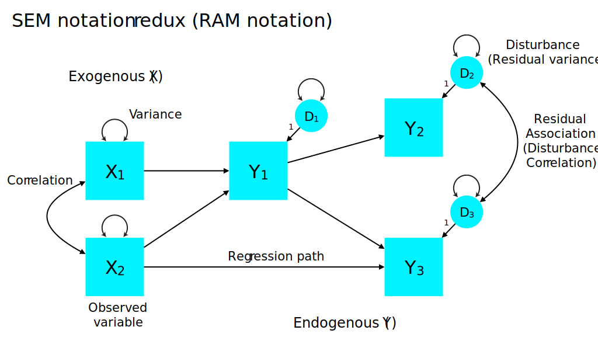
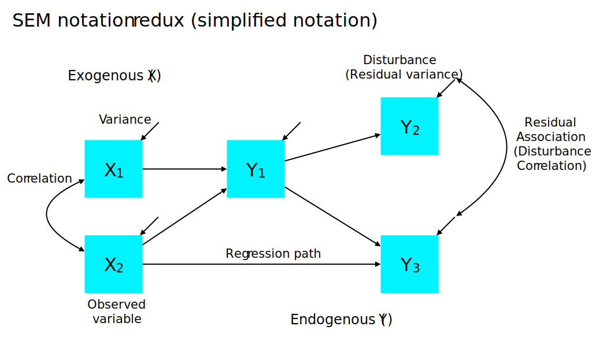
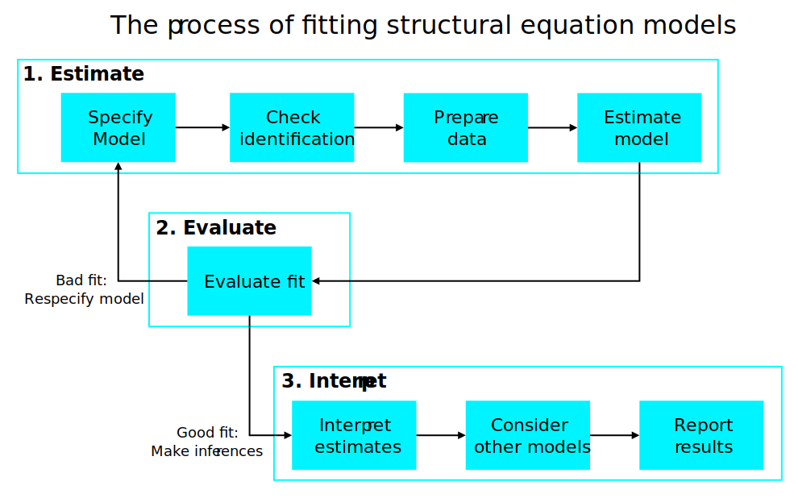

<style type="text/css">
body{ font-size: 24px; max-width: 1400px; margin: auto; padding: 1em; }
code.r{ font-size: 20px; }
</style>


```{r setup, include=FALSE}
if (!require(pacman)) { install.packages("pacman"); library(pacman) }
p_load(knitr, tidyverse, lavaan, modelr, mlbench, lattice, lm.beta, semPlot, DiagrammeR, matrixcalc)
knitr::opts_chunk$set(echo = TRUE) #print code by default
options(digits=3) 
```


# Purpose of SEM

Conceptually, the goal of structural equation modeling (SEM) is to test whether a theoretically motivated model of the covariance among variables provides a good approximation of the data.

More specifically, we are trying to test how well a parsimonious model (composed of measurement and/or structural components) reproduces the observed covariance matrix. Formally, we are seeking to develop a model whose *model-implied covariance matrix* approaches the *sample (observed) covariance matrix*.

$$
\mathbf{S_{XX}} \approx \mathbf{\Sigma}(\theta)
$$
In the case where we have positive degrees of freedom (overidentified model), $\mathbf{\Sigma}({\theta})$ is an approximation of $\mathbf{S_{XX}}$. That is, in SEM, we (usually) have more equations than unknowns, meaning that many parameters could yield a model-implied covariance matrix that approaches the sample covariance matrix. This is a *feature*, not a bug -- we are hoping to identify a parsimonious model whose parameters best fit the observed data.

Thus, there will always be some approximation error. One can think of this as the multivariate extension of residuals in the linear regression case: $Y - \hat{Y}$. More specifically, as in ANOVA and regression, we can decompose sources of error into deviations from the 'true' covariance matrix of the variables in the population, $\mathbf{\Sigma}$.

Let's get technical for a moment. The population covariance matrix $\mathbf{\Sigma}$ does not depend on estimates of each cell derived from a specific sample, nor does it depend on parameters from a statistical model. If we could observe the population covariance matrix and a plausible, but imperfect, SEM at the true population parameters, we could also derive a model-implied covariance matrix for the population, $\Sigma{\mathbf{\theta}}$. The extent to which this model approximates the true population covariance matrix quantifies the error of approximation (i.e., does the model recover the covariance structure of the population):

$$
Error_\textrm{approximation} = \mathbf{\Sigma} - \mathbf{\Sigma(\theta)}
$$

We, however, only have a sample of the population on which to test our model. Thus, our model-implied covariance matrix is based on parameters estimated in the sample, $\mathbf{\hat{\theta}}$. Thus, a second source of error in SEM is not how well the model could do in the ideal case (i.e., the population), but how well we can estimate population parameters using our sample.

$$
Error_\textrm{estimation} = \mathbf{\Sigma({\theta})} - \mathbf{\Sigma({\hat{\theta}})}
$$

In SEM, we will be minimizing the overall discrepancy by searching for parameters that maximize the sample likelihood function:

$$
\mathcal{L}(\mathbf{S_{XX}}|\hat{\mathbf{\theta}},\textrm{model})
$$

More descriptively, we are trying to maximize the likelihood of the observed covariance matrix given a set of parameter values $\mathbf{\hat{\theta}}$ and a specific model (some variant of SEM). We'll return to the underpinnings of maximum likelihood estimation next week, but for now, the idea is that we have a quantitative basis for ascertaining how good our parameter estimates are. If we identify better parameter estimates, the sample likelihood *increases*, indicating that we are getting closer to the observed covariance matrix.

# Types of parameters

## Free

Free parameters are estimated by the model according to the data. That is, they are estimated based by fitting the model to the data to achieve a criterion (e.g., OLS in regression).

## Fixed

Fixed parameters are constants, often specified by you (the scientist).

## Constrained

Constrained parameters specify a required relationship between two variables. For example, x = 2y. Or one could require that two factor loadings be equal. One can also specify that a parameter must fall within a certain range (e.g., -2 -- 2) using inequality constraints.

### Equality constraint

When two free parameters are constrained to be equal, then in effect we are only estimatin one free parameter. For example, if we posit that the association between self anger and partner sadness in an interaction should be equal for both members of a couple (*p1* and *p2*), then we can estimate just one parameter ($b$ in the path model below).


```{r}
grViz("digraph regression {
graph [rankdir = LR bgcolor=transparent]

forcelabels=true; splines=line;

node [shape = box, fontcolor=gray25 color=gray80]

node [fontname='Helvetica']
Anger_M [label=<Anger<sub>p1</sub>>]; Anger_F [label=<Anger<sub>p2</sub>>];

node [fillcolor=gray90 style=filled]
Sadness_M [label=<Sadness<sub>p1</sub>>]; Sadness_F [label=<Sadness<sub>p2</sub>>];

edge [color=gray50 style=filled]
Anger_M -> Sadness_M [label='a']
Anger_F -> Sadness_F [label='a']
Anger_M -> Sadness_F [label='b']
Anger_F -> Sadness_M [label='b']
}")
```

# Types of variables

## Endogenous

Endogenous variables have at least one cause (predictor) in the model. That is, their values *depend* on something that is modeled. In standard regression, we might call them *dependent* variables. In a path diagram, endogenous variables have at least one incoming arrow.

## Exogenous

Exogenous variables are not caused (predicted) by other variables in the model. 

# Types of relationships among variables

## Direct effect

Direct effects represent the relationship between a predictor and an outcome (endogenous variable) that are not mediated by any other variable (Bollen, 1987). This could mean either *ignoring* potential mediating variables (i.e., they are not included in the model) or including them. In causal mediation analysis, the direct effect represents the effect of an independent variable (e.g., treatment) on an outcome (e.g., depression) holding a candidate mediator constant a level that would occur under the corresponding level of the treatment (Imai).

```{r}
grViz("digraph regression {
graph [rankdir = LR bgcolor=transparent]

forcelabels=true;

node [shape = box, fontcolor=gray25 color=gray80]

node [fontname='Helvetica']
X;

node [fillcolor=gray90 style=filled]
Y;

edge [color=gray50 style=filled]
X -> Y [label='Direct']
}")
```


```{r}
grViz("digraph regression {
graph [rankdir = LR bgcolor=transparent]

forcelabels=true;

node [shape = box, fontcolor=gray25 color=gray80]

node [fontname='Helvetica']
X; M;

node [fillcolor=gray90 style=filled]
Y;

edge [color=gray50 style=filled]
X -> Y [label='Direct']
X -> M
M -> Y
}")
```

## Indirect effect

Indirect effects represent the effect of a predictor on an outcome via one or more intervening (mediating) variables. Thus, the idea is that the outcome is related to a predictor *because* the predictor influences a mediating variable, which in turn influences the outcome.

### Single mediator
```{r}
grViz("digraph regression {
graph [rankdir = LR bgcolor=transparent]

forcelabels=true;

node [shape = box, fontcolor=gray25 color=gray80]

node [fontname='Helvetica']
X; M;

node [fillcolor=gray90 style=filled]
Y;

edge [color=gray50 style=filled]
X -> Y [label='Direct']
X -> M
M -> Y
}")
```

### Multiple mediators
```{r}
grViz("digraph regression {
graph [rankdir = LR, bgcolor=transparent, layout=dot]

forcelabels=true;

node [shape = box, fontcolor=gray25 color=gray80]

node [fontname='Helvetica']
X; M1; M2;

node [fillcolor=gray90 style=filled]
Y;

edge [color=gray50 style=filled]
X -> Y [xlabel='e']
X -> M1 [label='a']
M1 -> M2 [label='b']
M2 -> Y [label='c']
M1 -> Y [label='d']
}")
```
In a multiple mediation model, one consider the direct effect ($e$) of a predictor $X$ on a criterion $Y$ after accounting for all mediating variables (here, $M1$ and $M2$).

### Specific indirect effect

Multiple mediation also exposes the new concept of specific indirect effects, which summarize the association between a predictor, $X$ and outcome $Y$ via one or more *specific* intervening pathways. For example, in the above model, we could measure how much of the relationship between $X$ and $Y$ is transmitted via the $X \rightarrow M1 \rightarrow Y$, which would be $a \cdot d$.

### Total indirect effect

The total indirect effect is the sum of all indirect pathways between $X$ and $Y$ (i.e., excluding the $X \rightarrow Y$ path).

### Testing indirect effects

We will return to the topic of mediation and moderation later in the semester, so for now this cursory treatment will have to do. But when we think about the *magnitude* of an indirect effect, it is best to conceptualize it as a *product* of the pathways between the predictor and outcome. Thus, the specific indirect effect of $X$ on $Y$ via the $X \rightarrow M1 \rightarrow M2 \rightarrow Y$ pathway is the product of the corresponding parameter estimates $a \cdot b \cdot c$.

## Total effect

The total effect of $X$ on $Y$ is the sum of the direct effect and the *total* indirect effects.

## Common cause

Two variables can be related to each other because they were caused by a common third variable. For example, $Y_1$ and $Y_2$ may be related because they were both influenced by $X$.

```{r}
grViz("digraph regression {
graph [rankdir = LR bgcolor=transparent]

forcelabels=true;

node [shape = box, fontcolor=gray25 color=gray80]

node [fontname='Helvetica']
X;

node [fillcolor=gray90 style=filled]
Y1; Y2;

edge [color=gray50 style=filled]
X -> Y1;
X -> Y2;

}")
```


#Review of SEM Notation

## RAM (graphical) notation



## Simplified RAM notation

For simplicity, we can remove the distinction between exogenous variances and endogenous disturbances using a single inward-pointing arrow to denote both constructs:



## LISREL all-y notation

In this class, we will typically adopt the 'all-y' LISREL notation in which the parameter matrices do not distinguish between exogenous and endogenous variables.

- $\mathbf{y}_i$: A vector of observed values for the *i*th variable.
- $\mathbf{\eta}_i$: A vector of estimated values of the *i*th latent variable. These are also referred to as factor scores.
- $\mathbf{\Lambda}_y$ or $\lambda_{1,1}$: Factor loadings of the observed variables $\mathbf{Y}$ onto factors $\mathbf{eta}$. Also conceptualized as regression slopes (observed regressed on latent). Note that if expressed by specific subscripts (e.g., $\lambda{1,1}$), the first subscript is the observed variable ($y_{1...j}$) and the second subscript is the factor ($\eta_{1...k}$). Thus, $\mathbf{\Lambda}$ is $j \times k$ in size.
- $\mathbf{\Theta_\varepsilon}$ or $\mathbf{\varepsilon}_i$: The variance-covariance matrix for all observed variables. Also includes covariances among errors. The diagonal will contain error variances for endogenous observed variables.
- $\mathbf{\zeta}_i$: vector of disturbances in endogenous variables (i.e., residual variability due to unmeasured causes).
- $\mathbf{\Psi}$: covariance matrix among latent variables. Note that the disturbances for endogenous variables fall along the diagonal.
- $\mathbf{B}$: The matrix of regression coefficients.

## lavaan notation for SEM matrices

The `lavaan` package largely uses LISREL notation in naming and structuring the underlying matrices in a SEM. More specifically, it uses the 'all-Y' notation in which there are not separate matrices for endogenous and exogenous variables (see Kline Appendix 10.A). Thus, for example, all structural regression coefficients are represented in the $\mathbf{B}$ matrix, rather than separating it into exogenous ($\mathbf{\Gamma}$) and endogenous ($\mathbf{B}$) predictors. The parameter specification and notation of `lavaan` can be seen by examining the output of the `inspect` function on a fitted model object:

```{r}
## The industrialization and Political Democracy Example 
## Bollen (1989), page 332
model <- ' 
  # latent variable definitions
     ind60 =~ x1 + x2 + x3
     dem60 =~ y1 + a*y2 + b*y3 + c*y4
     dem65 =~ y5 + a*y6 + b*y7 + c*y8

  # regressions
    dem60 ~ ind60
    dem65 ~ ind60 + dem60

  # residual correlations
    y1 ~~ y5
    y2 ~~ y4 + y6
    y3 ~~ y7
    y4 ~~ y8
    y6 ~~ y8

#regression of latent vars on observed
ind60 ~ y4
'

fit <- sem(model, data=PoliticalDemocracy)
summary(fit, fit.measures=TRUE)
inspect(fit)

# The Holzinger and Swineford (1939) example
HS.model <- ' visual  =~ x1 + x2 + x3
              textual =~ x4 + x5 + x6
              speed   =~ x7 + x8 + x9 

visual ~ sex
visual ~ ageyr
x2 ~ sex
visual ~~ speed
x9 ~~ x6
#sex ~ ageyr

'

fit <- lavaan(HS.model, data=HolzingerSwineford1939,
              auto.var=TRUE, auto.fix.first=TRUE,
              auto.cov.lv.x=TRUE)
#summary(fit, fit.measures=TRUE)
inspect(fit, what="free")

#fixed.x sets up whether the exogenous vars are free or fixed
fit <- sem(HS.model, data=HolzingerSwineford1939, fixed.x=FALSE)
```

### Common factor model

These parameter matrices can be used to express specific variants of SEM in matrix form. For example, the common factor model is a form of linear regression in which observed variables $\mathbf{Y}$ are regressed on latent factors $\mathbf{\mathbf{\eta}}$ with factor loadings $\mathbf{\Lambda_y}$ quantifying the magnitude of the relationship:

$$
\mathbf{y}_i = \mathbf{\nu} + \mathbf{\Lambda}_{y} \mathbf{\eta}_i + \mathbf{\Gamma}_y \mathbf{x}_i + \mathbf{\varepsilon}_i
$$


##Disturbance

Each endogenous variable has a *disturbance* that represents unexplained variability due to unmeasured exogenous causes. As a result, they are considered latent variables. Disturbances reflect a combination of measurement error and unmeasured latent causes.

#Steps in developing and testing SEMs

The typical set of steps in developing and testing SEMs is provided in the figure below:
```{r, eval=FALSE}
grViz("digraph regression {
graph [rankdir = LR bgcolor=transparent, splines=ortho]

node [shape = box, fontcolor=gray25 color=gray80, width=1.6, height=0.8]

node [fontname='Helvetica']
spec [label='Specify\nmodel'];
ident [label='Check\nidentification'];
data [label='Prepare\ndata'];
estimate [label='Estimate\nmodel'];
evaluate [label='Evaluate\nfit'];
interpret [label='Interpret\nestimates'];
equiv [label='Consider equiv.\nand alt. models'];


edge [color=gray50 style=filled, fontname='Helvetica']

subgraph p1 {

spec -> ident;
ident -> data;
data -> estimate;
}
subgraph p2 {
estimate -> evaluate;
evaluate -> spec [xlabel='\nBad fit:\nRespecify\nmodel', fontname='Helvetica'];
evaluate -> interpret [label='If fit is\nadequate' ];
interpret -> equiv;
}
}")

mermaid("graph TB

subgraph 1. Create model
A[Specify<br />model]-->B[Check<br />identification]
B-->C[Prepare<br />data]
C-->D[Estimate<br />model]
end

subgraph 2. Evaluate
D-->E[Evaluate<br />fit]
E-->|Bad fit:<br />respecify model| A
end

subgraph 3. Interpret
E-->|If fit is<br />adequate| F[Interpret<br />estimates]
F-->G[Consider equiv.<br />and alt. models]
G-->H[Report<br />results]
end
        ")
```



#Model identification

##Number of observations

The number of 'observations' in SEM refers to the number of unique values in the covariance matrix. We've seen this equation before:

$$ p = \frac{k(k+1)}{2} $$

where $p$ is the number of variance-covariance parameters and $k$ is the number of variables. The number of observations provides crucial information about how complex a SEM we can test given the number of observed variables.

The number of free parameters in a SEM is denote $q$, and the degrees of freedom for the overall model is the difference between $p$ and $q$:

$$ df_\textrm{M} = p - q $$

Thus, as we've discussed, the goal is to develop a parsimonious model with fewer free parameters than observations (covariance values). If two models fit the data equally well, the model with more degrees of freedom should be preferred as more parsimonious. We will return to this issue when considering relative model evidence.


##Overidentified

A model with $df_\textrm{M} > 0$ is called *overidentified*, meaning that there are more equations than unknowns. Thus, there are many parameter sets one could test, and all will be imperfect. Given a model parameterization (i.e., what matrices are included and what the free parameters are), the goal is to identify parameters that best fit the data. In an overidentified model, the idea is to adjudicate among parameter values based on a fit criterion. In SEM, this is usually the sample likelihood function, as mentioned above.

##Underidentified

A model with $df_\textrm{M} < 0$ is called *underidentified*, meaning that there are too man unknown parameters to solve for and no way to solve the equations.

$$ a + b = 6 $$

There are an infinite number of values for $a$ and $b$ that would solve this equation.

##Just-identified

A model with $df_\textrm{M} = 0$ is called *just-identified*, and by definition, it will fit the data perfectly. The idea is that there is one set of parameters in a just-identified model that reproduces the covariance matrix. But there are many alternative just-identified models one could test in a given dataset, but all fit the data equally well, making hypothesis testing difficult.


#Path analysis

## Notation

Path analysis is largely an extension of linear regression with observed variables to the multivariate case. That is, in path analysis, there are typically multiple predictors and multiple outcome variables. Furthermore, chained relationships (e.g., $X \rightarrow M \rightarrow Y$) lead to the possibility of indirect effects and the potential for a given variable to be endogenous (i.e., its values depend on other variables in the model) and to predict another endogenous variable.

Conceptually, we can think of path analysis in terms of a set of regression equations (Kline Appendix 6.A):

$$
\begin{align}
Y_1 &= \gamma_{11} X_1 + \beta_{12}Y_2 + \zeta_1 \\
Y_2 &= \gamma_{22} X_2 + \beta_{12}Y_1 + \zeta_2
\end{align}
$$
We could re-express this in matrix form as:

$$
\mathbf{Y} = \mathbf{\Gamma X} + \mathbf{B Y} + \mathbf{\zeta}
$$

In addition, there may be associations among exogenous variables (in $\mathbf{\Phi}$) or endogenous variables (in $\mathbf{\Psi}$).

#Tracing rule

[Adapted from Michael Clark](https://m-clark.github.io/docs/sem/graphical-models-1.html)

In a recursive model, *implied correlations* between two variables, A and B, can be found using *tracing rules*. The bivariate correlation between two variables in a path model is equal to the sum of the product of all standardized coefficients (i.e., variances equal to 1) for the paths between them. Specifically, one *traces* all valid routes between A and B that do not a) enter the same variable twice, and b) enter a variable through an arrowhead and leave through an arrowhead. If unstandardized coefficients are used, the product of tracings needs to be multiplied by the corresponding variance estimates for the variables.

Consider a set of correlated variables, A, B, and C with a model seen in the below diagram. We are interested in identifying the implied correlation between A and C by decomposing the relationship into its different components and using tracing rules.

```{r traceCoefsInit, echo=F}
mu <- rep(0,3)
Sigma <- tribble(
  ~a, ~b, ~c,
  1, 0.2, 0.3,
  0.2, 1, 0.7,
  0.3, 0.7, 1
)

abc = MASS::mvrnorm(1000, mu=mu, Sigma=Sigma, empirical=TRUE)
colnames(abc) = LETTERS[1:3]
psych::describe(abc)
```
<!-- something about semplot is screwy too, so don't cache it either -->

```{r traceCoefs, echo=-7, cache=F}
cor(abc)

model = "
  C ~ B + A
  B ~ A
"

pathMod = sem(model, data=abc)
coef(pathMod)
semPlot::semPaths(pathMod, whatLabels = 'par', style = 'lisrel',  
                  sizeMan=10, 
                  edge.label.cex=1.25, edge.color='gray50',
                  color='#ff5500', 
                  borders=T, border.color='gray80',  border.width=2,
                  label.color='#ffffff', bg='transparent')
```

To reproduce the correlation between A and C (sometimes referred to as a 'total effect'):

- Corr = $A \rightarrow C$ + ($A \rightarrow B) \cdot (A \rightarrow C)$
- Corr = `r paste(round(coef(pathMod)["C~A"],3), '+', round(prod(coef(pathMod)[c("B~A", "C~B")]),3))`
- Corr = `r coef(pathMod)["C~A"] + prod(coef(pathMod)[c("B~A", "C~B")])`

In SEM models, it's important to consider how well our model-implied correlations correspond to the actual observed correlations. For *over-identified* models, the correlations will not be reproduced exactly, and thus can serve as a measure of how well our model fits the data. 

In addition, the tracing of paths is important in understanding the <span class="emph">structural causal models</span> approach of Judea Pearl, of which SEM and the potential outcomes framework are part of.

