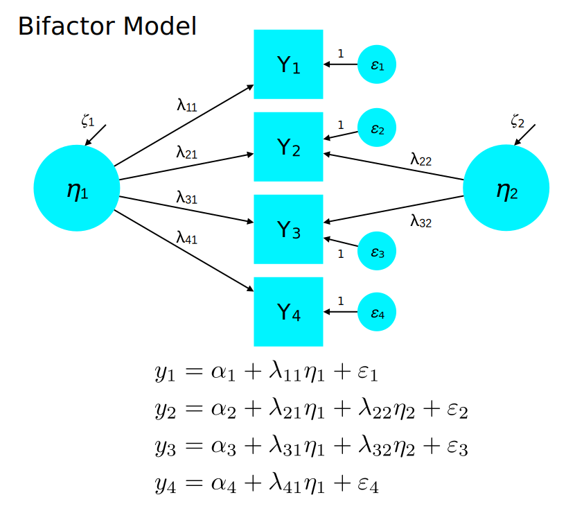

<style type="text/css">
body{ font-size: 20px; max-width: 1400px; margin: auto; padding: 1em; }
code.r{ font-size: 20px; }
p { padding-top: 10px; padding-bottom: 10px; }
pre { font-size: 18px; }
</style>


```{r setup, include=FALSE}
if (!require(pacman)) { install.packages("pacman"); library(pacman) }
p_load(knitr, MASS, tidyverse, viridis, lavaan, modelr, mlbench, lattice, lm.beta, semPlot, DiagrammeR, matrixcalc, psych)
knitr::opts_chunk$set(echo = TRUE) #print code by default
options(digits=3) 
```

Read in dataset from last time:

```{r}
data <- read.csv("quick_efa_data.csv")
describe(data)
round(cor(data), 2)
```


# Confirmatory factor analysis (CFA)

The common factor model underlies both exploratory and confirmatory factor analyses. The crucial difference in CFA, however, is that the investigator must specify the expected relationships between indicators and factors. Thus, one must have an explicit account of what factors underlie each item. This account then informs how the $\boldsymbol{\Lambda}_y$ matrix is defined. For example, if we havee 6 indicators that we believe load onto two factors (first three, second three):

$$
\underset{6 \times 2}{\boldsymbol{\Lambda}_y} = \begin{bmatrix}
   \lambda_{11} & 0 \\
   \lambda_{21} & 0 \\
   \lambda_{31} & 0 \\
   0 & \lambda_{42} \\
   0 & \lambda_{52} \\
   0 & \lambda_{62} \\
 \end{bmatrix}
$$

Here, instead of estimating 12 parameters as in EFA, we estimate only 6 and enforce simple structure. Whether this provides a good account of the data is a matter of model fit.

Also, recall the bifactor model in which some items may have both general and specific causes:



In addition to requiring that the scientist specify the measurement model, CFA also allows for certain assumptions of EFA to be relaxed. For example, in the six indicator model above, we could relax the assumption of conditional independence by freeing the residual association of two indicators, $Y_1$ and $Y_2$:

$$
\underset{6 \times 6}{\boldsymbol{\Theta}_\varepsilon} = \begin{bmatrix}
   \varepsilon_{1} & \varepsilon_{7} & 0 & 0 & 0 & 0 \\
   \varepsilon_{7} & \varepsilon_{2} & 0 & 0 & 0 & 0  \\
   0 & 0 & \varepsilon_{3} & 0 & 0 & 0 \\
   0 & 0 & 0 & \varepsilon_{4} & 0 & 0 \\
   0 & 0 & 0 & 0 & \varepsilon_{5} & 0 \\
   0 & 0 & 0 & 0 & 0 & \varepsilon_{6}
 \end{bmatrix}
$$

## CFA lavaan demo

We start with lavaan's default, which is to fix the first factor loading of each factor to 1.0 and estimate the variance of the factor.

Note that passing `standardized=TRUE` to `summary` prints out the standardized parameter estimates alongside the regular set. Note that `Std.lv` refers to a model in which the variances of the factors are fixed at 1.0, but the indicators themselves are not standardized. The `Std.all` column indicates that both latent variables and indicators have been standardized (mean = 0, SD = 1), which is closest to the conventional EFA model. That is, in the case of uncorrelated factors, loadings represent the correlation between an indicator and its factor.

##Model with orthogonal (uncorrelated) factors

We force the factors to be orthogonal in the first model by specifying `math ~~ 0*sci`.

```{r}
msyn <- '
math =~ 1*CALC + ALG + STAT #putting the 1* here for clarity, but it is the lavaan default
sci =~ 1*BIO + GEO + CHEM
math ~~ 0*sci #force orthogonal (uncorrelated) factors
math ~~ NA*math #explicitly indicate that lavaan should estimate a free parameters for factor variances
sci ~~ NA*sci
'

mcfa <- cfa(msyn, data)
summary(mcfa, standardized=TRUE)

```

##Model with correlated factors

How does model fit change if we allow the factors to correlate? This is accomplished by estimating a free parameter, and we can compare to the orthogonal version using a likelihood ratio test (LRT; which tests difference in model fit).

```{r}
msyn_corr <- '
math =~ 1*CALC + ALG + STAT #putting the 1* here for clarity, but it is the lavaan default
sci =~ 1*BIO + GEO + CHEM
math ~~ NA*sci #estimate correlation between factors
math ~~ NA*math #explicitly indicate that lavaan should estimate a free parameters for factor variances
sci ~~ NA*sci
'

mcfa_corr <- cfa(msyn_corr, data)
summary(mcfa_corr, standardized=TRUE)

#likelihood ratio test
anova(mcfa, mcfa_corr)

```

The LRT (and AIC difference) provides strong evidence that the factors are meaningfully correlated. Forcing them to be orthogonal significantly worsens fit.

##Equivalent model with standardized factor variances

Note that there are two common ways to identify a factor model. The first is to fix the loading of one indicator to 1.0 for each factor, while estimating the factor variance as a free parameter. The second is to estimate all factor loadings, but fix the factor variance to 1. The latter model is sometimes called 'standardizing the factors' since we estimate a model with factors means at 0 and variances at 1. In lavaan nomenclature, this is also called `Std.lv` (standardized latent variables). Note that the fit is identical to the correlated factors model above because this is an *equivalent* model.

The key issue is that unlike an observed variable, latent variables have no inherent metric that defines their scale. What is a score of 1000 or 10 on a variable that represents a hypothetical construct built from observed data? Thus, in SEM, we need to *scale* the latent variable by defining its relationship to the observed variables. The approach above fixed one factor loading to 1.0, sometimes called a unit loading identification (ULI) constraint. The indicator whose factor loading is fixed is called the *reference variable*. By fixing the loading to 1.0, the scale of measurement for the latent variable *follows* the reference indicator. So if the reference indicator is on the scale of 0-100, then the latent variable will be, too. Consequently, if indicators are on very different scales, changing from one reference indicator to another will a) substantially change the factor scores, and b) substantially change factor loadings. However, the fit to the data will be (generally) unchanged -- it's just an issue of assigning a scale to the latent variable.

The alternative is to standardize the factor variance to 1 while estimating all loadings. This approach works well when the factors are exogenous, since placing the variances on a unit scaling means that covariances among them will be in a correlational scale (as in EFA). Interpretation for this approah is generally less clean once we allow factors to be caused by other variables, since the factor variance scaling will fix the *residual* variance at 1.

Here's how to manually specify the standardized factor variance CFA with correlated factors:

```{r}

msyn_std <- '
math =~ NA*CALC + ALG + STAT
sci =~ NA*BIO + GEO + CHEM
math ~~ NA*sci
math ~~ 1*math
sci ~~ 1*sci
'

mcfa_std <- cfa(msyn_std, data)
summary(mcfa_std, standardized=TRUE)

```

Notice how that the `Estimate` column and the `Std.lv` columns are now identical. This is because when we ask `lavaan` for `standardized=TRUE` in the `summary()` call, it essentially fits the same model (factor variances at 1) behind the scenes. Likewise, `lavaan` provides a few convenience functions for helping with standardization to reduce the burden on you. However,  it's important that you know how to specify things directly so that you have the 'chops' to specify more complex models where no convenience functions exist. For the reference indicator model, we can specify

```{r}
msyn <- '
math =~ CALC + ALG + STAT
sci =~ BIO + GEO + CHEM
'

mcfa <- cfa(msyn, data, auto.fix.first=TRUE)
summary(mcfa)
```

## Using convenience functions in the lavaan function

Note that by default, correlations among exogenous latent variables are included. We could either remove this default using the `math ~~ 0*sci` manual approach above or switch to the `lavaan` function, which forces the user to specify each parameter explicitly. In particular, we can disable correlations between factors using, `auto.cov.lv.x=FALSE`. For `lavaan`, we need to enable `auto.var=TRUE` so that residual variances and variances of exogenous latent variables are estimated. See `?lavOptions` for more details

```{r}
msyn <- '
math =~ CALC + ALG + STAT
sci =~ BIO + GEO + CHEM
'

mcfa <- lavaan(msyn, data, auto.fix.first=TRUE, auto.cov.lv.x=FALSE, auto.var=TRUE)
summary(mcfa)
```

##Manual specification of all parameters using lavaan

If we use `lavaan`, we can also specify *all* parameters to be estimated in the model:

```{r}

msyn <- '
math =~ 1*CALC + ALG + STAT
sci =~ 1*BIO + GEO + CHEM

#factor variances and covariances
math ~~ sci
math ~~ math
sci ~~ sci

#residual variances of indicators
CALC ~~ CALC
ALG ~~ ALG
STAT ~~ STAT
BIO ~~ BIO
GEO ~~ GEO
CHEM ~~ CHEM
'

mcfa <- lavaan(msyn, data)
summary(mcfa, standardized=TRUE)
```

##Completely standardized solution

Note, however, that the scaling of factor loadings still does not approximate the EFA case, where they represented correlations between the factors and indicators in the orthogonal case. Recall that in the correlated factors case, the loadings represent standardized regression coefficients.

To achieve the same parameterization in CFA, we need to standardized both the latent variables and observed variables. This is sometimes called the 'completely standardized' solution. In `lavaan`, it's labeled `Std.all`. In Mplus, it's called `STDYX`. The standardization of the latent variables is already described above (factor variances at 1, all loadings estimated).

Standardization of the observed variables involves *z*-scoring all of them (mean = 0, SD = 1). This can be done manually using the `scale` function, or can be accomplished by `lavaan` using the `std.ov=TRUE`. Note that both of these are a kind of data preprocessing in which the data are transformed prior to the SEM estimation. The `scale` approach changes the data.frame since you are rescaling the data that are then passed to `lavaan`, whereas the `std.ov=TRUE` approach does the standardization in a temporary copy used internally to `lavaan`.

```{r}

data_std <- data %>% mutate_all(scale)

msyn <- '
math =~ CALC + ALG + STAT
sci =~ BIO + GEO + CHEM
'

mcfa <- cfa(msyn, data_std, std.lv=TRUE)
summary(mcfa)

```

Or using the `std.ov=TRUE` approach:

```{r}
msyn <- '
math =~ CALC + ALG + STAT
sci =~ BIO + GEO + CHEM
'

mcfa <- cfa(msyn, data, std.lv=TRUE, std.ov=TRUE)
summary(mcfa)
```

Now, we are back to the same setup as EFA, where we work from a correlation matrix (all variables standardized) and we assume mean = 0, SD = 1 latent variables.

##Approximating EFA in CFA (Exploratory SEM)

We have now achieved a close correspondence to the parameterization of EFA. But, unlike EFA, we assume no cross-loadings between factors, whereas EFA allows for these. Rotations are a post-processing method for minimizing cross-loadings, but not a formal part of the model specification. Rather, the EFA model assumes that each observed variable is a weighted combination of *all* factors.

We can approximate the EFA model if we allow the same saturated $\boldsymbol{\Lambda}_y$ matrix, but it leads to an estimation problem because of indeterminacy at the factor level. We should probably use *different* reference indicators on each factor to get this to work even approximately. Otherwise, there is no easy way to determine the scaling of each factor. Standardizing the latent variables will contribute to indeterminacy in this case.

```{r}
#lambda matrix equivalent to EFA
msyn <- '
f1 =~ 1*CALC + ALG + STAT + BIO + GEO + CHEM
f2 =~ 1*BIO + GEO + CHEM + CALC + ALG + STAT
f1 ~~ f2
'

mcfa <- cfa(msyn, data, std.ov=TRUE, std.lv=FALSE)
summary(mcfa, standardized=TRUE)
```

Despite the estimation problems, we are close to the factor loadings under EFA.
